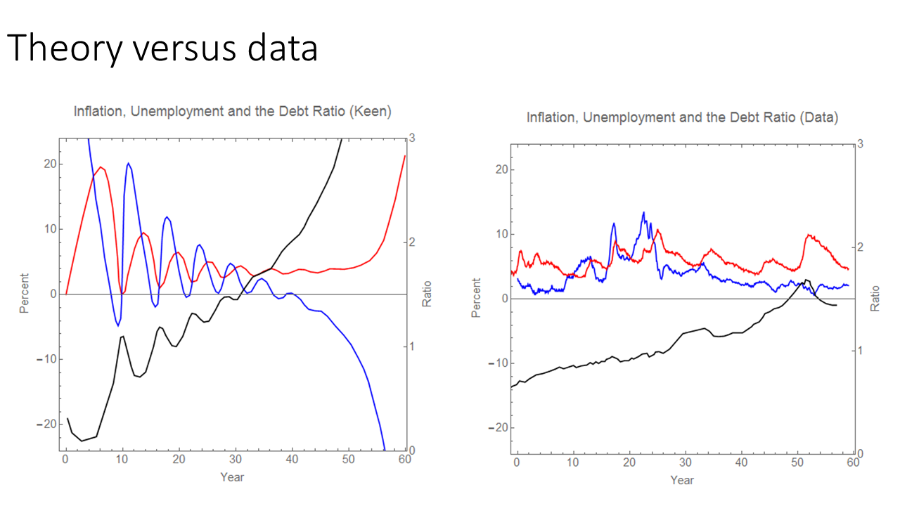
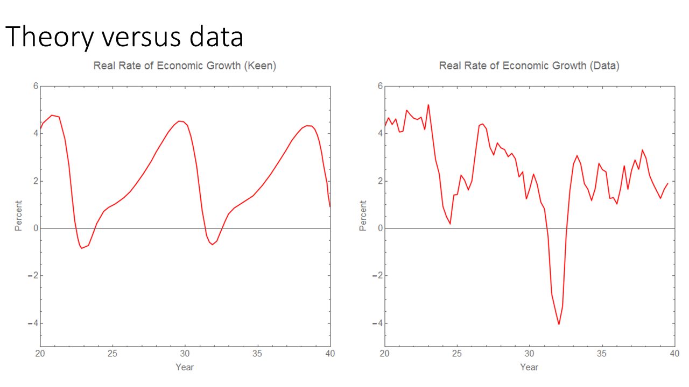
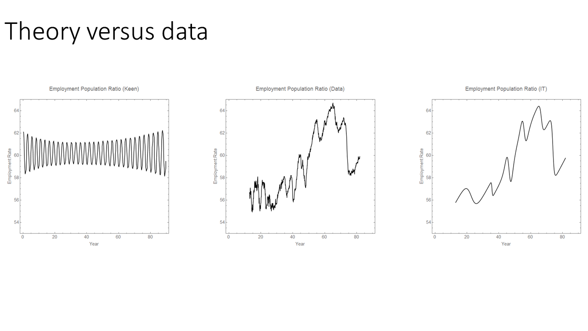

_Debunking Economics_[here](http://informationtransfereconomics.blogspot.com/2016/10/keen-chaos-and-equilibrium.html)[here](http://informationtransfereconomics.blogspot.com/2016/10/i-am-not-sure-steve-keen-understands.html)[here](http://informationtransfereconomics.blogspot.com/2016/02/attainable-definitions-of-equilibrium.html)[here](http://informationtransfereconomics.blogspot.com/2015/12/limit-cycles-versus-avalanches.html)
[UnlearningEcon](https://twitter.com/UnlearningEcon/status/828177509837574149)

> _Keen (and Godley) used their models to make clear predictions about crisis_

[here](http://informationtransfereconomics.blogspot.com/2017/02/qualitative-economics-done-right-part-1.html)
[in 2007](http://keenomics.s3.amazonaws.com/debtdeflation_media/2007/04/KeenDebtWatch200704.pdf)[famously lost a bet](http://www.news.com.au/finance/economist-steve-keen-loses-housing-bet-against-rory-robertson/news-story/93ed4546692bf96793651c0cbcf0d8bb)
**_about_** **_of_**

**defines** _Y__Y + dD/dt ~ GDP'_[here](http://slackwire.blogspot.com/2012/04/case-of-keen.html)[here](https://krugman.blogs.nytimes.com/2012/03/27/minksy-and-methodology-wonkish/?_r=0)
_Y + dD/dt ~ GDP'_[JW Mason put it well](http://slackwire.blogspot.com/2012/04/case-of-keen.html)

> _Honestly, it sometimes feels as though Steve Keen read a bunch of Minsky and Schumpeter and realized that the pace of credit creation plays a big part in the evolution of GDP. So he decided to theorize that relationship by writing, credit **squiggly** GDP. And when you try to find out what exactly is meant by **squiggly**, what you get are speeches about how orthodox economics ignores the role of the banking system._

_dD/dt_
[Part 1](http://informationtransfereconomics.blogspot.com/2017/02/qualitative-economics-done-right-part-1.html)

[Forbes piece](http://www.forbes.com/sites/stevekeen/2016/10/04/olivier-blanchard-equilibrium-complexity-and-the-future-of-macroeconomics/6/#36a242b818be)

**Unemployment: a detailed qualitative analysis**

[information equilibrium approach](http://informationtransfereconomics.blogspot.com/2017/01/dynamic-equilibrium-presentation.html)

[a matching function](http://informationtransfereconomics.blogspot.com/2017/01/matching-theory-and-employment-in.html)[using this model](http://informationtransfereconomics.blogspot.com/2017/02/randomly-generated-economies-work-in.html)

[in the financial sector](http://informationtransfereconomics.blogspot.com/2017/01/what-about-s-500.html)[housing prices](http://informationtransfereconomics.blogspot.com/2017/01/housing-prices-and-dynamic-equilibrium.html)[wealth and income (or all three)](http://informationtransfereconomics.blogspot.com/2017/02/a-desired-wealth-to-income-ratio-as.html)
[in my post](http://informationtransfereconomics.blogspot.com/2017/02/qualitative-economics-done-right-part-1.html)

-   Keen's models generally have many, many parameters (I stopped counting after 20 in the model discussed above). The model discussed above The [Lorenz limit cycle version](http://www.profstevekeen.com/crisis/models/) from the Forbes piece appears to have 10. \[4\]
-   If real RGDP is as above, then Keen's model does have a log-linear limit for RGDP growth. However, the price level fails to have a log-linear limit (since the rate goes from on average positive to increasingly negative, the price level will go up log-linearly and then fall precipitously).
-   As shown, there is a time scale on the order of 60 years controlling the progression from cyclic unemployment to instability in addition to the roughly 7-8 year cyclic piece. This makes it pure speculation given the data (always be wary of time scales on the order of the length of available data, too).
-   Keen's model is not qualitatively consistent with the shape of the fluctuations (per the discussion above).
-   Keen's model is not qualitatively consistent with the full time series (per the discussion above).

**Update 10 February 2017**

One of the curious push-backs I've gotten in comments below is that Keen's model "is just theoretical musings", or that I am somehow against new ideas. The key point to understand is that I am against the idea of saying a model has anything to do with a qualitative understanding of the real world when the model doesn't even qualitatively look like the real world. 

Keen himself thinks his model is more than just theoretical musings. He doesn't think the model just demonstrates a principle. He doesn't think these are just new ideas that people might want to consider. He thinks it is the first step towards the correct theory of macroeconomics. Here's the conclusion from Keen's "A dynamic monetary multi-sectoral model of production" (2011):

> _Though this preliminary model has many shortcomings, the fact that it works at all \[ed. it does not\] shows that it is possible to model the dynamic process by which prices and outputs are set in a multisectoral economy \[ed. we don't learn this because the model fails to comport with data\]. ... The real world is complex and the real economy is monetary, and complex monetary models are needed to do it justice \[ed. we don't know monetary models are the true macro theory\]. ... Given the complexity of this model and the sensitivity of complex systems to initial conditions, it is rather remarkable that an obvious limit cycle developed \[ed. limit cycles are not empirically observed\] out of an arbitrary set of parameter values and initial conditions—with most (but by no means all) variables in the system keeping within realistic bounds \[ed. they do not\]. ... For economics to escape the trap of static equilibrium thinking \[ed. we don't know if this the the right approach\], we need an alternative foundation methodology that is neat, plausible, and—at least to a first approximation—right \[ed. it is not\]. I offer this model and the tools used to construct it as a first step towards such a neat, plausible and generally correct approach to macroeconomics \[ed. it is not because it is not consistent with the data\]._

**_squiggly_** **_not_**

**Footnotes:**
\[1\] Interestingly, the power spectrum (Fourier transform) of the unemployment rate looks like [pink noise](https://en.wikipedia.org/wiki/Pink_noise) with exponent very close to 1. Pink noise arises in a variety of natural systems.
\[2\] The constant rate is related to the linear transform piece and the fractional decrease is related to the logarithm piece.
\[3\] I also made this fun comparison of Keen's model, the data, and an IT dynamic equilibrium model:

\[4\] The random unemployment rate model produced from the information equilibrium framework has 2 for the mean and standard deviation of the random amplitude of the shocks, 2 for the mean and standard deviation of the random width of the shocks, 1 for the Poisson process of the timing of the shocks, and finally 1 for the rate of decline of the unemployment rate for a total of 6.
\[5\] Not [Lumpy Space Princess](http://adventuretime.wikia.com/wiki/Lumpy_Space_Princess), but Lucas, Sargent, and Prescott.
