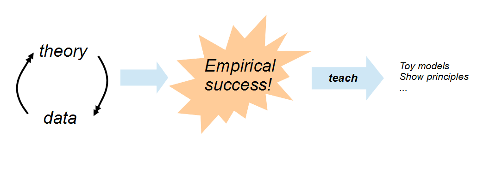

When did insisting on comparing theory to data become anything other than incontrovertible? On my post _[Qualitative economics done right, part 2](http://informationtransfereconomics.blogspot.com/2017/02/qualitative-economics-done-right-part-2.html)_, I received some push back against this idea in comments. These comments are similar to comments I've seen elsewhere, and represent a major problem with macroeconomics embodied by [the refrain](http://delong.typepad.com/sdj/2011/10/calibration-and-econometric-non-practice.html) the data rejects "too many good models":

> _But after about five years of doing likelihood ratio tests on rational expectations models, I recall Bob Lucas and Ed Prescott both telling me that those tests were rejecting too many good models._

The "_I_"in that case was Tom Sargent. Now my series (here's [Part 1](http://informationtransfereconomics.blogspot.com/2017/02/qualitative-economics-done-right-part-1.html)) goes into detail about why comparison is necessary even for qualitative models. But let me address a list of arguments I've seen that are used against this fundamental tenet of science.

**"It's just curve fitting."**

I talked about a different aspect of this [here](http://informationtransfereconomics.blogspot.com/2017/01/curve-fitting-and-relevant-complexity.html). But the "curve fitting" critique seems to go much deeper than a critique of setting up a linear combination of a family of functions and fitting the coefficients (which does have some usefulness per the link).

Somehow any comparison of a theoretical model to data is dismissed as "curve fitting" under this broader critique. However this fundamentally misunderstands two distinct processes and I think represents a lack of understanding of [function spaces](https://en.wikipedia.org/wiki/Function_space). Let's say our data is some function of time _d(t)_. Now because some functions _fₐ(t)_ form complete bases, any function _d(t)_ (with reasonable caveats) can be represented as a vector in that function space:

_d(t) = Σ__ₐ_ _c__ₐ_ _f__ₐ__(t)_

An example is a [Fourier series](https://en.wikipedia.org/wiki/Fourier_series), but given some level of acceptable error any finite set of terms {_1, t, t², t³, t⁴ ..._} can suffice (like a Taylor series, or linear, quadratic, etc regression). In this sense, and only in this sense, is this a valid critique. If you can reproduce any set of data, then you really haven't learned anything. However, as I talk about [here](http://informationtransfereconomics.blogspot.com/2017/01/curve-fitting-and-relevant-complexity.html), you can constrain the model complexity in an [information-theoretic sense](https://en.wikipedia.org/wiki/Akaike_information_criterion).

However, this is **not** the same situation as saying the data is given by a general function _f(t)_ with parameters _a_, _b_, c, ...:

_d(t) = f(t|__a, b, c, ..._ _)_

where the theoretical function _f_ is not a complete basis and where the parameters are fit to the data. This is the case of e.g. Planck's blackbody radiation model or Newton's universal gravity law, and in this case we **_do_** learn something. We learn that the theory that results in the function _f_ is right, wrong or approximate.

In the example with Keen's model in Part 2 above, we learn that the model (as constructed) is wrong. This doesn't mean debt does not contribute to macroeconomic fluctuations, but it does mean that Keen's model is not the explanation if it does.

A simply way to put this is that there's a difference between parameter estimation (science) and fitting to a set of functions that comprise a function space (not science).

**"It shows how to include _X_."**

In the case of Keen, _X_ = debt. There are two things you need to do in order to show that a theoretical model shows how to include _X_: it needs to fail to describe the data when _X_ isn't included, and it needs to describe the data better when _X_ is included.

A really easy way to do this with a single model is to take _X → α X_ and fit _α_ to the data (estimate the parameter per the above section on "curve fitting"). If _α_ ≠ 0 (and the result looks qualitatively like the data overall), then you've shown a way to include _X_.

Keen does not do this. His ansatz for including debt _D_ is _Y + dD/dt_. It should be _Y + α dD/dt_.

**"It's just a toy model."**

Sure that's fine. But [toy models](https://en.wikipedia.org/wiki/Toy_model) nearly always a) perform qualitatively well themselves when compared to data, or b) are  easy versions of much more complex models where the more complex model has been compared to data and performed reasonably well. It's fine if Keen's debt model is a toy model that doesn't perform well against the data, but then where is the model that performs really well that it's based on?

**"It just demonstrates a principle."**

This is similar to the defense that "it's just a toy model", but somewhat more specific. It is only useful for a model to demonstrate a principle if that principle has been shown to be important in explaining empirical data. Therefore the principle should have performed well when compared to data. I used the example of demonstrating [renormalization](https://en.wikipedia.org/wiki/Renormalization) using a scalar field theory (how it's done in some physics textbooks). This is only useful because a) renormalization was shown to be important in understanding empirical data with quantum electrodynamics (QED), and b) the basic story isn't ruined by going to a scalar field from a theory with spinors and a gauge field.

The key point to understand here is that the empirically inaccurate qualitative model is being used to teach something that has already demonstrated itself empirically. Let's put it this way:

After the churn of theory and data comes up with something that explains empirical reality, you can then produce models that capture the essence of the theory that captures reality. Or more simply: you can only use teaching tools after you have learned something.

In the above example, QED was the empirical success that lead to using scalar field theory to teach renormalization. You can't use Keen's models to teach principles because we haven't learned anything yet. As such, Keen's models are actually evidence **_against_** the principle (per the argument in curve fitting above). If you try to construct a theory using some principle and that theory looks nothing like the data, then that is an indication that either a) the principle is wrong or b) the way you constructed the model with the principle is wrong.
