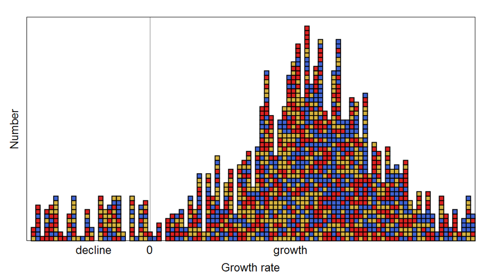

In the "[ensemble of many markets](http://informationtransfereconomics.blogspot.com/2016/09/the-economic-state-space-mini-seminar.html)" picture where the diagram above indicates a "statistical equilibrium" of a set of growth states, we have a definition of a general economic equilibrium that is describable [in terms of a partition function](http://informationtransfereconomics.blogspot.com/2016/09/balanced-growth-maximum-entropy-and.html).

First, this is one way you can [make sense of economic equilibrium](http://informationtransfereconomics.blogspot.com/2016/02/attainable-definitions-of-equilibrium.html) that Steve Keen says is impossible using an overly strict mathematical construct to represent neoclassical economics. Equilibrium is not a case where all relative prices are always the same (a ridiculous definition that we can see is not true of even a normally operating economy by inspection because e.g. sometimes things go on sale), but rather a case where the _distribution_ of prices remains relatively unchanged.

We can observe examples of the [distribution in profit rates](http://informationtransfereconomics.blogspot.com/2016/07/a-statistical-equilibrium-approach-to.html), the [prices of goods](http://informationtransfereconomics.blogspot.com/2016/10/price-growth-ie-inflation-state.html), as well as [stocks](http://informationtransfereconomics.blogspot.com/2016/12/stocks-and-k-states.html), for example. Disequilibrium can be seen as strong deviations from the distribution (illustrated in the stock example) and macroeconomic forces as entropic forces ([here](http://informationtransfereconomics.blogspot.com/2014/10/wage-stickiness-is-entropic-force.html), [in the paper](http://ssrn.com/abstract=2894072), or [here](http://informationtransfereconomics.blogspot.com/2016/09/supply-and-demand-as-causal-entropic.html) as causal entropic forces) maintaining it.

Now let's go to a bit I wrote about the lack of uniqueness of the Arrow-Debreu-McKenzie (ADM) equilibrium [before](http://informationtransfereconomics.blogspot.com/2014/06/towards-arrow-debreu-mckenzie_27.html):

> _Let's look at what the ADM equilibrium says with regards to a partition function in thermodynamics. It effectively says there exists some set of occupation numbers \[i.e. growth states\] so that the energy of the system is the total energy, or more generally, there exists a microstate consistent with an observed macrostate. The [SMD theorem](http://en.wikipedia.org/wiki/Sonnenschein%E2%80%93Mantel%E2%80%93Debreu_theorem) then tells us that there are only limited properties of that microstate that survive to the macrostate. ... The other consequence of the SMD theorem should also be intuitive. If your macro system appears to be described by n << N degrees of freedom, then it seems highly likely that among the total number of microstates, large subsets of the microstates are going to be described by a given macro state -- i.e. the equilibrium (the microstate satisfying macro constraints) is not going to be unique._

Basically, since every re-labeling of the boxes in the diagram above is another macroeconomy with the same growth state distribution, every re-labeling represents an equivalent macrostate. Since each growth state (i.e. [IT index _k_ state](http://informationtransfereconomics.blogspot.com/2016/12/stocks-and-k-states.html)) also indicates a price growth state \[1\], the price clearing vector is highly non-unique. **This is a good thing, too.** It means that macroeconomics is somewhat easier than applied microeconomics ‒ it's a different theory (like particle kinematics versus the ideal gas law). Additionally, consistent with the SMD theorem, the detailed properties of the microstates (the individual boxes) are not absolutely necessary to describe the macrostate. (It also means that agent based modeling is fine, but unnecessary.)

Instead of a single price vector pointing motionless in a single direction, we should visualize a rapidly changing price vector with elements drawn from a stable distribution (possibly even a [Stable Distribution](https://en.wikipedia.org/wiki/Stable_distribution) per [here](http://informationtransfereconomics.blogspot.com/2016/07/a-statistical-equilibrium-approach-to.html)).

...

**Footnotes**

\[1\] If $n_{i}$ is the nominal output of the $i^{th}$ market with common "factor of production" ($m$ money, [or it could be labor](http://informationtransfereconomics.blogspot.com/2016/07/an-ensemble-of-labor-markets.html) $\ell$), we have:

Basically, the distribution of $k$ states describes both the nominal output of the $i^{th}$ market as well as the price $p_{i}$ of the good in that market.

PS Snow day! Seattle tends to be useless with even a few inches of snow, so I took the day off.

