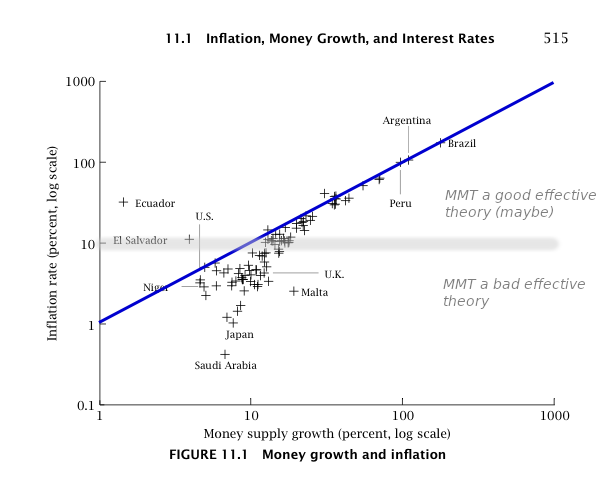

Scott Sumner [makes a good point](http://www.themoneyillusion.com/?p=32385) that inflation is not only demographics using Belarus as an example. However I think this example is a great teachable moment about effective theories. The data on inflation versus monetary base growth shows two distinct regimes; the graph depicting this above is from a diagram in David Romer's _Advanced Macroeconomics_. One regime is high inflation and because it is pretty well described by the quantity theory of money (the blue line) I'll call it the quantity theory of money regime. The second regime is low inflation. It is much more complex and is probably related to multiple factors at least partially including [demographics](http://informationtransfereconomics.blogspot.com/2016/01/its-people-economy-is-made-out-of-people.html) (or e.g. [price controls](http://informationtransfereconomics.blogspot.com/2016/05/wwii-price-controls-and-models.html)).

The scale that separates the two regimes (and that defines the scope of the quantity theory of money theory) is on the order of 10% inflation (gray horizontal line). For inflation rates ~ 10% or greater, the quantity theory is a really good effective theory. What's also interesting is that the theory of inflation seems to simplify greatly (becoming a single-factor model). It is also important to point out that there is no accepted theory that covers the entire data set ‒ that is to say there is no theory with global scope.

In physics, we'd say that the quantity theory of money has a scale of _τ₀_ ~ 10 years (i.e. 10% per annum). For base growth scales shorter than this time scale like, say, _β₀_ ~ 5 years (i.e. 20% per annum), we can use quantity theory.

At 10% annual inflation, Belarus should be decently described by the quantity theory of money with other factors; indeed base growth has been on the order of 10%.

The problem is that then Scott says:

> _So why do demographics cause deflation in Japan but not Belarus?  Simple, demographics don’t cause deflation in Japan, or anywhere else._

Let me translate this into a statement about physics:

> _So why does quantum mechanics make paths probabilistic for electrons but not for baseballs? Simple, quantum mechanics doesn’t make paths probabilistic for electrons, or anything else._

As you can see this framing of the question completely ignores the fact that there are different regimes where different effective theories can operate (quantum mechanics on scales set by de Broglie wavelengths; when the de Broglie wavelength is small you have a Newtonian effective theory).

...

**Update 28 March 2017**

[In this post](http://informationtransfereconomics.blogspot.com/2016/02/the-is-lm-model-as-effective-theory-at.html), I work out a version of a quantity theory/AD-AS model that turns into an IS-LM-like effectively theory at low inflation as a potential example of the two-regime model described above.

...

**Update 12 February 2019**

I'd like to update this post with another example: MMT. Sparked by [a tweet from Steve Roth](https://twitter.com/asymptosis/status/1095391087076622338), I said that MMT _might_ be a theory of hyperinflation. If government deficit spending decisions start to affect inflation (and not — per empirical evidence —[multiple demographic & labor factors](https://twitter.com/infotranecon/status/971881574810533890) \[twitter talk\]), you're out in the "single variable describes inflation" regime in the graph at the top of the page. MMT. QTM. Take your pick. In that regime almost all macro variables are highly correlated.  The subspace collapses to a single dimension so it's projection along any other single dimension (as long as it's a non-zero projection) is just a (non-zero) scale factor. It doesn't matter if it's debt, M2, or NGDP.

