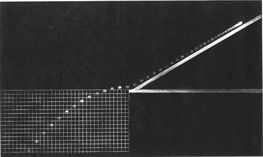

Nick Rowe [tweeted](https://twitter.com/MacRoweNick/status/847524770614849536) his old post on his "[minimalist model of recessions](http://worthwhile.typepad.com/worthwhile_canadian_initi/2015/12/minimalism-and-recessions.html)" and comes to the conclusion that: 

> _This minimalist model of recessions gives us a very simple message: **recessions are a reduction in the volume of monetary exchange caused by an excess demand for the medium of exchange. Recessions reduce utility because some mutually advantageous exchanges do not take place.**_

Emphasis in the original. However, this conclusion is based on the following procedure

1.  Assume three markets: firms producing _A_, _B_ and a "money" market _M_
2.  Assume utility functions for _A_ and _B_ 
3.  Maximize utility subject to constraint
4.  Solve for Nash equilibrium to obtain _A_ \= _B_ \= 100/_P_

The question is: Does this explain anything or rather just define recessions as an excess demand for money? Steps 2 through 4 are just mechanical mathematical procedures that effectively transform the assumptions of step 1 into the result of step 4. In fact, you really need nothing more than [Walras' law](https://en.wikipedia.org/wiki/Walras%27_law) with an aggregate goods market and a money market. An excess demand for money is then equal to a deficit of demand for aggregate goods. The "embroidery" (Rowe's term) the minimalist model adds is just to say that if there are two goods markets, both will suffer from a deficit of demand (Walras' law only tells us at least one must).

As it stands, this model just defines recessions to be an excess demand for money. I think this is part of [a more general problem in macroeconomics](http://informationtransfereconomics.blogspot.com/2015/11/frameworks.html): instead of developing frameworks to study what a recession is, macroeconomic frameworks just define what a recession is.

On its own, simply positing assumptions that lead to a conclusion via mechanical procedures is really no different than positing the inevitable conclusion. There are two cases where it becomes interesting. The first is where you don't know where the mechanical procedures lead ‒ deriving a completely new result. For the second, I will take you through a a different mechanical procedure that leads to a well-known result.

Let's start by assuming there is a constant acceleration due to gravity _g_ that has units of distance/time². Integrating this with respect to time (mechanical procedure) we obtain:

_v(t) =  -g t + v₀_

_s(t) = -½ g t² + v₀ t + s₀_

This minimalist model of ballistic trajectories gives us a very simple message: trajectories are parabolic functions of time. (I'm intentionally paraphrasing Rowe above.) But does the explanatory power of this procedure derive from the assumptions or the procedure itself? **No.** It comes from the assumptions and the procedure _plus empirical data_:

Without the data, I'm just defining the function _s(t)_.

In a sense Arrow-Debreu general equilibrium and Nash equilibrium are, on their own, equally devoid of explanatory power. Both are essentially applications of the [Bouwer fixed point theorem](https://en.wikipedia.org/wiki/Brouwer_fixed-point_theorem) (not detracting from these examples as mathematical results, but rather as economic ones). The question is whether the system set up (Rowe's three good economy, Arrow & Debreu's markets in time and space, Nash's _N_\-player games, constant acceleration due to gravity) explain empirical data. They don't have to explain it perfectly (even the gravity model above neglects air resistance), but they do have to match data to some level of precision before they can be considered "explanations" rather than just "definitions" (or if you prefer "model definitions").

In writing that, I think that might be a good phrase to introduce to a wider audience. A **model** is something that explains **data**. A **model definition** is just a collection of assumptions and mathematical procedures that relate variables. A model starts off as a model definition, and becomes a model after it is compared to data.

Nick Rowe's minimalist system above is a _model definition_. The projectile motion equations I wrote down are a _model_. The IS-LM model as usually presented is a _model definition_, as are a great deal of DSGE models out there. In fact most of macroeconomics deals not with models but _model definitions_. Model definitions are only wrong inasmuch as they contain math errors. Models are wrong if they are rejected by empirical data. Conclusions reached via a model definition do not "explain" anything about the real world any more than defining a new term explains anything.
