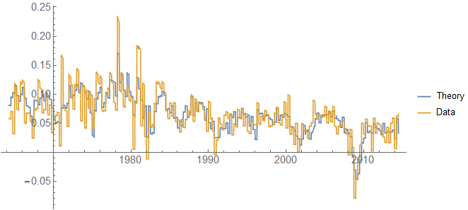
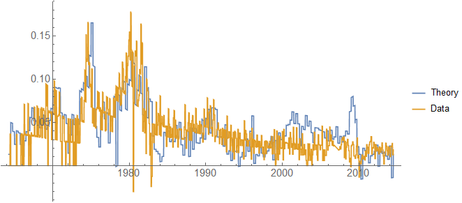
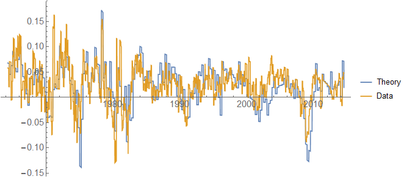

I added the modification from [this post](http://informationtransfereconomics.blogspot.com/2017/03/the-quantity-theory-of-labor-and.html) to the "[quantity theory of labor and capital](http://informationtransfereconomics.blogspot.com/2016/03/a-quantity-theory-of-labor-and-capital.html)" (QTLK, aka the "nominal Solow model" without TFP dynamics) to the [information equilibrium GitHub repository](http://informationtransfereconomics.blogspot.com/2017/02/information-equilibrium-code.html). The _Mathematica_ notebook starts from the basic labor model of the first link, shows Okun's law, adds capital to obtain the QTLK of the second link, and then finally shows the "improved" QTLK described below.

In the [information equilibrium notation](http://informationtransfereconomics.blogspot.com/2016/09/basic-definitions-in-information.html) the modified model is: 

_
P : NGDP ⇄ L
     NGDP ⇄ K_

         _CPI ⇄ P_

The modification is essentially changing the abstract price/detector in the first relationship to an unknown quantity _P_ and adding the relationship _CPI ⇄ P_ (that is to say we don't measure the abstract price _P_ directly, but rather just something ‒ e.g. core CPI ‒ that is in information equilibrium with the abstract price).

The result is primarily a much improved description of inflation:

PS Why do I call this a "quantity theory of labor and capital"? Because it started out as a simple model of labor where (solving the differential equation described by the relationship _P : NGDP ⇄ L_)

log _NGDP_ ~ _α_ log _L_

log _P_ ~ (_α_ − 1) log _L_

Therefore if _α_ = 2, _P_ ~ exp _π t_, and _L_ ~ exp _λ t_, we can say _π = λ_. That is to say inflation is equal to the growth rate of the (employed) labor supply. This is directly analogous to the quantity theory of money where inflation is equal to the growth rate of the money supply.

However, in practice _α_ < 2. What we end up with is something more like the Solow model where:

log _NGDP_ ~ _α_ log _L + β_ log _K_

log _P_ ~ (_α_ − 1) log _L_

And in the modified version we substitute the latter equation with

log _P_ ~ γ (_α_ − 1) log _L_
