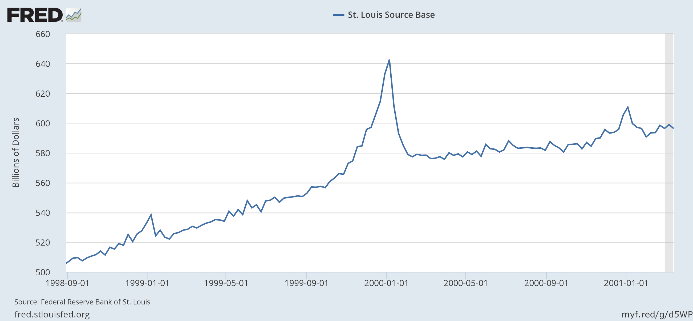

[Srinivas](https://twitter.com/teasri/status/843986464878870528) \[1\] has been requesting that I look into India's demonetization using the information equilibrium (IE) framework for awhile now. One of the reasons I haven't done so is that I can't seem to find decent NGDP data from before 1996 or so. I'm going to proceed using this limited data set because there are several results that I think are a) illustrative of how to deal with different models with different scope, b) show that monetary models are not very useful.

Previously, the only "experiment" with currency in circulation I had encountered was the Fed's stockpiling of currency before the year 2000 in preparation for any issues:

This temporary spike had no impact on inflation or interest rates. Economists would say that the spike was expected to be taken away, and therefore there would be no impact. Scientifically, all we can say is that rapid changes in M0 do not necessarily cause rapid changes in other variables. This makes sense if it is entropic forces maintaining these relationships between macroeconomic aggregates. Another example is the Fed's recent increases in short term interest rates. [The adjustment of the monetary base to the new equilibrium](http://informationtransfereconomics.blogspot.com/2017/03/the-fed-raised-interest-rates-today.html) appears to be a process with a time scale on the order of years.

If either interest rates or monetary aggregates are changed, it takes time for agents to find or explore the corresponding change in state space.

India recently removed a bunch of currency in circulation (M0). If the historical relationship between nominal output (NGDP) and M0 were to hold, we'd get a massive fall in output and the price level. However, the change in M0 appears to be quick:

**Interest rates**

The interest rate model says that a drop in M0 should raise interest rates ceteris paribus. However this IE relationship only holds on average over several years. Were the drop in M0 to remain, we should expect higher long term interest rates in India:

However, if M0 continues to rise as quickly as it has in Dec 2016, Jan 2017, and Feb 2017, then we probably won't see any effect at all (much like the year 2000 effect described above). M0 needs to maintain a lower level for an extended period for rates to rise appreciably.

This is to say that the model scope is long time periods (on the order of years to decades), and therefore sharp changes are out of scope.

**Monetary model**

Previously, like many other countries, India has shown an information equilibrium relationship (described at the end of [these slides](http://informationtransfereconomics.blogspot.com/2016/02/slides.html)) between M0 and NGDP with an information transfer index (_k_) on the order of 1.5. A value of _k_ \= 2 means a quantity theory of money economy, while a lower value means that prices and output respond much less to changes in M0.

In fact, as I mentioned [in a post from yesterday](http://informationtransfereconomics.blogspot.com/2017/03/belarus-and-effective-theories.html) monetary models only appear to be good effective theories when inflation is above 10%, and in that case we should find _k_ \= 2. That _k_ < 2 implies the monetary theory is out of scope and we have something more complex happening.

**The quantity theory of labor**

The monetary models don't appear to be very useful in this situation. However one model that does do well for countries with _k_ < 2 is [the quantity theory of labor (and capital)](http://informationtransfereconomics.blogspot.com/2016/03/a-quantity-theory-of-labor-and-capital.html). This is basically the information equilibrium version of the Solow model (but deals with nominal values, doesn't have varying factor productivity, and doesn't have constant returns to scale). unfortunately the time series data doesn't go back very far and there aren't a lot of major fluctuations. Even so, the model does provide a decent description of output and inflation:

The exponents are 1.6 for capital and 0.9 for labor meaning India is a great place to get return on capital investment (the US has 0.7 and 0.8, and the UK has 1.0 and 0.5, respectively).

This model tells us that inflation is primarily due to an expanding labor force, and therefore demonetization should have little to no effect on it.

**Dynamic equilibrium**

The [dynamic equilibrium](http://informationtransfereconomics.blogspot.com/2017/01/dynamic-equilibrium-presentation.html) approach to prices (price indices) and ratios of quantities has shown remarkable descriptive power as I've shown in several recent posts (e.g. [here](http://informationtransfereconomics.blogspot.com/2017/02/nairu-and-other-connections-between.html)). India is no different and inflation over the past 15 years can be pretty well described by a single shock centered in late 2010 continuing over a time scale on the order of one and a half years:

This model doesn't tell us the source of the shock, but unless another shocks hits we should expect inflation to continue at the same rate as it has over the past 2 years (averaging 4.7% inflation). This also means that the demonetization should have little to no effect.

**Summary**

The preponderance of model evidence tells us that the demonetization should have little to no effect on inflation or output. The speed at which it was enacted means that the monetary models are out of scope and tell us nothing; we can only rely on other models that are in scope and those have no dependence on M0.

**Footnotes**

\[1\] Srinivas also sent me much of the data used in this post.
