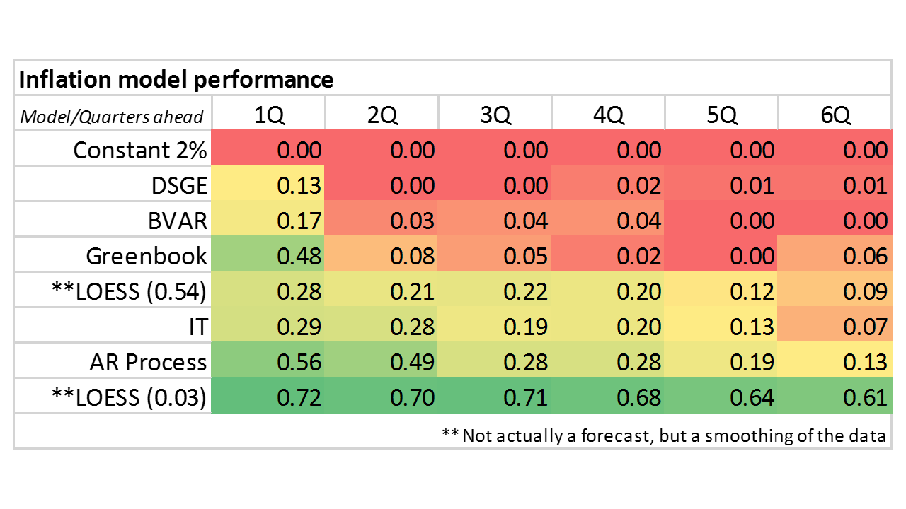

I think I first became aware of Beatrice Cherrier's work on economic history in January of last year when I read Roger Farmer's [post on competing terminology](http://www.rogerfarmer.com/rogerfarmerblog/2016/01/please-lets-agree-to-speak-same-language.html). I recently barged into [a Twitter conversation](https://twitter.com/infotranecon/status/840233932528398336) that was started by Cherrier about critiques of economics \[1\], and ended up reading her blog which I recommend. I learned a lot about the history of economics with regards to prediction [from this post](https://beatricecherrier.wordpress.com/2017/02/10/the-problem-with-economists-failed-to-predict-the-2008-crisis-macro-death-articles/) especially.

I agree with Cherrier that the "economists failed to predict the crisis" (or as it is sometimes taken: "mainstream economists ...") trope is problematic from a scientific standpoint. I listed failures of prediction under the heading of _Complaints that depend on framing_ in [my list of valid and invalid critiques of economics](http://informationtransfereconomics.blogspot.com/2016/11/a-list-of-valid-and-not-so-valid.html). What do we mean by prediction? Conditional forecasts? Unconditional forecasts? Finding a new effect based on theory?

I like to use the example of earthquakes to illustrate this. We cannot predict _when_ earthquakes will happen, however we can predict _where_ they will generally happen to some degree of accuracy (along fault lines or increasingly near areas where fracking is used). The plate tectonics model that predicts earthquakes will occur mostly at plate boundaries also explains some observations about the fossil record (fossils are similar in South America and Africa up until the end of the Jurassic). Does this mean earthquakes are predictable or unpredictable? And if unpredictable, do we consider this a failure of the model or possibly the field of geophysics?

We do not yet know if recessions are predictable in any sense. For example, if recessions are triggered by [information cascades](https://en.wikipedia.org/wiki/Information_cascade) among agents they could arise so quickly that no data could conceivably be collected fast enough to predict it. They'd be inherently unpredictable by the normal process of science. So you can see that an insistence on prediction is declaring certain kinds of theories (even potentially theories that are accurate in hindsight) to be invalid by fiat.

This possibility sets up a real branding problem for macroeconomics. As I have heard from some commenters on my blog (and generally in the econoblogosphere), a model that is accurate only in hindsight is not useful to most people. This does not mean such a model is unscientific (quantum field theory isn't useful to most people, either), just that a large segment of the population will think the model is failing. As Cherrier points out, this expectation was baked in at the beginning:

> _Macroeconomics is born out of [finance fortune-tellers’ early efforts](http://press.princeton.edu/titles/10057.html) to predict changes in stock prices and economists’ efforts to explain and tame agricultural and [business cycles](https://hope.econ.duke.edu/sites/hope.econ.duke.edu/files/Hoover%20History%20of%20Modern%20Macro%202008_1.pdf)._

I don't think we've moved beyond this expectation coming from society and politicians. I also think it will be difficult to undo (e.g. by moving towards a view of "economist as doctor" per [Simon Wren-Lewis](https://mainlymacro.blogspot.com/2015/01/encouraging-dialogue-between-economists.html)) because macroeconomics deals with issues of importance to society (employment and prices).

**Prediction case studies: information equilibrium models**

Prediction is an incredibly useful tool in science and can be for economics, but only if the system is supposed to be predictable. Let me show some ways prediction can be used to help understand a system using some examples with the information equilibrium (IE) model I work with on this blog.

In the first example, the dynamic equilibrium model [forecast of unemployment](http://informationtransfereconomics.blogspot.com/2017/03/comparing-unemployment-forecast-to.html) depends on whether a recession is coming or not, and produces two different forecasts (shown in gray and red, respectively):

We can see what look like the beginnings of a negative shock (see also [here](http://informationtransfereconomics.blogspot.com/2017/01/an-updated-unemployment-rate-projection.html) about predicting the size of the global financial crisis shock). This kind of model (if correct) would give leading indicators before a recession starts.

I've used a different model to [make an unconditional prediction](http://informationtransfereconomics.blogspot.com/2015/08/comparison-of-interest-rate-predictions.html) about the path of the 10-year interest rate:

We can clearly see the shock after the 2016 election. If this model is correct, the evidence of that shock should [evaporate](http://informationtransfereconomics.blogspot.com/2016/03/the-emh-and-evaporating-information.html) in a year or so. This gives us an interesting use case: if the data fails to follow the unconditional forecast, that forecast acts as a counterfactual for the scenario where "nothing happens" allowing one to extract the impacts of policy or other events. 

However [there's another example](http://informationtransfereconomics.blogspot.com/2014/08/are-interest-rates-good-indicator-of.html) that's more like earthquake prediction: regions where interest rate data is above the "theoretical ideal" curve (gray) for extended periods (highlighted in green) culminate in a recession (red) much like building up snow on a mountainside usually culminates in an avalanche. The latest data says that we've started to build up snow:

This indicator (if it turns out to be correct) doesn't tell us when a recession happens, only if one will possibly happen. According to this model, the chance of recession went above zero in December of 2015.

In yet another example, I [put together a prediction](http://informationtransfereconomics.blogspot.com/2016/11/the-effect-of-december-2016-fed.html) where I actually have no information. The information equilibrium model says that the monetary base will generally fall (or output will increase) with interest rate increases, but doesn't say how fast. Essentially, the model tells us where equilibrium is, but not the non-equilibrium process that arrives there. This use of forecasting is primarily as a learning tool:

In the model above, the base should fall towards _C'_ (_C_ is the Dec 2015 rate hike, _C'_ is the Dec 2016 hike, and the likely March 2016 2017 hike will require a _C''_), but when it should reach it is an unknown parameter since the monetary base has never been this large before. The prediction in a sense already has one success: the model predicted the base would deviate from the path labeled 0 in the graph.

And in [this case](http://informationtransfereconomics.blogspot.com/2015/11/cpi-inflation-predictions-and.html), I used prediction performance to reject a modification (adding lags) to a model of inflation. The key point to understand here is that this model wasn't conditional, so a large spike in CPI inflation at the beginning of 2016 was sufficient to reject it:

But a good question to ask is how well can e.g. inflation be predicted? A 2011 study shows that many economic models fail to be as predictive as [some simple stochastic processes (or the IE model)](http://informationtransfereconomics.blogspot.com/2016/10/forecasting-it-versus-all-comers.html):

Using the same methodology as the 2011 study, I tested the performance of [LOESS smoothing](https://en.wikipedia.org/wiki/Local_regression) of the data and found the best case model would probably only score a _R²_ ~ 0.6 at 6 quarters out.

As we can see, prediction is a useful tool to tame the proliferation of macroeconomic models. However I would stress that prediction is not necessarily the best metric by which to determine the _usefulness_ of models in understanding economic systems. For example, the unemployment model above is very uncertain about predicting the size and onset of recession shocks due to some basic issues with estimating the parameters of the exponential functions involved. However, if the model is just as accurate post-shock as it was pre-shock that is an argument that the model just fails to forecast during recessions (understandable for an _equilibrium_ model). This is useful for science (and potentially policy design); it's just not useful for people who want forecasts.

...

PS All of the information equilibrium model predictions are [collected on this page](http://informationtransfereconomics.blogspot.com/2015/09/prediction-aggregation-redux.html). I've started uploading the _Mathematica_ codes to GitHub repositories linked [here](http://informationtransfereconomics.blogspot.com/2017/02/information-equilibrium-code.html).

...

**Footnotes:**

\[1\] The initial thread was about defenses of the "Econ 101" (or "economism" by James Kwak, or "101ism" by Noah Smith). I wrote what could be considered a defense of "Econ 101" [here](http://informationtransfereconomics.blogspot.com/2016/12/saving-scissors.html). I called it _Saving the scissors_ (in reference to supply and demand diagrams, and also a pun on Dan Aykroyd's portrayal of Julia Child on _Saturday Night Live_ where he says "Save the liver"). I proposed that Econ 101 could be defended, but only if one pays close attention to model scope (one entry on [my list](http://informationtransfereconomics.blogspot.com/2016/11/a-list-of-valid-and-not-so-valid.html) of "valid" complaints against econ, another of which is prediction per the post above).
