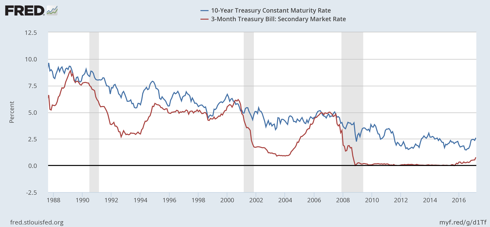

The Fed raised its interest rate target to a band between 0.75 to 1.0 percent at today's meeting, so I have to update [this graph](http://informationtransfereconomics.blogspot.com/2016/11/the-effect-of-december-2016-fed.html) with a new equilibrium level _C''_:

We might be able to see whether the [interest rate indicator](http://informationtransfereconomics.blogspot.com/2014/08/are-interest-rates-good-indicator-of.html) of a potential recession has any use:

This indicator is [directly related](http://informationtransfereconomics.blogspot.com/2014/09/the-emerging-story-of-great-recession.html) to [yield curve inversion](https://en.wikipedia.org/wiki/Yield_curve#Inverted_yield_curve) (the green curve needs to be above the gray curve in order for yield curve inversion to become probable). Here are the 3-month and 10-year rates over the past 20 years showing these inversions preceding recessions (both in linear and log scales):

