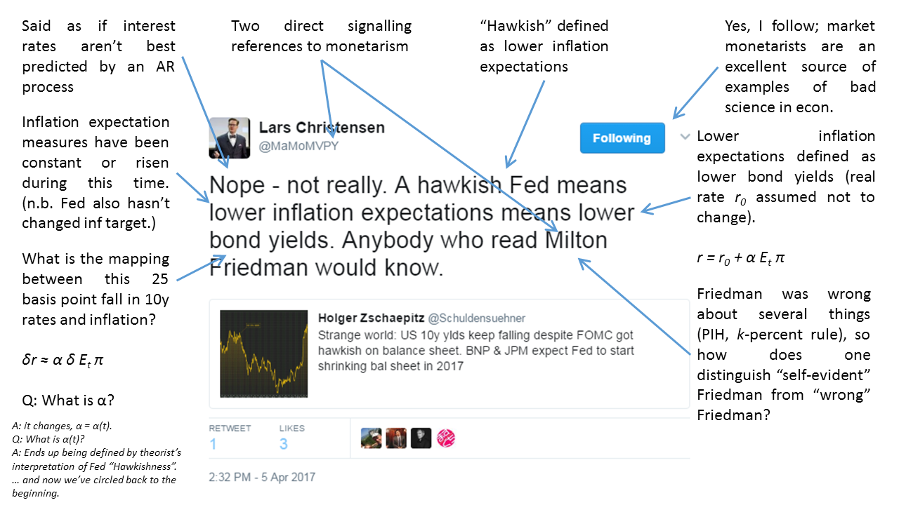

Lars Christensen's [tweet](https://twitter.com/MaMoMVPY/status/849736603861962757) about the slight fall in 10-year interest rates is a thing of beauty, if by beauty one means the smug security of a circular argument:

I thought his qualitative circular hand-waving theory that lacks the capacity for even an order of magnitude estimate for observable variables would be an excellent counterpoint to my update of [the quantitative 10-year interest rate model forecast](http://informationtransfereconomics.blogspot.com/2015/09/prediction-aggregation-redux.html) (where the performance has been tracked publicly since 2015):

