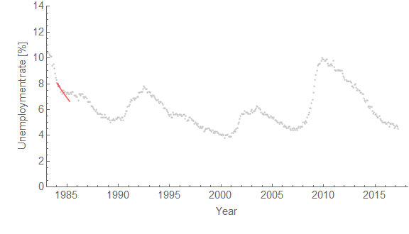

This is still a work in progress, but I put together a simple algorithm that forecasts unemployment and determines recessions via the [dynamic equilibrium model](http://informationtransfereconomics.blogspot.com/2017/01/dynamic-equilibrium-presentation.html) as the monthly data would have become available for the years 1984-2017. Data points for the previous month are released in the first week of the following month. The algorithm determines if the forecast is "good enough" (a tolerance that can be set), and if not it posits a shock.

The animation below shows this in action. The lines are the dates when the algorithm noticed there was a shock (these dates would have been November 1990, July 2001, and March 2008).

The gray dots are the data, and the blue ones are the data available at the time of the forecast (red line). That forecast goes one year ahead.

I definitely want to improve this a bit ‒ for example to use the estimated model error as an indicator of when to apply a shock instead of a fixed tolerance (or even optimize the tolerance value which I set at _δ_ log _u_ \= 0.2 because reasons ... dropping this to 0.19 \[1\] finds the recessions a month earlier). I also need to distinguish between a positive and a negative shock. But I thought it was neat and I try to be open with this research. Please excuse the sorry shape of the code when I put it up on GitHub (ed. [up now](http://informationtransfereconomics.blogspot.com/2017/02/information-equilibrium-code.html)).

[I asked on Twitter](https://twitter.com/infotranecon/status/851932277273616384) if anyone knew where to find out when the Fed or the US government noticed in real time whether there was a recession and am still waiting for input there. I did find [this article](http://www.nytimes.com/1990/09/26/business/when-is-it-a-recession.html) in the _New York Times_ from 26 September 1990:

> _At a time when many Americans believe that a recession has descended on the country, they are being told by Government officials to put their worries aside for the moment because other economic issues, mainly inflation, have to be dealt with first._ 

> _This message is coming from the Federal Reserve, but the Bush Administration is not openly challenging the thesis. And the top financial officials of the six other major industrial nations, meeting in Washington this week, have also declared that recession, or the threat of it, is still a second-rung issue. ..._ 

> _Millions of Americans, in particular, are experiencing unemployment, wage freezes, bankruptcies and falling real estate prices, and concluding that what they are living through constitutes a recession. How can their perception, reported in public opinion polls, differ so strikingly from that of the Federal Reserve and its counterparts elsewhere?_ 

> _The answer is that the central banks remain more worried by the threat of inflation than of recession, and that to ignore the inflationary dangers now will only mean a deeper recession later. ..._

[This article](http://www.nytimes.com/1990/11/16/business/bush-says-recession-is-possible.html) from 16 November 1990 (which is after the algorithm above would have noticed) notes that economists thought we were in or on the verge of a recession:

> _President \[G.H.W.\] Bush conceded for the first time tonight that the country might face a recession, but he said his economic advisers did not believe a long and severe one was in the offing. ..._

> _Most economists are saying that the economy, if not in a recession now, is on the verge of one._

As for July 2001, we have [this "quote of the day"](http://www.nytimes.com/2001/07/15/nyregion/quotation-of-the-day-253588.html) from Alan Blinder from the 15th (again, after the model would have noticed):

> _I'm worried about the consumer -- not putting away their wallets but using them a little less. It wouldn't take much downward movement in consumer spending to cause a recession._

As for March of 2008, Krugman's piece "[Partying Like It's 1929](http://www.nytimes.com/2008/03/21/opinion/21krugman.html)" came out at the end of that month as we were all watching the financial system collapsing in the wake of the bubble. Lehman had yet to fail, but Bear Stearns would fail (14-16 March 2008) about a week after the data point the algorithm above would use to predict a recession (7 March 2008).

...

**Update +4 hours**

_δ_ log _u_ \= 0.17 predicts recessions as of September 1990, April 2001, and December 2007 (better than above by 2 months, 3 months, and 3 months, respectively):

 ...

**Update +5 hours**

I just though this was fun:

...

**Footnotes:**

\[1\] I ran this again later with the new tolerance of 0.19:

