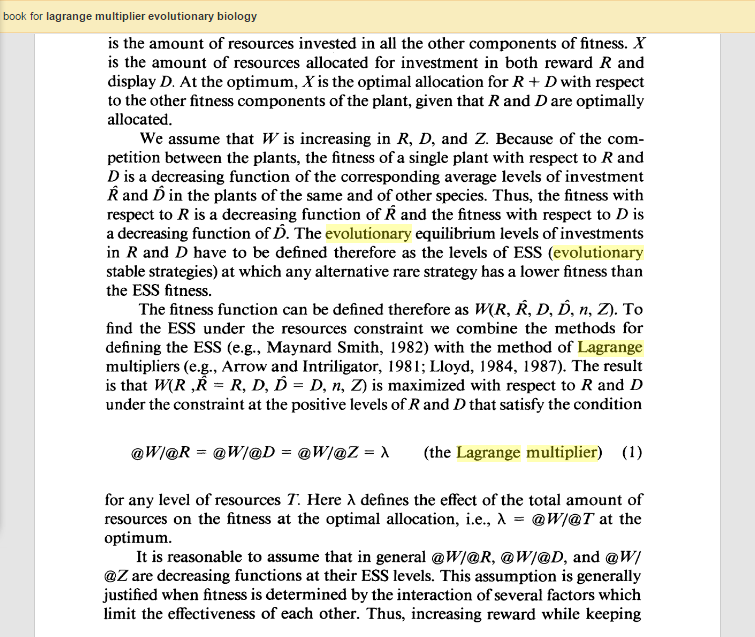

There's a certain vein of economic criticism that has a tendency to turn me right back into a defender of the mainstream status quo. An example of it was written by Kate Raworth and published [a couple of weeks ago in the Guardian](https://www.theguardian.com/global-development-professionals-network/2017/apr/06/kate-raworth-doughnut-economics-new-economics). Prof. Raworth begins by saying modern economics is born of "physics envy". To some degree this is true (Irving Fisher's thesis advisor was the physicist Willard Gibbs), but really modern economic methods were born of the incredibly useful [Lagrange multiplier approach](https://en.wikipedia.org/wiki/Lagrange_multiplier) that had its first applications in physics but is far more general. It basically provides a way of figuring out the optima of a function given complex constraints. In fact, it is so general, it's used in just about every scientific field including Raworth's ideal of evolutionary biology. Here's an example that took me a few seconds of Googling:

Raworth comments:

> _Their mechanical metaphor sounds authoritative, but it was ill-chosen from the start – a fact that has been widely acknowledged since the astonishing fragility and contagion of global financial markets was exposed by the 2008 crash. ... So if the economy is not best thought of as a mechanism that returns to equilibrium and follows fixed laws of motion, how should we think of it? Like the living world: it’s complex, dynamic and ever-evolving._

As I just showed, this "mechanical" metaphor also applies to evolutionary biology and ecosystems sometimes collapse so there goes that argument. I'd bet that there are a lot more examples if Raworth wanted to look into this more than not at all. Maybe her enthusiasm comes from some sort of false belief that evolutionary biology doesn't have a lot of math in it?

Her comments also reference the 2008 crash as if this somehow invalidates anything about mainstream economics. In order to say the 2008 crash could be foreseen, prevented, or mitigated _for certain_ using an evolutionary economics "gardening" \[1\] approach  requires a much more established and validated evolutionary macroeconomic theory than exists today. It's a bit like asking physicists why they didn't understand the [solar neutrino problem](https://en.wikipedia.org/wiki/Solar_neutrino_problem) before SNO and saying the answer is obvious but not providing any details of the requisite neutrino oscillation theory and evidence supporting it \[2\]. This issue with Raworth's "secret theory with secret evidence that supports it" reaches its zenith (nadir?) when she says:

> _The most pernicious legacy of this fake physics has been to entice generations of economists into a misguided search for economic laws of motion that dictate the path of development. People and money are not as obedient as gravity, so no such laws exist._

Either she has a secret theory with secret evidence, or has a time machine enabling her to see the future where this was either proven or humans all died off without finding them. More likely she is just repeating one of the age-old criticisms of science. "This system is too complex for your silly math" (or really that God/Zeus/whoever couldn't be constrained by human mathematical laws) was the same criticism leveled at the founding practitioners of science. People looked at nature and saw a mess; people did not believe it could be understood with simple laws and instead went with mythological explanations that used their intuition about human behavior. [Thales](https://en.wikipedia.org/wiki/Thales_of_Miletus) was one of the earliest known people to say that nature may well be messy, but it might be amenable to rational argument. Imagine if people had listened to an ancient Greek version of Raworth saying "nature is complex, so mathematics and geometry will be useless". 

Following Thales example, I refuse to listen to Raworth's completely unsupported claim that no laws of macroeconomics exist. I've called claims like Raworth's the "failure of imagination fallacy" (but is also known as an [argument from incredulity](http://rationalwiki.org/wiki/Argument_from_incredulity)). It is odd that this total pessimism can come from the same source as the unbridled (and unsupported) optimism for the evolutionary approach.

Like most scientists, I would totally get on board with "evolutionary economics" if it had some useful results or evidence in its favor. But paraphrasing [Daniel Davies](http://blog.danieldavies.com/2004/05/d-squared-digest-one-minute-mba.html): _Good ideas do not need lots of invalid arguments in order to gain public acceptance._

Again, [I've discussed this before](http://informationtransfereconomics.blogspot.com/2016/01/complexity-without-purpose-evolution-as.html) with regard to David Sloan Wilson.

**Footnotes:**

\[1\] Any time I hear the economist as gardener metaphor, it makes me think of this:

\[2\] For those that might have difficulty following my convoluted physics metaphor, the solar neutrino problem is the financial crisis, SNO is the experiment that eventually confirms whatever theory of the financial crisis is correct, and Raworth's evolutionary economics purports to be the confirmed neutrino oscillation theory. Raworth and other evolutionary economics proponents have not provided any evidence (or any theory for that matter) that their approach is useful or empirically accurate e.g. by showing they could prevent/mitigate/forecast the financial crisis before it happened or really explain any aspect of macroeconomic data at all.
