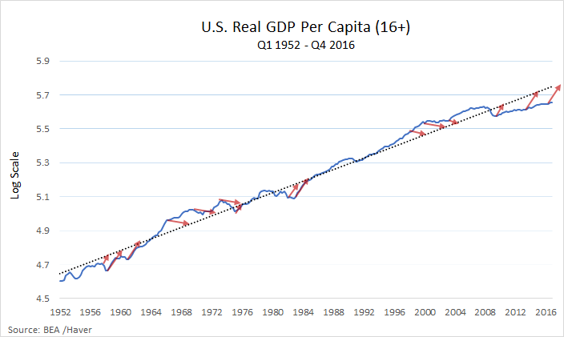
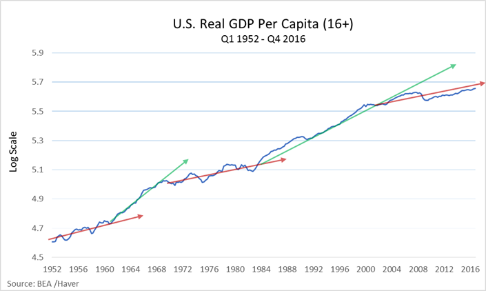
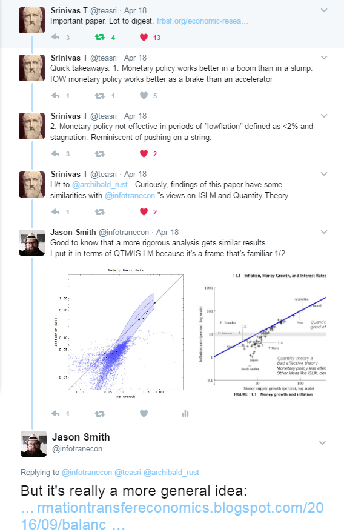

[David Andolfatto](http://andolfatto.blogspot.com/2017/04/the-st-louis-feds-macroeconomic-outlook.html?spref=tw) points out how different models frame the data:

> _What does Bullard have in mind when he speaks of a low-growth "regime?" The usual way of interpreting development dynamics is that long-run growth is more or less stable and that deviations from this stable trend represent "cyclical" mean-reverting departures from trend. And if it's "cyclical," then it's temporary--we should be forecasting reversion to the mean in the near future--like the red forecasting lines in the picture below. ... This view of the world can lead to a series of embarrassing forecast errors. Since the end of the Great Recession, for example, you would have forecast several recoveries, none of which have materialized.  ... But what if that's not the way growth happens? Suppose instead that growth occurs in decade-long spurts? Something like this \[picture\]. ..._

The two accompanying pictures are here:

As you can see, interpreting data depends on the underlying model. I've talked about this before, e.g. [here](http://informationtransfereconomics.blogspot.com/2017/03/the-recovery-and-using-models-to-frame.html) or [here](http://informationtransfereconomics.blogspot.com/2015/10/the-paradigm-dependence-of-productivity.html). Let's try another!

What about [dynamic equilibrium](http://informationtransfereconomics.blogspot.com/2017/01/dynamic-equilibrium-presentation.html) (see also [here](http://informationtransfereconomics.blogspot.com/2017/04/productivity-growth-and-verdoorns-law.html))? In that framework, we have a shock centered in the late 70s that hits both NGDP per capita (prime age) and the GDP deflator:

At this resolution, there is another shock to NGDP alone (although it might be visible in the deflator data, see [here](http://informationtransfereconomics.blogspot.com/2017/03/the-quantity-theory-of-labor-and.html), but it's not relevant to the discussion in this post). Note: I am talking about quantities per capita (prime age) so it should be understood if I leave off a p.c. in the following discussion. The figure shows the transition locations as well as the width (red). The NGDP p.c. transition is much wider than the deflator transition. Combining these (dividing the NGDP p.c. model by the deflator model), you get RGDP per capita:

The lines represent the "dynamic equilibrium" for RGDP p.c. made from the dynamic equilibria for NGDP p.c. minus the GDP deflator. I translated it up and down tot he maximum and minimum during the period as well as for recent times. You can see how the interaction between two Gaussian shocks of different widths give you an apparent fluctuating growth rate, which is what Bullard/Andolfatto see in the data:

It's actually just the mis-match between the NGDP shock and the GDP deflator shock ([likely due to women entering the workforce](http://informationtransfereconomics.blogspot.com/2017/02/nairu-and-other-connections-between.html)) that makes it look like different growth regimes when in fact there is just one. If the shocks to each measure were exactly equal, there'd be no change. Therefore it is entirely possible these "growth regimes" are just artefacts of mis-measuring the price level (deflator/inflation) data ‒ that a proper measurement of the price level would result in no changes (since NGDP and the deflator would be subject to the same shocks).

In fact, a LOESS smoothing (gray solid) of the RGDP growth data (blue) almost exactly matches the dynamic equilibrium (blue) result during the 70s and 80s:

In this graph the gray horizontal lines are at zero growth and the dynamic equilibrium growth rate (1.6%,  equal to the dynamic equilibrium growth rate of NGDP = 3.6% minus the dynamic equilibrium growth rate of the deflator/inflation = 2%). We can see that we were at the dynamic equilibrium in the 1950s and the early 2000s as well as today. The other times, we were still experiencing deviations due to the shock. 

I also show Andolfatto's 10-year annualized average growth rate (gray dotted), which basically matches up with a 10-year shifted version of the LOESS smoothing.

I'd previously talked about Bullard's regime-switching approach [here](http://informationtransfereconomics.blogspot.com/2016/06/regime-dependent-modeling-and-st-louis.html). In that post, I showed how the information equilibrium approach reverses the flow of the regime selection diagram. But I also talked about how the information equilibrium monetary models can be divided in to "high _k_" and "low _k_" regimes (_k_ is the information transfer index). High _k_ is essentially the [effective quantity theory of money for high inflation](http://informationtransfereconomics.blogspot.com/2017/03/belarus-and-effective-theories.html), whereas low _k_ means [the ISLM model is a good effective theory](http://informationtransfereconomics.blogspot.com/2016/02/the-is-lm-model-as-effective-theory-at.html) for low inflation (or we just have something more complex as I discuss in the quantity theory link). This means that monetary policy would be more effective in a high inflation environment than in a low inflation environment. I've also discussed ["lowflation" regimes](http://informationtransfereconomics.blogspot.com/2014/08/lowflation-is-meaningful-concept.html) before here.

This brings up another topic. On Twitter, [Srinivas](https://twitter.com/infotranecon/status/854376514225295360) pointed me to a new [SF Fed paper](http://www.frbsf.org/economic-research/files/wp2017-02.pdf) \[pdf\] on monetary policy effectiveness that comes to similar conclusions based on the data: there are low inflation regimes where monetary policy is less effective than in high inflation regimes.

Actually, as indicated by one of the graphs in my reply, I've been discussing this [since the first few months of this blog](http://informationtransfereconomics.blogspot.com/2013/06/which-is-failing-itm-or-qtm.html) (almost 4 years ago).

One difference between the inflation (i.e. _k_) regimes and Bullard's regimes is that there isn't "switching" so much as a continuous drift. You don't go from high _k_ to low _k_ in a short period, but rather continuously past through moderate _k_ values over a few decades.

Is there a way to connect lowflation to dynamic equilibrium? Well, one possibility is that we only have "high _k_" during shocks but we [lack enough macroeconomic data to be able to see this clearly](http://informationtransfereconomics.blogspot.com/2017/04/macroeconomics-has-no-equilibrium-data.html) – the shock from the first half of the post-war period has only faded out recently.

However, this would make more sense of the fact that all countries haven't reached low _k_ in the [partition function/ensemble/statistical equilibrium](http://informationtransfereconomics.blogspot.com/2016/09/balanced-growth-maximum-entropy-and.html) picture. It's a question that has floated around in the back of my mind for awhile ‒ ever since I put up this picture (from e.g. [here](http://informationtransfereconomics.blogspot.com/2014/06/output-and-price-level-behavior-across.html)):

The problem is evident in that light green US data as it comes from the Depression. That means the US was once at "low _k_", but then went to "high _k_" in the WWII and post-WWII era and has since steadily fallen back to low _k_. The problem is that while the ensemble approach [can handle the drift towards lower _k_ values](http://informationtransfereconomics.blogspot.com/2016/07/an-ensemble-of-labor-markets.html) (i.e. the expected value of _k_ falls in an ensemble of markets as the factors of production increase), the mechanism for increasing _k_ involves _ad hoc_ modeling (e.g. [exit/reset through wartime hyperinflation](http://informationtransfereconomics.blogspot.com/2013/09/exit-through-hyperinflation.html)).

However, what if shocks (in the dynamic equilibrium sense) reset _k_ to higher values (in the ensemble sense)? If we take this view, then there might be different growth "regimes", but they split into "normal" and "shock" periods (the red bands in the graphs above). The shock periods can have different dynamics depending on the shocks (e.g. the fluctuating RGDP due to the mis-match between the shock to the price level and the shock to NGDP). Outside of these periods, we have "normal" times characterized by e.g. a constant RGDP growth (the gray line described in the graph above).

_Which view is correct?_

Given the quality of the description of the data using the dynamic equilibrium model, I don't think Bullard's regimes capture it properly. We have a shock that includes both high and low growth, but the low growth regimes on either side of the shock (today and the 1950s) represent the "normal" dynamic equilibrium (the low RGDP growth period of the 1970s wasn't the dynamic equilibrium, but rather just a result of our measure of the GDP deflator and definition of "real" quantities). This is evident from the good match between the RGDP data and the theoretical curve that is just NGDP/GDPDEF (NGDP divided by the GDP deflator). NGDP and the deflator have one major shock in the 1970s that turns into a fluctuating growth rate simply because the difference of two Gaussians \[1\] with different widths fluctuates:

The two high growth regimes and the intervening low growth regime are simply due to this. Occam's razor would say that there is really just one shock \[2\] with different widths for the different observables centered in the late 70s instead of three different manifestations of two growth regimes (per Bullard).

**Footnotes:**

\[1\] The derivative of the step function in the dynamic equilibrium is approximately a Gaussian function (i.e. a normal distribution PDF), and when you divide NGDP by DEF and look at the log growth rate you end up with the difference of the two Gaussians.

\[2\] This is the same shock involved in interest rates, inflation, employment-population ratio, etc so we should probably attribute it to a single source instead of more complex models (at least without other information).
