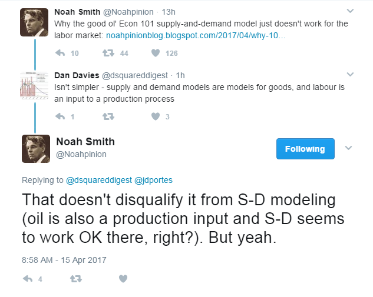

From [twitter](https://twitter.com/Noahpinion/status/853276315834646528):

> [_Noah Smith‏ @Noahpinion_](https://twitter.com/Noahpinion)
> _Why the good ol' Econ 101 supply-and-demand model just doesn't work for the labor market: [http://noahpinionblog.blogspot.com/2017/04/why-101-model-doesnt-work-for-labor.html …](https://t.co/beW8bIroWo)_ 

> [_Dan Davies‏ @dsquareddigest_](https://twitter.com/dsquareddigest)
> _Isn't simpler - supply and demand models are models for goods, and labour is an input to a production process_ 

> [_Noah Smith‏ @Noahpinion_](https://twitter.com/Noahpinion)
> _That doesn't disqualify it from S-D modeling (oil is also a production input and S-D seems to work OK there, right?). But yeah._

I don't think there could be a more perfect way to bring up the major difference in the information equilibrium model of supply and demand versus the normal understanding. I went into more detail about this [in this post](http://informationtransfereconomics.blogspot.com/2016/12/saving-scissors.html), but there is one observation I'd like to make here.

What we have is a model with two "scales". One is the time it takes for demand to adjust to changes in supply. The other is the time it takes for demand supply to adjust to changes in supply demand. Let's call these $t_{d \rightarrow s}$ and $t_{s \rightarrow d}$. We have three major scenarios:

In the first, demand moves faster (a shift in the demand curve). In the second, supply moves faster (a shift in the supply curve). In the third, we have adjustment back to "general equilibrium" as both have had a chance to adjust to each other.

According to [the information equilibrium condition](http://informationtransfereconomics.blogspot.com/2016/09/basic-definitions-in-information.html), we have (for concreteness talking about the labor market with aggregate demand $N$ (possibly from many factors) and labor supply $L$ with abstract price $p$):

$$ 
p \equiv \frac{\partial N}{\partial L} = \; k \frac{N}{L} 
$$

If $N = N(L, x, y, ...)$, then this has general solution:

$$ 
N(L, x, y, ...) \sim f(x, y, ...) \; L^{k} 
$$

but only when we look at time scales in the third regime where supply and demand adjust well before we observe the system. Note that this is precisely the form that operates as a production input for a Cobb-Douglas production function (see e.g. [here](http://ssrn.com/abstract=2894072)). In the other two regimes, we treat either $N$ or $L$ as approximately constant, which yields supply and demand curves (per [here](http://informationtransfereconomics.blogspot.com/2013/04/supply-and-demand-from-information.html) or [here](http://informationtransfereconomics.blogspot.com/2016/12/saving-scissors.html)).

So for long times $t \gg t_{N \rightarrow L}, t_{L \rightarrow N}$, we can treat $L$ as a production input. More labor means more output. However, in the case of the labor market, because the labor supply are people who buy stuff we might never have the first two regimes because adding to the labor force also adds aggregate demand.

And this is part of the point I was trying to make in [my very long short play](http://informationtransfereconomics.blogspot.com/2017/04/is-economics-scientific-short-play-in.html). Until you understand the scope of the theory or model under consideration, you're not really "doing science". Instead you are making _ad hoc_ theories like Noah and Dan above. _Labor is a production input, not a market good so supply and demand doesn't work. But oil is also a production input, and supply and demand works fine there._

Effectively, without the idea of model scope and scales, you're left with _sometimes supply and demand works and sometimes it doesn't_ which is totally unscientific. Now the information equilibrium picture may not be correct, but it shows at least one way you can understand this idea of "sometimes it works" in a much more scientific and rigorous way.

And that is the more general theme of my short play: (to me) there does not seem to be any real organizing principle for this situation among the hundreds of (macro)economic models. Sometimes you use a DSGE model. Sometimes it doesn't work. Sometimes you use a VAR model. Sometimes it doesn't work. [Olivier Blanchard](https://piie.com/blogs/realtime-economic-issues-watch/need-least-five-classes-macro-models) and [Dani Rodrik](https://www.project-syndicate.org/commentary/economists-versus-economics-by-dani-rodrik-2015-09) essentially try to make the question a question of methodology. You should use certain models in certain situations or for certain questions. But really it's a question for the models themselves (well, the model's authors). A DSGE model should tell you about its own scope. If it fails to perform within that scope, then it should be rejected.

**_And this is where the math comes in_** because it shouldn't be economists just declaring the model's scope by fiat (that's what Blanchard is basically doing in his blog post, but not even about specific models but rather **for whole classes of models** ‒ to borrow a phrase from the British, _it does my head in_). You should show how the scope conditions apply due to the mathematical assumptions. In the information equilibrium model above, you can literally only [derive the supply and demand curves mathematically](http://informationtransfereconomics.blogspot.com/2013/04/supply-and-demand-from-information.html) by making assumptions about how fast supply and demand change (i.e. setting scope conditions). There are no supply and demand curves if we ignore the scope conditions listed above, only production functions.

...

PS I am not in any way saying adjustment time is the proper or even only scope condition. This is just one of the simplest ‒ i.e. something that should be taught in Econ 101 as an example, but in graduate school you move on to more complicated models.

...

**Update:** [There are some simulation animations here](http://informationtransfereconomics.blogspot.com/2016/04/simulations-with-supply-demand-and.html) of these two regimes. The simulation below shows a case where demand adjusts a bit slower to an increase in supply resulting in a fall in the price:

Over time ($t \gg t_{d \rightarrow s}, t_{s \rightarrow d}$) we return to the production input view where $D \sim S^{k}$ and $P \sim S^{k-1}$.

**Update, the second:** I should add that there is a fourth regime, but it's trivial:

$$ 
t_{d \rightarrow s}, t_{s \rightarrow d} \gg t 
$$
In this regime, nothing happens.
