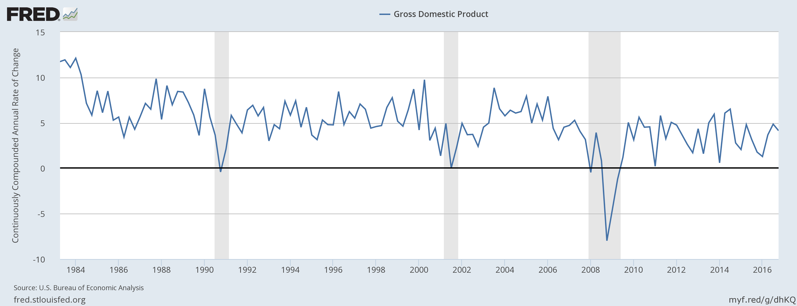

About six months ago, [I applied](http://informationtransfereconomics.blogspot.com/2016/10/parsing-macrohistory-database-principal.html) a simple principal component analysis to the "macrohistory database" \[1\] and [made some observations](http://informationtransfereconomics.blogspot.com/2016/10/parsing-macrohistory-database-for.html). That focused mostly on interest rates. Today the focus of this quick post is CPI inflation:

The major component has three major bumps associated with WWI, WWII, and the so-called "[Great Inflation](http://www.federalreservehistory.org/Period/Essay/13)":

What is interesting is that really only the Great Inflation is represented in the long term nominal interest rate principal component:

One last note: as I was writing this post, I read [Simon Wren-Lewis' post](https://mainlymacro.blogspot.com/2017/04/economists-as-medics.html) that contained a graph that makes for an interesting juxtaposition ‒ banking crises:

Most analysis points to the post-Depression regulatory environment, but what if it was just rising inflation and interest rates? These occur in an environment of strong/increasing nominal growth \[2\]:

That is to say, what if the explanation for the lack of financial crises was simply strong growth? This might turn the causality pointed to in _[This Time Is Different](http://www.reinhartandrogoff.com/)_ on its head. Whereas many analyses point to low growth in the aftermath of financial crises (even to the point of [adding financial frictions to DSGE models](http://noahpinionblog.blogspot.com/2013/05/dsge-financial-frictions-macro-that.html)), the reverse causality might be at play. High growth may prevent financial crises, and the low growth seen in the "aftermath" of financial crises may just be the low/declining growth environment that already existed.

Some people see the post-crisis growth in the US as a "new normal" of lower growth, but the fact is that there has been a long term trend towards lower nominal growth rates:

Is the importance of banking and financial sectors just [economic analysis in search of a narrative again](http://informationtransfereconomics.blogspot.com/2016/11/a-list-of-usupported-narratives-in.html)?

**Update + 30 minutes**

As I mentioned [on twitter](https://twitter.com/infotranecon/status/850426606044577793), we call the difference "real growth". But is there really much of a difference taking into account measurement error? In an information equilibrium (IE) model (e.g. [the quantity theory of labor and capital](http://informationtransfereconomics.blogspot.com/2017/03/improved-quantity-theory-of-labor-and.html)), if we have an [IE relationship](http://informationtransfereconomics.blogspot.com/2016/09/basic-definitions-in-information.html) _CPI : NGDP ⇄ X_, then if the growth rate of _CPI_ is _π_, the growth rate of _NGDP_ is _γ_, and the growth rate of _X_ is _ξ_, then

_γ = k ξ_
_π = (k − 1) ξ = ((k − 1)/k) γ_

_γ_ _−_ _π =_ _k ξ_ _−_ _(k − 1) ξ =_ _ξ = (1/__k)_ _γ =_ _(1/(k − 1))_ _π_

There are really only two things one needs to know: one growth rate (_ξ,_ _γ ,_ or _π_) and one scaling factor (_k_).

...

**Footnotes:**

\[1\] Òscar Jordà, Moritz Schularick, and Alan M. Taylor. 2017. “Macrofinancial History and the New Business Cycle Facts.” in NBER Macroeconomics Annual 2016, volume 31, edited by Martin Eichenbaum and Jonathan A. Parker. Chicago: University of Chicago Press.

[http://www.macrohistory.net/data/#DownloadData](http://www.macrohistory.net/data/#DownloadData)

\[2\] Here is the principal component analysis of nominal growth from the same database:

This is fairly similar to the inflation picture; the major features are WWI, the Great Depression, WWII, the "Great Inflation", and the global financial crisis.
