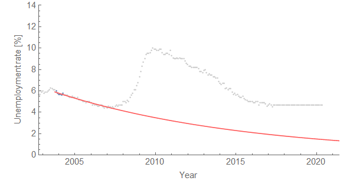

Continuing with [my post from yesterday](http://informationtransfereconomics.blogspot.com/2017/04/determining-recessions-with-algorithm.html) about using the dynamic equilibrium model to build an algorithm to try and forecast recessions in real time, I thought of a potential conditional forecast for the future. The idea is that if the unemployment rate doesn't change (in this case from the average of the last three available measurements), when does the algorithm posit that some sort of shock must have happened? It's probably easiest to see with  a picture:

What this algorithm is saying is that the data either has to start falling before June of 2018 (data available first week of July) or else there is a potential recession (i.e. the unemployment rate rises). This is generally consistent [with the other forecasting approach](http://informationtransfereconomics.blogspot.com/2017/04/unemployment-rate-conditional-forecast.html) where I assume there is a shock (note that the result above also implies that the FRBSF forecast at the link will be shown to be wrong in late 2018).

As a side note, the above result constrains the dynamic equilibrium (the slope, or rate of recovery) as opposed to the results from yesterday. This is a somewhat heavy-handed way of implementing a check to see if the latest model parameters start to strongly affect the fiit to previous data. If this wasn't done, the dynamic equilibrium starts to change once we reach the constant portion of the data, and the description of the data from before 2008 starts to get worse as the model starts to think the dynamic equilibrium is zero (the slope of the constant portion). In a sense, without constraining the rate of recovery (per the dynamic equilibrium model), the algorithm decides not to add a shock in 2018, but rather change the very good description of the data from 2005.

Anyway, here are both formats of the animations:

