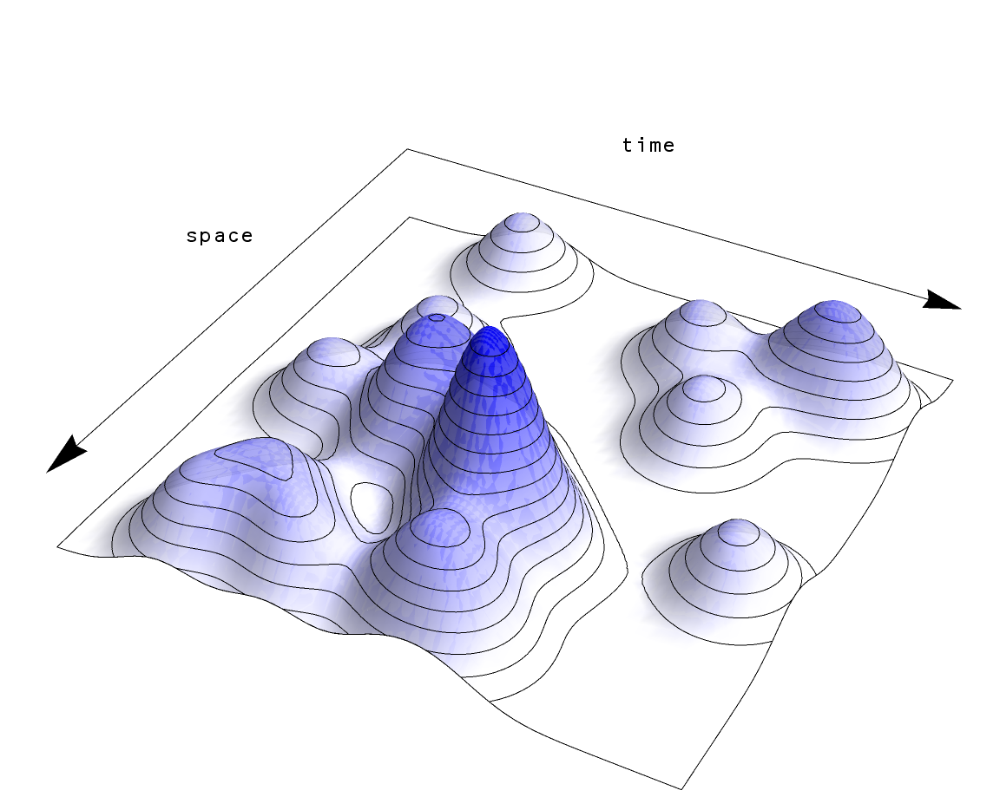

\[**Update:** A (in my opinion, better) version of this blog post has been reprinted as [an article at _Evonomics_.](http://evonomics.com/hayek-meets-information-theory-fails/)\]

[Vox talked](https://www.vox.com/2017/4/19/15356534/chris-hayes-donald-trump-media-elections-2016-criminal-justice) with Chris Hayes of MSNBC in one of their podcasts. One of the topics that was discussed was neoclassical economics:

> _\[Vox:\] The center-of-right ideas the left ought to engage\[?\]_ 

> _\[Hayes:\] The entirety of the corpus of Hayek, Friedman, and neoclassical economics. I think it’s an incredibly powerful intellectual tradition and a really important one to understand, these basic frameworks of neoclassical economics, the sort of ideas about market clearing prices, about the functioning of supply and demand, about thinking in marginal terms._ 

> _I think the tradition of economic thinking has been really influential. I think it's actually a thing that people on the left really should do — take the time to understand all of that. There is a tremendous amount of incredible insight into some of the things we're talking about, like non-zero-sum settings, and the way in which human exchange can be generative in this sort of amazing way. Understanding how capitalism works has been really, really important for me, and has been something that I feel like I'm a better thinker and an analyst because of the time and reading I put into a lot of conservative authors on that topic._

I can hear some of you asking: _Do I have to?_

The answer is: _No._

Why? Because you can get the same understanding while also understanding where these ideas fall apart ‒ that is to say understanding the limited _scope_ of neoclassical economics – using information theory.

**Prices and Hayek**

One thing that I think needs to be more widely understood is that Hayek did have some insight into prices having something to do with information, but got the details wrong. He saw market prices aggregating information; a crop failure, a population boom, speculating on turning rice into ethanol ‒ these events would cause food prices to increase, and that price change represented knowledge about the state of the world being communicated. However, Hayek was writing in a time before communication theory (Hayek's _The Use of Knowledge in Society_ was written in 1945, a few years before Shannon's _A Mathematical Theory of Communication_ in 1948). The issue is evident in my list. The large amount of knowledge about biological or ecological systems, population, and social systems are all condensed into a single number that goes up. Can you imagine the number of variables you'd need to describe crop failures, population booms, and market bubbles? Thousands? Millions? How many variables of information do you get out via the price of rice the market? One.

What we have is a complex multidimensional space of possibilities that is being compressed into a single dimensional space of possibilities (i.e. prices), therefore if the price represents information aggregation, we are losing a great deal of it in the process. As I talk about in more detail [here](http://informationtransfereconomics.blogspot.com/2015/03/the-price-system-as-communication.html), one way neoclassical economics deals with this is to turn that multidimensional space into a single variable (utility), but that just means we've compressed all that information into something else (e.g. non-transitive or unstable preferences). 

However we can re-think the price mechanism's relationship with information. Stable prices mean a balance of crop failures and crop booms (supply), population declines and population booms (demand), speculation and risk-aversion (demand). The distribution of demand for rice is equal to the distribution of the supply of rice (see the pictures above: the transparent one is the "demand", the blue one is the "supply"). If prices change, the two distributions would have to have been unequal. If they come back to the original stable price ‒ or another stable price ‒ the two distributions must have become equal again. That is to say prices represent information about the differences (or changes) in the distributions. Coming back to a stable means information about the differences in one distribution must have flowed (through a communication channel) to the other distribution. We can call one distribution _D_ and the other _S_ for supply and demand. The price is then a function of changes in _D_ and changes in _S_, or

_p = f(ΔD, ΔS)_

Note that we observe that an increase in _S_ that's bigger than an increase in _D_ generally leads to a falling price, while an increase in _D_ that is bigger than the increase in S generally leads to a rising price. That means we can try

_p = ΔD/ΔS_

for our initial guess. Instead of a price aggregating information, we have a price detecting the flow of information. Constant prices tell us nothing. Price changes tell us information has flowed (or been lost) between one distribution and the other.

This picture also gets rid of the dimensionality problem: the distribution of demand can be as complex and multidimensional (i.e. depend on as many variables) as the distribution of supply.

**Marginalism and supply and demand**

Marginalism is far older than Friedman or Hayek, going back at least to Jevons and Marshall. [In his 1892 thesis](http://informationtransfereconomics.blogspot.com/2014/08/fishers-proto-information-transfer.html), Irving Fisher tried to argue that if you have gallons of one good _A_ and bushels of another good _B_ that were exchanged for each other then the last increment (the margin) was exchanged at the same rate as _A_ and _B_, i.e.

_ΔA/ΔB = A/B_

calling both sides of the equation the price of _B_ in terms of _A_. Note that the left side is our price equation above, just in terms of _A_ and _B_ (you could call _A_ the demand for _B_). In fact, we can get a bit more out of this equation if we say

_pₐ = A/B_

If you hold _A = A₀_ constant and change _B_, the price goes down. For fixed demand, increasing supply causes prices to fall – a demand curve. Likewise if you hold _B = B₀_ constant and change _A_, the price goes up – a supply curve. However if we take tiny increments of _A_ and _B_ and use a bit of calculus (_ΔA/ΔB →dA/dB_) the equation only allows _A_ to be proportional to _B_. It's quite limited, and Fisher attempts to break out of this by introducing marginal utility. However, thinking in terms of information can again help us.

If we think of our distribution of _A_ and distribution of _B_ (like the distribution of supply and demand above), each "draw" event from those distributions (like a draw of a card,a flip of a coin, or roll of a die) contains _I₁_ information (i.e. a flip of a coin contains 1 bit of information) for _A_ and _I₂_ for _B_. If the distribution of _A_ and _B_ are in balance ("equilibrium"), each draw event from each distribution (a transaction event) will match in terms of information. Now it might cost two or three gallons of _A_ for each bushel of _B_, so the numbers of of draws on either side will be different in general but as long as the number of draws is large the total information from those draws will be the same:

_n₁ I₁ = n₂ I₂_

We'll call _I₁/I₂ = k_ for convenience so that

_k n₁ = n₂_

Now say the smallest amount of _A_ is _ΔA_ and likewise for _B_. That means

_n₁ = A/ΔA_

_n₂ = B/ΔB_

i.e. the number of gallons of _A_ is the amount of _A_ (i.e. _A_) divided by 1 gallon of _A_ (i.e. _ΔA_). Putting this together and re-arranging a bit we have

_ΔA/ΔB = k A/B_

This is just Fisher's equation again except there's a coefficient in it, making the result a bit more interesting when you use tiny increments (_ΔA/ΔB →dA/dB_) and use calculus. But there's a more useful bit of understanding you get from this approach that you don't get from neoclassical economics. What we have is information flowing between _A_ and _B_ and we've assumed that information transfer is perfect. But markets aren't perfect, and all we can really say is that the most information that gets from the distribution of _A_ to the distribution of _B_ is all of the information in the distribution of _A_. Basically

_n₁ I₁ ≥ n₂ I₂_

Following this through the derivation above, we find

_p = ΔA/ΔB ≤ k A/B_

The real prices in a real economy will fall **_below_** the neoclassical prices. There's also another assumption in that derivation – that the number of transaction events is large. So even if the information transfer was ideal, neoclassical economics only applies in markets that are frequently traded. 

Another insight we get is that supply and demand doesn't always work in the simple way described in Marshall's diagrams. We had to make the assumption that _A_ or _B_ was relatively constant while the other changed. In many real world examples [we can't make that assumption](http://informationtransfereconomics.blogspot.com/2017/04/its-production-input-no-its-market-good.html). A salient one today is (empirically incorrect) claim that immigration lowers wages. A naive application of supply and demand (increase supply of labor lowers the price of labor) ignores the fact that more people means more people to buy goods and services produced by labor. Thinking in terms of information, it is impossible to say that you've increased the number of labor supply events without increasing the number of labor demand events so A and B must both increase.

Instead of the neoclassical picture of ideal markets and simple supply and demand, we have the picture the left (and to be fair many economists) tries to convey of not only market failures and inefficiency but more complex interactions of supply and demand. However, it is also possible through collective action to mend or mitigate some of these failures. We shouldn't assume that just because a market spontaneously formed or produced a result it is working, and we shouldn't assume that because a price went up either demand went up or supply went down.

**The market as an algorithm**

The picture above is of a market as an algorithm matching distributions by raising and lowering a price until it reaches a stable price. In fact, this picture is of a specific machine learning algorithm called [Generative Adversarial Networks](https://en.wikipedia.org/wiki/Generative_adversarial_networks) (GAN, described in this [Medium article](https://medium.com/@devnag/generative-adversarial-networks-gans-in-50-lines-of-code-pytorch-e81b79659e3f) or [in the original paper](https://arxiv.org/abs/1406.2661)). The idea of the market as an algorithm to solve a problem is not new. For example [one of the best blog posts of all time](http://crookedtimber.org/2012/05/30/in-soviet-union-optimization-problem-solves-you/) uses linear programming as the algorithm, giving an argument for why planned economies will likely fail, but the same reasons imply we cannot check the optimality of the market allocation of resources (therefore claims of markets as optimal are entirely faith-based). The Medium article uses a good analogy that I will repeat here:

Instead of the complex multidimensional distributions we have paintings. The "supply" _B_ is the forged painting, the demand _A_ is the "real" painting. Instead of the random initial input, we have the complex, irrational, entrepreneurial, animal spirits of people. The detective is the price _p_. When the detective can't tell the difference between the paintings (i.e. when the price reaches a relatively stable value because the distributions are the same), we've reached our solution (a market equilibrium). 

Note that the problem the GAN algorithm tackles can be represented two-player [minimax game](https://en.wikipedia.org/wiki/Minimax) from game theory. The thing is that with the wrong settings algorithms fail and you get garbage. I know from experience in my regular job researching machine learning, sparse reconstruction, and signal processing algorithms. So depending on the input data (i.e. human behavior), we shouldn't expect to get good results all of the time. These failures are exactly the failure of information to flow from the real painting to the forger through the detective – the failure for information from the demand to reach the supply via the price mechanism.

**An interpretation of neoclassical economics for the left**

The understanding of neoclassical economics provided by information theory and machine learning algorithms is better equipped to understand markets. Ideas that were posited as articles of faith or created through incomplete arguments by Hayek and Friedman are not the whole story and leave you with no knowledge of the ways the price mechanism, marginalism, or supply and demand can go wrong. In fact, leaving out the failure modes effectively declares many of the concerns of the left moot by fiat. The potential and actual failures of markets are a major concern of the left, and are frequently part of discussions of inequality and social justice.

The left doesn't need to follow Chris Hayes advice and engage with Hayek, Friedman, and the rest of neoclassical economics. The left instead needs to engage with a real world vision of economics that recognizes its potential failures. Understanding economics in terms of information flow is one way of doing just that.

...

**Update 26 April 2017**

I must add that the derivation of the information equilibrium condition (i.e. _d__A/dB = k A/B_) is originally [from a paper](https://arxiv.org/abs/0905.0610) by Peter Fielitz and Guenter Borchardt and applied to physical systems. The paper is always linked in the side bar, but it doesn't appear on mobile devices.
