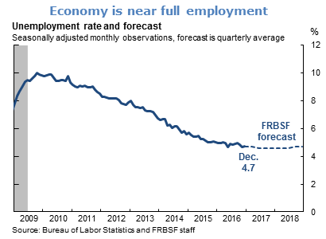

The new unemployment rate data is out, and it doesn't help distinguish between the two paths (one \[gray\] assumed a new recession is coming, one \[red\] doesn't, hence the "conditional"):

The previous update is [here](http://informationtransfereconomics.blogspot.com/2017/03/comparing-unemployment-forecast-to.html). There's also a [head-to-head with the FRBSF](http://informationtransfereconomics.blogspot.com/2017/01/unemployment-forecasts.html) which predicts a flat unemployment rate:

