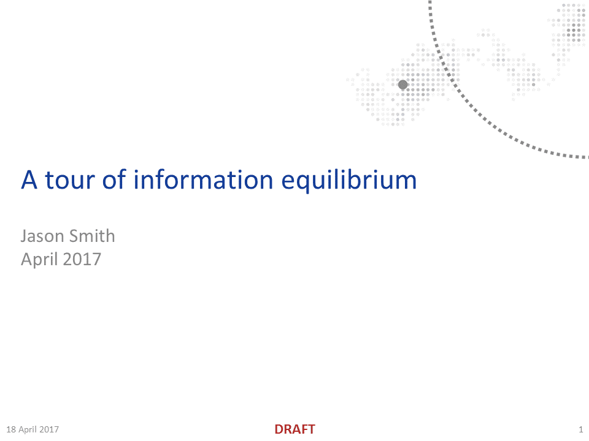
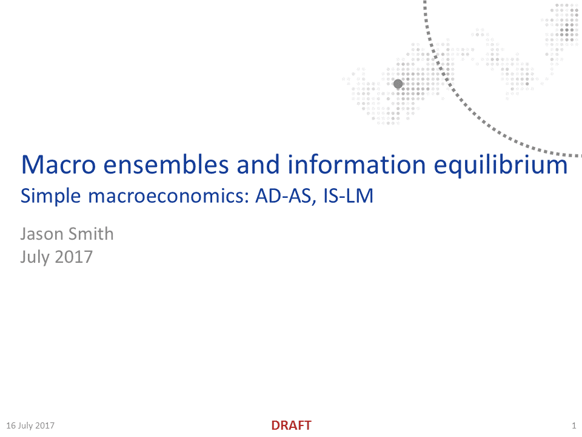
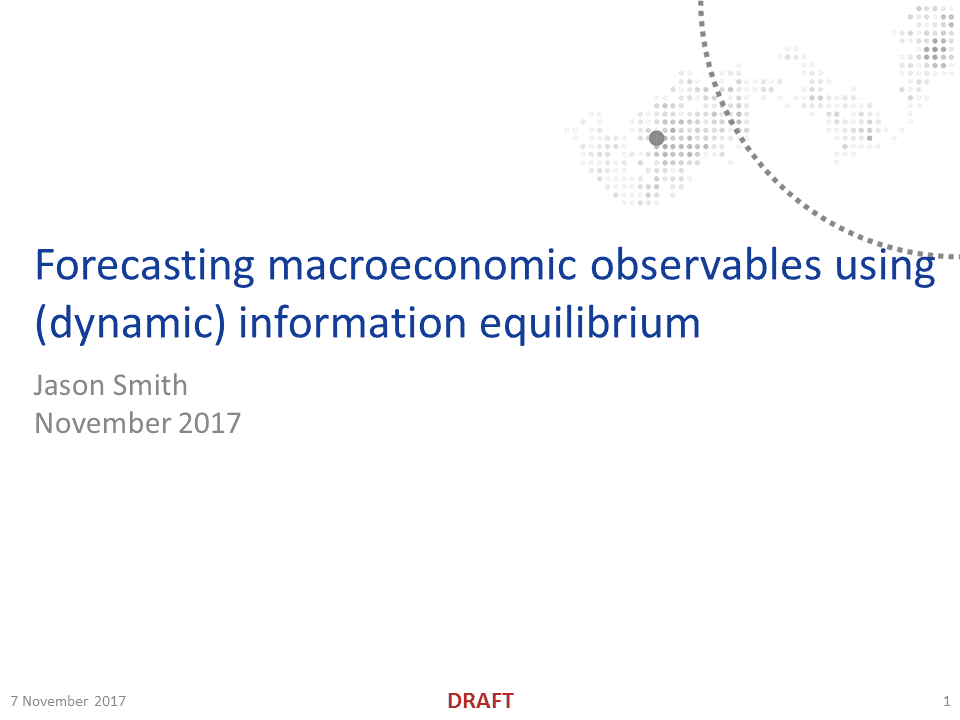
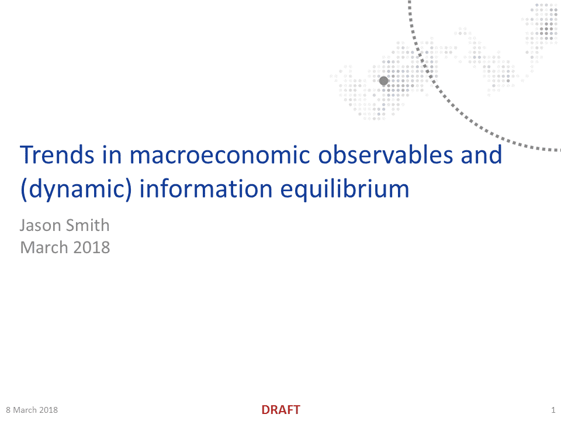
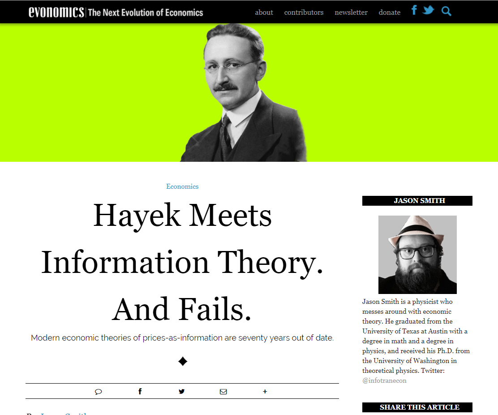
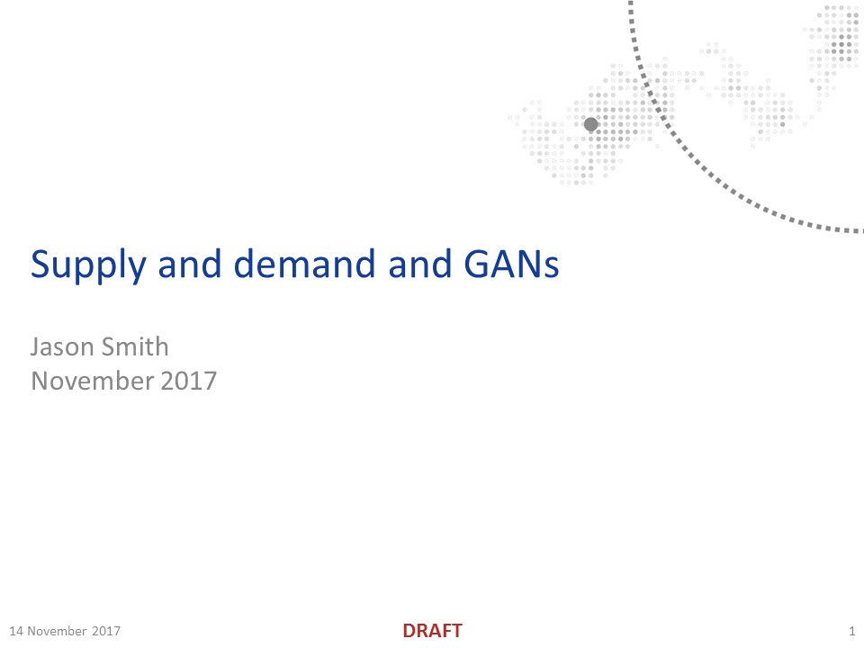
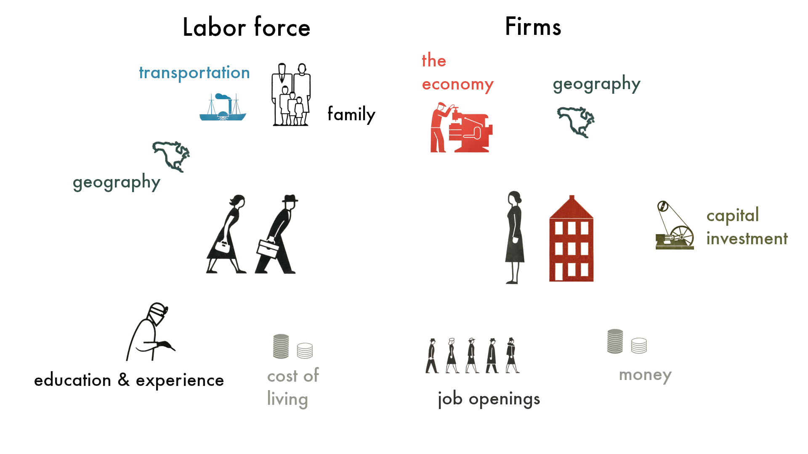

Originally formulated by physicists Peter Fielitz and Guenter Borchardt for natural complex systems, [information equilibrium](https://arxiv.org/abs/0905.0610) \[arXiv:physics.gen-ph\] is a potentially useful framework for understanding many economic phenomena. Here are some additional resources:

_A tour of information equilibrium_

Slide presentation (51 slides)

\[[download pdf](https://drive.google.com/open?id=0B6qAxdK1gOgwTlVkVkNhN3gtMU0)\], \[[slide images](http://informationtransfereconomics.blogspot.com/2017/04/a-tour-of-information-equilibrium.html)\]

_Dynamic equilibrium and information equilibrium_

Slide presentation (19 slides)

\[[download pdf](https://drive.google.com/file/d/0B6qAxdK1gOgwZjgydjhYTHpQa2c/view?usp=sharing)\], \[[slide images](http://informationtransfereconomics.blogspot.com/2017/01/dynamic-equilibrium-presentation.html)\]

_Maximum entropy and information theory approaches to economics_

Slide presentation (27 slides)

\[[download pdf](https://drive.google.com/file/d/0B6qAxdK1gOgwbndmdTB5dFY0ZDA/view?usp=sharing)\], \[[slide images](http://informationtransfereconomics.blogspot.com/2016/02/slides.html)\]

_Information equilibrium as an economic principle_

Pre-print/working paper (44 pages)

\[[arXiv:q-fin.EC](http://arxiv.org/abs/1510.02435)\], \[[SSRN](http://ssrn.com/abstract=2894072)\], \[[EconPapers:RePEc](http://econpapers.repec.org/RePEc:arx:papers:1510.02435)\]

...

**Update 27 July 2017**

_Macro ensembles and information equilibrium_
_Simple macroeconomics: AD-AS, IS-LM_

Slide presentation (29 slides)

\[[download pdf](https://drive.google.com/open?id=0B6qAxdK1gOgwcU1BYVdhODZWWVE)\], \[[slide images](http://informationtransfereconomics.blogspot.com/2017/07/presentation-macroeconomics-and.html)\], \["[Twitter talk](https://twitter.com/infotranecon/status/928717075291320320)"\]

...

**Update 28 December 2017**

_Forecasting macroeconomic observables using (dynamic) information equilibrium_

Slide presentation (36 slides)

\[[download pdf](https://drive.google.com/open?id=1zCqJtnUd4_IA0Q-mFC0RvkMudJBDuI6a)\], \[[slide images](http://informationtransfereconomics.blogspot.com/2017/11/presentation-forecasting-with.html)\], \["[Twitter talk](https://twitter.com/infotranecon/status/928028648115810305)"\]

...

**Update 01 January 2018**

_Maximum entropy and information theory approaches to economics_
Pre-print/working paper (21 pages)
\[[SSRN](https://papers.ssrn.com/sol3/papers.cfm?abstract_id=3094757)\]

...

**Update 2 April 2018**

_Trends in macroeconomic observables and (dynamic) information equilibrium_

Slide presentation (22 slides)

\[[download pdf](https://drive.google.com/file/d/1Hsln5HOo_cC6jhCe8YiUFBTs7A9h0Lpm/view?usp=sharing)\], \["[Twitter talk](https://twitter.com/infotranecon/status/971881574810533890)"\], \[[page link](https://informationtransfereconomics.blogspot.com/2018/03/trends-in-macro-observables-twitter.html)\]

...

**Update 6 October 2018**

_Information equilibrium and economics: Applications of maximum entropy information theory_

Presented at the "Outside the Box" workshop
at the UW Economics department 5 October 2018
Slide presentation (67 slides)

\[[download pdf](https://drive.google.com/file/d/1EidnlruyMBbXjJ00WMnzNC__pzdW2TeH/view?usp=sharing)\], \[[download pptx](https://drive.google.com/file/d/1MgB8qQ4cDzN83MFOHEwD20gOWt-MA3qX/view?usp=sharing)\], \["[Twitter talk](https://twitter.com/infotranecon/status/1076572663261188096)"\], \[[page link](https://informationtransfereconomics.blogspot.com/2018/10/outside-box-workshop.html)\]

...

**For a general audience:**

_A random physicist takes on economics_
2017 e-Book and Paperback (133 pages)
\[[book website](http://www.arandomphysicist.com/)\]

_A Workers' History of the United States 1948-2020_
2019 e-Book and Paperback (138 pages)
\[[book website](http://www.arandomphysicist.com/)\]

_Hayek Meets Information Theory. And Fails._
Evonomics article (3500 words)
\[[evonomics.com](http://evonomics.com/hayek-meets-information-theory-fails/)\]

_Supply and demand and GANs_
Slide presentation/twitter talk (9 "slides")
\["[Twitter talk](https://twitter.com/infotranecon/status/930541889446490112)"\]

_Information equilibrium_
Slide presentation/twitter talk (16 "slides")
\["[Twitter talk](https://twitter.com/infotranecon/status/1217533581125287937)"\], \[[slide images](https://informationtransfereconomics.blogspot.com/2020/01/twitter-talk-slides-information.html)\]
