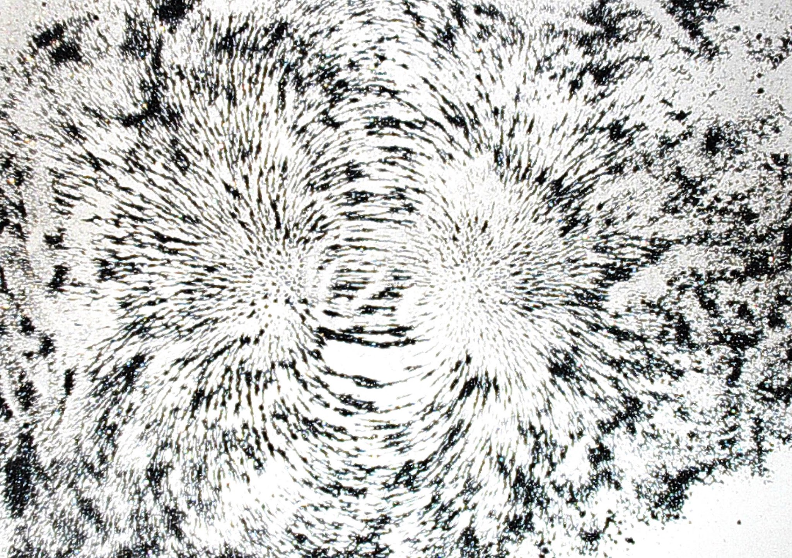
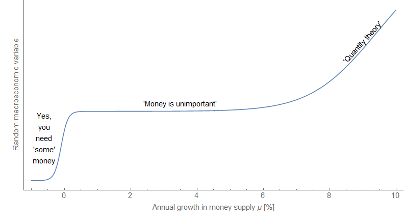

I have a novel theory for why all the discussions of "money" in macroeconomics don't seem to go anywhere. Aside from cases of really high inflation (the only cases with [any empirical support of money having a macroeconomic effect](http://informationtransfereconomics.blogspot.com/2017/03/belarus-and-effective-theories.html)), money doesn't matter. It doesn't matter what it is. It doesn't matter what it does. It doesn't matter if it's base money or MZM. It doesn't matter how it's created. It doesn't matter how it's destroyed.

It simply doesn't matter.

Money is a proxy for our human behaviors in the economic sphere. It's like the iron filings conforming to the magnetic fields, or the smoke in a wind tunnel test. It's not doing anything; we're doing things.

Let me back this up with a few aspects of the information transfer model.

First, it is basically a mathematical identity to insert money that mediates transactions into an information equilibrium ([definition](http://informationtransfereconomics.blogspot.com/2016/09/basic-definitions-in-information.html)) condition. If you have _A_ ⇄ _B_ then _A_ ⇄ _M_ ⇄ _B_ [is just a chain rule and use of _M_/_M_ = 1 away](http://informationtransfereconomics.blogspot.com/2015/05/money-defined-as-information-mediation.html).

Second, most recessions and other shocks involve [non-ideal information transfer](http://informationtransfereconomics.blogspot.com/2015/03/non-ideal-information-transfer-tail.html) ([definition](http://informationtransfereconomics.blogspot.com/2016/09/basic-definitions-in-information.html)). It is caused by [correlation of agents in state space](http://informationtransfereconomics.blogspot.com/2015/10/economics-as-and-versus-social-science.html) (if agents were uncorrelated and fully exploring the state space, you'd have ideal information transfer). Money wouldn't correlate in state space without agents (in fact, if we had just mindless sources and sinks of money, macroeconomics would just be thermodynamics). Money in cases of non-ideal information transfer is just an indicator dye along for the ride reeling about with the non-equilibrium dynamics of human behavior.

And finally, what about those high inflation cases? In those cases we have empirical evidence that money is tied to inflation, so how can you say it doesn't matter? Well if we think of money _M_ [as a factor of production](http://informationtransfereconomics.blogspot.com/2016/09/balanced-growth-maximum-entropy-and.html) (along with labor _L_ and other factors) we have 

(1) log _P_ ~ ⟨α − 1⟩ log _L_ \+ ... + ⟨β − 1⟩ log _M_

where _P_ is the price level. If money grows at a rate μ, and labor at a rate λ, then we have

(2) π ~ ⟨α − 1⟩ λ + ... + ⟨β − 1⟩ μ

If m is large and π is large \[1\], we can approximate the equation with just 

(3) π ~ ⟨β − 1⟩ μ

which is basically the quantity theory of money. That's a relatively trivial role for money, however. [And empirically](http://informationtransfereconomics.blogspot.com/2017/03/belarus-and-effective-theories.html), a trivial relationship is what we see for high inflation (over 10%). 

For most modern economies, inflation dynamics are more likely demographic (see [here](http://www.interfluidity.com/v2/4706.html) or [here](http://informationtransfereconomics.blogspot.com/2017/02/nairu-and-other-connections-between.html)) or due to other shocks (e.g. [oil](http://informationtransfereconomics.blogspot.com/2016/09/paul-romer-on-volcker-disinflation.html)). Basically, that means the other terms in Eq. (2) are more important than the money term.

Overall, we have a series of trivial (math identity, quantity theory) or non-causal ("iron filings") relationships between money and macroeconomics. In most of the policy-relevant scenarios (recessions, modern moderate inflation economies), money doesn't really matter \[2\].

...

**Update 29 May 2017**

This is mostly for commenter Shocker below, but I think this post has been generally misinterpreted to mean we don't need money **_at all_**. My thesis is that we don't need money to explain modern moderate inflation economies or to implement economic policy. Only in trivial scenarios (e.g. high inflation, or no money at all) does it have an impact. Graphically:

This is to say that for policy relevant scenarios in modern moderate inflation economies, for random macroeconomic variable _R_ and money supply _M_:

_∂R/∂M ≈ 0_

...

\[1\] If π is small, then we must have a large cancellation.

\[2\] E.g. [India's demonetization](http://informationtransfereconomics.blogspot.com/2017/03/indias-demonetization-and-model-scope.html).
