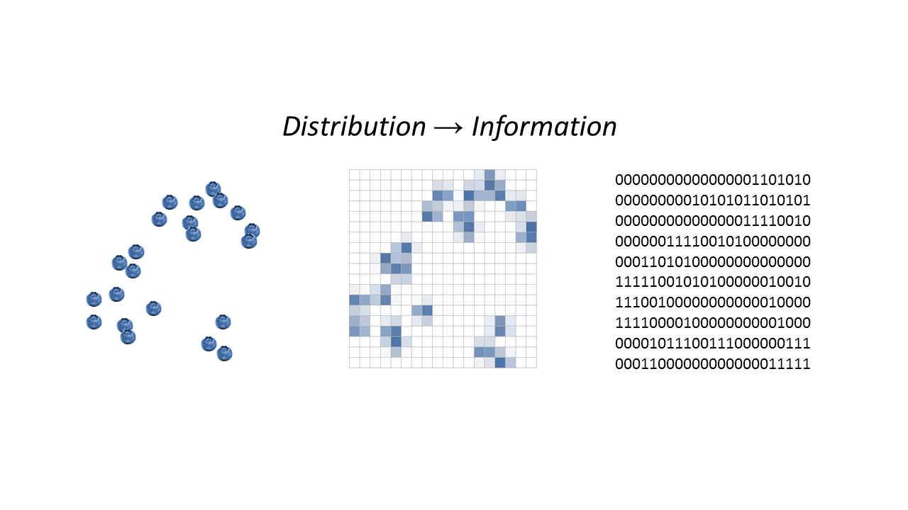

[My piece at _Evonomics_](http://evonomics.com/hayek-meets-information-theory-fails/) was largely well-received in the econoblogosphere. The exception should be obvious: fans of Hayek. Actually, my editor and I discussed the likely backlash before publication.

The most common complaint was some sort of knee-jerk complaint response fans of Hayek seem to have: "you haven't read [the vast literature](http://noahpinionblog.blogspot.com/2017/05/vast-literatures-as-mud-moats.html) of Hayek". It was pretty strange to me because I've actually read a bunch of Hayek's writing. Only a limited part of it is relevant to the microeconomics in my _Evonomics_ piece.

Hayek wrote about (among other things, so do not consider this list exhaustive):

1.  The price mechanism (e.g. _The Use of Knowledge in Society_)
2.  Intertemporal equilibrium (e.g. _Economics and Knowledge_)
3.  Business cycles (includes his arguments with Keynes)
4.  The central planning calculation problem (his expansions on Mises, including _The Use of Knowledge in Society_)
5.  The political effects of central planning (e.g. _The Road to Serfdom_)

As [no one really understands business cycles](http://informationtransfereconomics.blogspot.com/2015/05/leeches-rant.html) (the identity and cause of recessions represent an open question in macroeconomics), any contribution to item 3 is only meaningful if it represents a useful description of empirical data. Hayek is a bit on the wordy side, and doesn't really engage with data.

Item 4 is generally true at the time of Hayek and probably for hundreds of years in the future as Cosma Shalizi shows in his [excellent book review](http://crookedtimber.org/2012/05/30/in-soviet-union-optimization-problem-solves-you/) of _Red Plenty_:

> _There are many, many things to be said against the market system, but it is a mechanism for providing feedback from users to producers, and for propagating that feedback through the whole economy, without anyone having to explicitly track that information. This is a point which both Hayek, and Lange (before the war) got very much right. The feedback needn’t be just or even mainly through prices; quantities (especially inventories) can sometimes work just as well. But what sells and what doesn’t is the essential feedback._ 

> _It’s worth mentioning that this is a point which **Trotsky** got right._

However, while Hayek might have intuitively understood the issue, you can't demonstrate it in any convincing way without understanding computational complexity (as Shalizi also shows). Just asserting the calculation problem is too hard to solve isn't quite the same as showing that the linear programming problem would take a massive amount of computational resources. And truthfully, the linear programming problem is actually solvable, so some future society could eventually implement it (meaning Mises and Hayek were correct, but only for a period of time).

The point Shalizi also makes is that because the problem is too complex to solve without a heroic dose of computational resources, you can't actually know if the market's "heuristic" solution is optimal. It's just "a" solution.

Item 5 is a _**political**_ treatise, and, empirically speaking, a largely false one as e.g. the United Kingdom hasn't devolved into totalitarianism in the intervening decades despite running a mixed economy. I recently had a discussion about this with some colleagues that were fans of Hayek who backtracked to the position that Hayek was only talking about something that "could happen". However even that is incorrect as Hayek said that "tyranny ... **_inevitably_** results from government control of economic decision-making" (emphasis mine).

This leaves items 1 and 2.

Coincidentally, [David Glasner posted](https://uneasymoney.com/2017/05/21/hayek-and-intertemporal-equilibrium/) a pretty good rundown of item 2 earlier this week. I also discuss the concept of intertemporal equilibrium ([and its potential failure](http://informationtransfereconomics.blogspot.com/2015/10/when-is-intertemporal-budget-constraint.html)) using information equilibrium in many contexts on this blog (including framing the problem as [information transfer from the future to the present](http://informationtransfereconomics.blogspot.com/2014/12/how-money-transfers-information-from.html), [statistical equilibrium](http://informationtransfereconomics.blogspot.com/2016/09/the-economic-state-space-mini-seminar.html), and [dynamic equilibrium](http://informationtransfereconomics.blogspot.com/2017/01/dynamic-equilibrium-presentation.html)). The information equilibrium approach is fully consistent with Hayek in the sense that, as Glasner put it:

> _\[Hayek believed\] he had in fact grasped the general outlines of a solution when in fact he had only perceived some aspects of the solution and offering seriously inappropriate policy recommendations based on that seriously incomplete understanding._

In that sense, information equilibrium can be seen as offering a potential framework for addressing the intertemporal equilibrium problem Hayek identified. But I didn't discuss this in the article.

While none of items 2-5 are really discussed in the article (item 2 is alluded to with a comment about future and past distributions, and I actually agree with Hayek on item 4 but only allude to it with a link to Shalizi's blog post linked above), many of the Hayek fans brought them up in comments at _Evonomics_ or on Twitter saying that I misunderstood them or failed to talk about them. 

I'll freely admit I failed to talk about them (and it's hard to say if someone misunderstands things they don't talk about). My _Evonomics_ article concentrated on item 1: the price mechanism. I tried to explain what Hayek got wrong about it, what he got right, and how we might understand it in terms of information theory. Information theory naturally leads to serious arguments against assuming the efficacy of the market mechanism, so that where Hayek is enthralled with how well it works, we should instead by surprised -- and on the look-out for some non-market mechanism in place propping it up.

I actually don't claim Hayek got many things wrong. The title is "Hayek Meets Information Theory. And Fails." Generally titles for pieces are created by the editors, and this case was no different. However, I did approve it so I am at least partially responsible for it. And given the arguments in the article, this title is not far off the mark: _Hayek's description of the price mechanism as a communication system is not consistent with information theory_.

The only claims I make about Hayek in the article are:

> 1\. _Friedrich Hayek did have some insight into prices having something to do with information, but he got the details wrong and vastly understated the complexity of the system._

> \[Several readers took this to mean that I said Hayek said markets weren't complex. If you read that carefully, you'll notice that I only said Hayek understated the complexity.\]

> 2\. _Hayek thought a large amount of knowledge about biological or ecological systems, population, and social systems could be communicated by a single number: a price._

> \[This is the statement behind the title that I go into more detail about below.\]

> 3. _Ideas that were posited as articles of faith or created through incomplete arguments by Hayek are not even close to the whole story, and leave you with no knowledge of the ways the price mechanism, marginalism, or supply and demand can go wrong._

> \[No one seems to be arguing that Hayek had a complete understanding of the price mechanism. However I will discuss the part about how markets "go wrong" in more detail below.\]

> 4\. _But \[Hayek\] didn’t have the conceptual or mathematical tools of information theory to understand the mechanisms of that relationship_

> \[This isn't even debatable. Hayek never used information theory to understand the price mechanism.\]

There is also another thread about how I am supposedly claiming to be designing a machine learning algorithm that will work better than markets. However, this is just a reading comprehension failure as I claim the exact opposite:

> _The thing is that with the wrong settings, \[machine learning\] algorithms fail and you get garbage. I know this from experience in my regular job researching ... algorithms. Therefore depending on the input data (especially data resulting from human behavior), we shouldn’t expect to get good results all of the time. These failures are exactly the failure of information to flow from the real data to the generator through the detector – the failure of information from the demand to reach the supply via the price mechanism._

I was actually making an analogy that the failure of machine learning algorithms might be similar to the failure of markets. I do claim "The understanding of prices and supply and demand provided by information theory and machine learning algorithms is better equipped to explain markets", but again that doesn't mean machine learning is better than markets but rather a potential model of markets.

Now on to the more substantive complaints above ...

One of the main things Hayek got wrong was his "metaphor" (that he says is "more than a metaphor") of price as a communication system, from "The Use of Knowledge in Society" (1945):

> _**We must look at the price system as such a mechanism for communicating information** if we want to understand its real function—a function which, of course, it fulfills less perfectly as prices grow more rigid. (Even when quoted prices have become quite rigid, however, the forces which would operate through changes in price still operate to a considerable extent through changes in the other terms of the contract.) The most significant fact about this system is the economy of knowledge with which it operates, or how little the individual participants need to know in order to be able to take the right action. **In abbreviated form, by a kind of symbol, only the most essential information is passed on and passed on only to those concerned.** I**t is more than a metaphor to describe the price system as a kind of machinery for registering change, or a system of telecommunications** which enables individual producers to watch merely the movement of a few pointers, as an engineer might watch the hands of a few dials, in order to adjust their activities to changes of which they may never know more than is reflected in the price movement._

The main point in my _Evonomics_ article is that information is not passed through prices, and the markets are not transmitting information as a telecommunications system. His words are fairly straightforward. Hayek makes these claims about the price mechanism (emphasis mine in the quote above) despite the fact that they are inconsistent with information theory.

A more subtle and interesting point raised by Hayek fans was that Hayek never claimed the system was perfect or free from error or failures (that markets never "go wrong"). Again, from "The Use of Knowledge in Society":

> _Of course, these \[price\] adjustments are probably never "perfect" in the sense in which the economist conceives of them in his equilibrium analysis. But I fear that our theoretical habits of approaching the problem with the assumption of more or less perfect knowledge on the part of almost everyone has made us somewhat blind to the true function of the price mechanism and led us to apply rather misleading standards in judging its efficiency. The marvel is that in a case like that of a scarcity of one raw material, without an order being issued, without more than perhaps a handful of people knowing the cause, tens of thousands of people whose identity could not be ascertained by months of investigation, are made to use the material or its products more sparingly; **i.e., they move in the right direction**. This is enough of a marvel even if, in a constantly changing world, not all will hit it off so perfectly that their profit rates will always be maintained at the same constant or "normal" level._

I was well aware that Hayek did say the price mechanism could fail (famously in the case of government interference such as taxes or subsidies). However my claim was that Hayek doesn't tell you "**the ways** the price mechanism ... can go wrong" -- not that he doesn't tell you "**that** the price mechanism ... can go wrong". In my description of non-ideal information transfer, I show mathematically that market failures lead to lower prices. That's **_a_** _**way**_ markets fail. Although I didn't go into it in the article, [correlations among agents](http://informationtransfereconomics.blogspot.com/2014/10/coordination-costs-money-causes.html) are one way to get non-ideal information transfer (essentially a failure of the maximum entropy assumptions). Markets also can fail if you don't have enough transactions. Where Hayek says airplanes _can_ crash, I claim Hayek doesn't tell us **how** airplanes crash but information theory does.

Strictly speaking, this is not entirely true. Hayek does claim that price controls and other government interventions will cause the price mechanism to fail. However the failure mode I talk about in my article does not require government intervention, and the implication when I say that "the price mechanism, marginalism, or supply and demand can go wrong" is that we are talking about the possibility of failure even in the case free markets. Hayek also says that the market is self-correcting (emphasis in the previous quote), but this is only true in the case of nearly ideal information transfer.

**_\*  \*  \*_**

As I don't make that many claims about Hayek, the corpus of material required to understand those claims about Hayek is actually relatively small. It's also not hard to understand what Hayek was saying in general about the price mechanism: prices are a way to get information about a drought in one region to markets in another. But while his intuition was useful, you have to be consistent with information theory which leads to a better understanding of the possible failure modes.

I wasn't talking about the "economic calculation problem" (about central planning), the business cycle, or any of the politics in e.g. _The Road to Serfdom_ so references to those topics aren't germane to the discussion of Hayek and the price mechanism. Therefore a lot of the criticism of my Evonomics article misses the point.

PS For those interested, [I have a more detailed argument](http://informationtransfereconomics.blogspot.com/2015/01/is-market-intelligent.html) about how markets can fail to aggregate information (they represent a heuristic algorithm solution to the allocation problem, but not the information aggregation problem). 

PPS I have an animation [I started to put together](http://informationtransfereconomics.blogspot.com/2013/11/light-blogging-and-coming-soon.html) about this subject several years ago that was never completed:

The animation first describes Hayek's information aggregation function (where the all-knowing market spits out a price after aggregating all the information. The second part shows the information equilibrium picture where the price is just "listening in" (using a particularly 2013-relevant metaphor).
