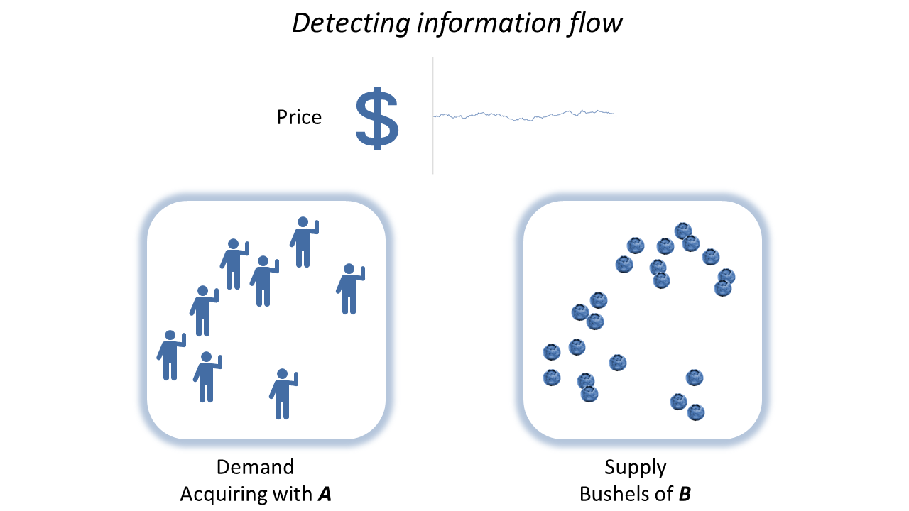
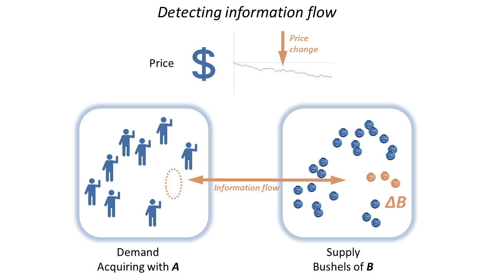
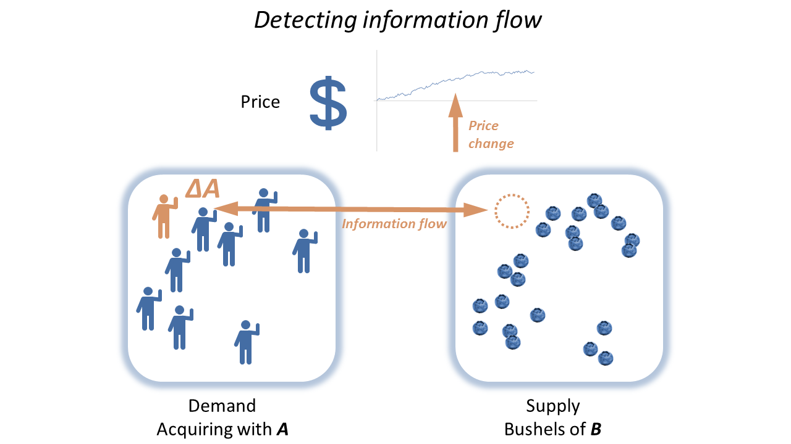

I have [an article up at Evonomics](http://evonomics.com/hayek-meets-information-theory-fails/) about the basics of information equilibrium looking at it from the perspective of Hayek's price mechanism and the potential for market failure. Consider this post a forum for discussion or critiques. I earlier put up a post with further reading [and some slides linked here](http://informationtransfereconomics.blogspot.com/2017/05/explore-more-about-information.html).

I also made up a couple of diagrams that I didn't end up using illustrating price changes:

