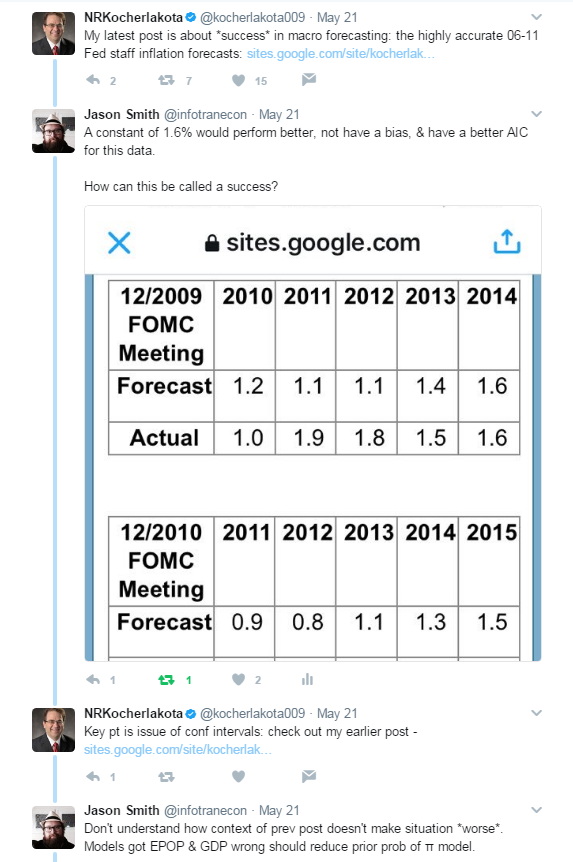

A few days ago, I had a back and forth with [Narayana Kocherlakota](https://twitter.com/kocherlakota009/status/866336422906785792) on Twitter where he called economic forecasting of inflation a "success":

AIC refers to the [Akaike information criterion](https://en.wikipedia.org/wiki/Akaike_information_criterion) (as a proxy for various information criteria) which is a maximum likelihood metric that takes into account the number of parameters in the model (penalizing a model with more parameters). EPOP refers to the employment-population ratio Kocherlakota refers to in his blog post (and for which there is a pretty good [dynamic equilibrium model available](http://informationtransfereconomics.blogspot.com/2017/01/dynamic-equilibrium-employment.html), by the way). I also used π to refer to inflation as is common in DSGE models in my last tweet. 

The data Kocherlakota compares to the Fed inflation forecast is much better described by a constant 1.6% inflation. Not only would that model have a better AIC (since the Fed forecasts undoubtedly contain more than one parameter), but a forecast of 1.6% wouldn't have the negative bias of the Fed forecast. This is basically saying that an AR process would outperform the Fed model (as we've seen [before](http://informationtransfereconomics.blogspot.com/2016/10/forecasting-it-versus-all-comers.html)).

My main point was that on its own, the inflation forecast is not evidence of success because it is beaten by a constant. In physics, if a model was beaten by a constant that model would be rejected and it's likely the entire approach would be abandoned unless some extremely compelling reasons to keep going were found. But Kocherlakota's post was part of a short series wherein forecasts of other variables _from the same framework_ were completely wrong. If the IT framework got GDP and EPOP completely wrong and then underperformed a constant for inflation, that would be more than sufficient evidence to reject it. One's Bayesian prior for the entire framework should be given a lower probability because it gets two variables wrong and doesn't do as well as a constant. This is to say a scientist would abandon pretense of knowledge of EPOP and GDP (and the framework that produced the forecasts) and resort to a constant model of inflation. Kocherlakota not only doesn't reject the framework but calls the inflation forecast a success!

The next line was Kocherlakota saying "This the point - \[inflation\] evolves almost completely separately." which I thought was a good enough stopping point because I am not sure Kocherlakota understood what I was saying. And on its own, that is an interesting point coming from a former Fed official ‒ that inflation seems independent of other macroeconomic variables. However, my point was that despite the fact that Kocherlakota was staring at evidence that he should probably be starting over from scratch, he wasn't seeing it.
