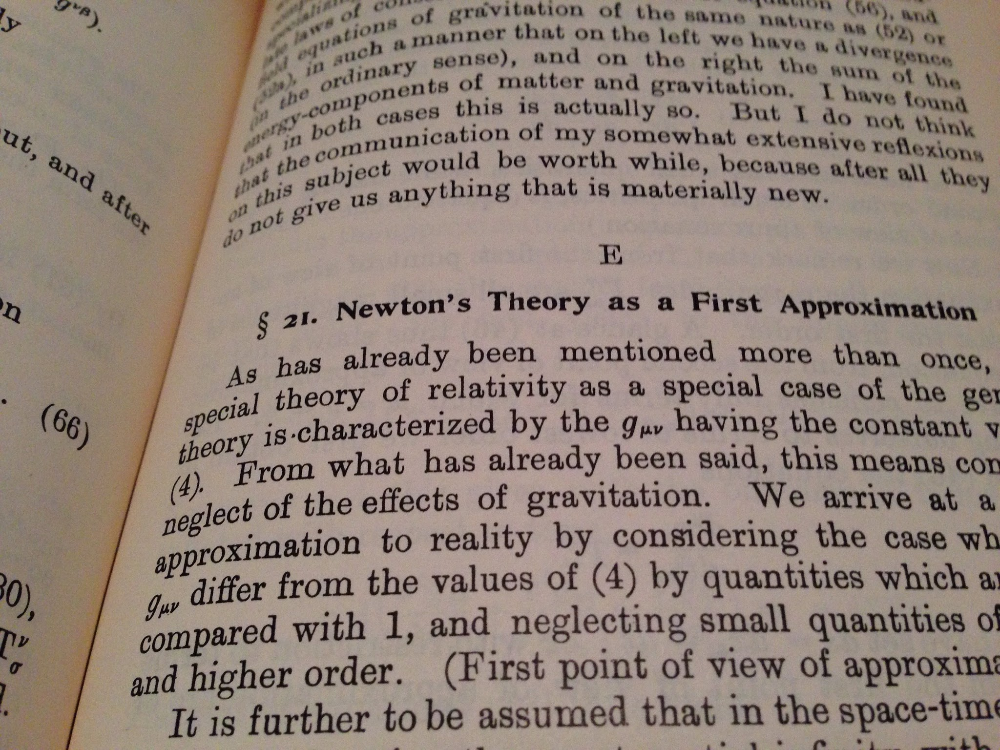
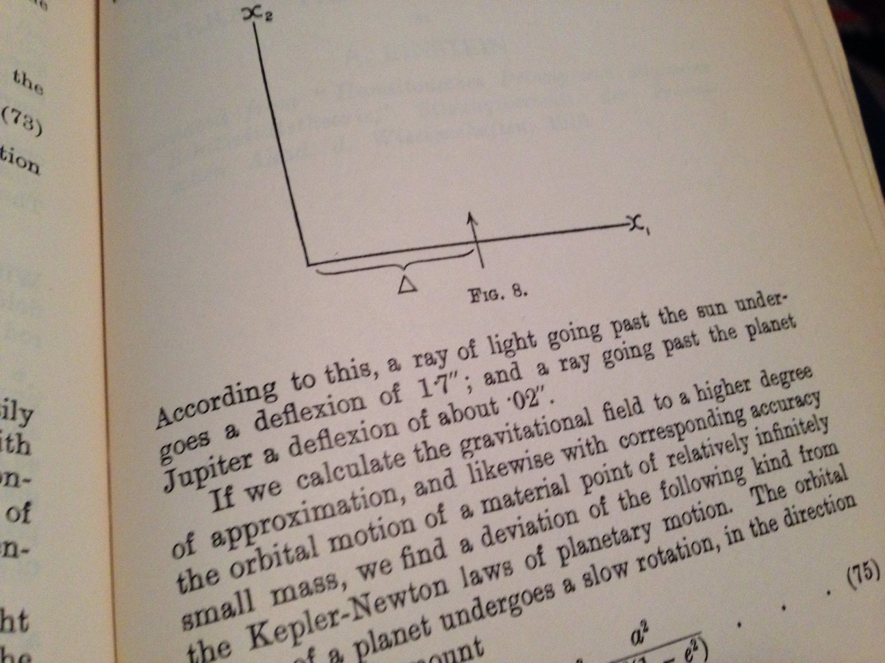
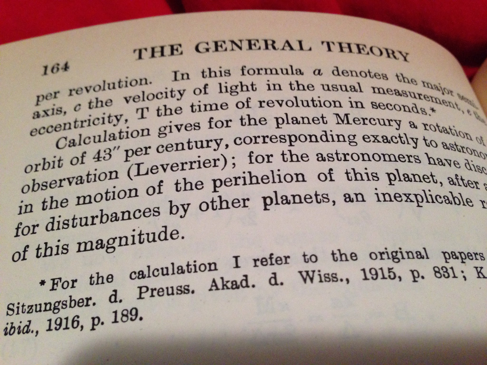

[wrote something](http://noahpinionblog.blogspot.com/2017/04/ricardo-reis-defends-macro_13.html)

> _One thing I still notice about macro, including the papers Reis cites, is the continued proliferation of models. Almost every macro paper has a theory section. Because it takes more than one empirical paper to properly test a theory, this means that theories are being created in macro at a far greater rate than they can be tested._

1.  It's compared to some kind of data
2.  It's predicting a new effect that could be measured by new data
3.  It's included for pedagogical reasons
4.  It reduces to existing theories that have been tested

[https://arxiv.org/abs/nucl-th/0202016](https://arxiv.org/abs/nucl-th/0202016)

> The paper above is compared to data. The model fails, but that was the point: we wanted to show that a particular approach would fail.

[https://arxiv.org/abs/nucl-th/0407093](https://arxiv.org/abs/nucl-th/0407093)

[https://arxiv.org/abs/nucl-th/0505048](https://arxiv.org/abs/nucl-th/0505048)

> The two papers above predict new effects that would be measured at Jefferson Lab.

[https://arxiv.org/abs/nucl-th/0107026](https://arxiv.org/abs/nucl-th/0107026)

[https://arxiv.org/abs/nucl-th/0509033](https://arxiv.org/abs/nucl-th/0509033)

> The two papers above contain pedagogical examples and math. The first has five different models, but only one is compared to data. The second is more about the math.

[https://arxiv.org/abs/nucl-th/0508036](https://arxiv.org/abs/nucl-th/0508036)

> Finally in my thesis linked above, I show how the "new" theory I was using connects to existing chiral perturbation theory and lattice QCD.

Of course, the immediate cry will be: _What about string theory!_ But then string theory is about new physics at scales that can't currently be measured. Most string theory papers fall under 2, 3, or 4. Maybe if all these macroeconomic models were supposed to be about quantities we couldn't measure yet, then you might have a point about string theory.

Even Einstein's paper on general relativity showed how it could be tested, explaining existing data, or how they reduced to existing theories:

I'm sure there are probably exceptions out there, but the rule is that if you come up with a theory you have to show how it connects/how it could connect to data, other existing theories, or you say you're just working out some math.

In any case, if you have a new model that can or should be tested with empirical data, _the original paper should have the first test_. Additionally, _it should pass that first test_ ‒ otherwise, why publish? "Here's model that's wrong" is not exactly something that warrants publication in a peer reviewed journal except under particular circumstances \[1\]. And those circumstances are basically the circumstances that occur in my first paper listed above: you are trying to show a particular model approach will not work. In that paper I was showing that a relativistic mean-field effective theory approach in terms of [hadrons](https://en.wikipedia.org/wiki/Hadron) cannot show the type of effect that was being observed (motivating the quark level picture I would later work on).

The situation Noah describes is just baffling to me. You supposedly had some data you were looking at that gave you the idea for the model, right? Or do people just posit "what-if" models in macroeconomics ... and then continue to consider them as .... um, plausible descriptions of how the world works ... um, without testing them???

**Footnote:**

\[1\] This is not the same thing as saying don't publish negative results. Negative empirical results are useful. We are talking about papers with theory in them. Ostensibly, the point of theory is to explain data. If it fails in it's one job, then why are we publishing it?

\[2\] When I looked it up for this blog post, it looks like another paper demonstrates a similar result (about the [Hugenholtz-van Hove theorem](http://www.unm.edu/~aierides/505/A%20Theorem%20On%20The%20Single%20Particle%20Energy%20In%20A%20Fermi%20Gas%20With%20Interaction.pdf) \[pdf\]) but was published three months later (in the same journal) that I didn't know about:

[https://arxiv.org/abs/nucl-th/0204008](https://arxiv.org/abs/nucl-th/0204008)
