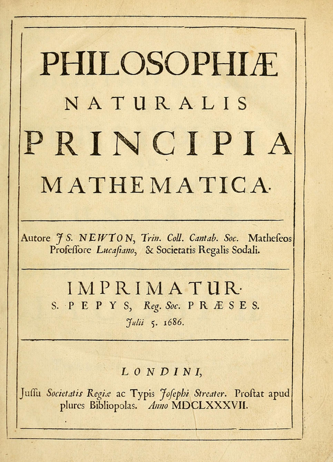
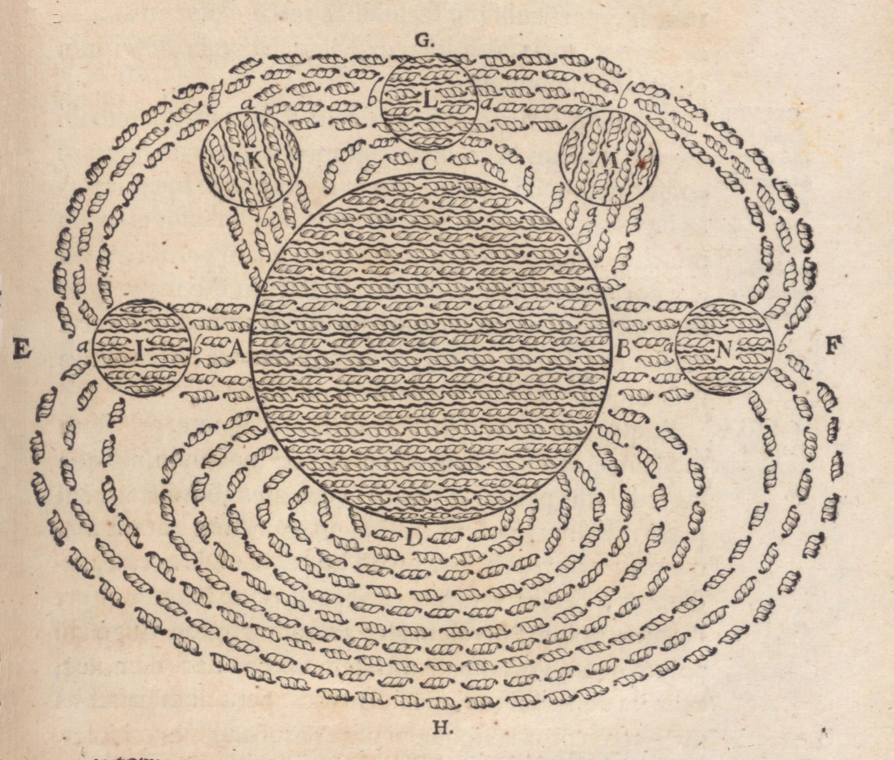

[Noah Smith has a fine post](http://noahpinionblog.blogspot.com/2017/05/how-should-theory-and-evidence-relate.html) on theory and evidence in economics so I suggest you read it. It is very true that there should be a combined approach:

> _In other words, econ seems too focused on "theory vs. evidence" instead of using the two in conjunction. And when they do get used in conjunction, it's often in a tacked-on, pro-forma sort of way, without a real meaningful interplay between the two. ... I see very few economists explicitly calling for the kind of "combined approach" to modeling that exists in other sciences - i.e., using evidence to continuously restrict the set of usable models._

This does assume the same definition of theory in economics and science, though. However there is a massive difference between "theory" in economics and "theory" in sciences. 

**"Theory" in science**

In science, "theory" generally speaking is the amalgamation of successful descriptions of empirical regularities in nature concisely packaged into a set of general principles that is sometimes called a framework. Theory for biology tends to stem from the theory of evolution which was empirically successful at explaining a large amount of the variation in species that had been documented by many people for decades. There is also the cell model. In geology you have plate tectonics that captures a lot of empirical evidence about earthquakes and volcanoes. Plate tectonics explains some of the fossil record as well (South America and Africa have some of the same fossils up to a point at which point they diverge because the continents split apart). In medicine, you have the germ theory of disease.

The quantum field theory framework is the most [numerically precise](https://en.wikipedia.org/wiki/Electron_magnetic_moment) amalgamation of empirical successes known to exist. But physics has been working with this kind of theory since the 1600s when Newton first came up with a concise set of principles that captured nearly all of the astronomical data about planets that had been recorded up to that point (along with Galileo's work on projectile motion).

But it is important to understand that the general usage of the word "theory" in the sciences is just shorthand for being consistent with past empirical successes. That's why string theory can be theory: it appears to be consistent with general relativity and quantum field theory and therefore can function as a kind of shorthand for the empirical successes of those theories ... at least in certain limits. This is not to say your new theoretical model will automatically be correct, but at least it doesn't obviously contradict Einstein's _E = mc²_ or Newton's _F = ma_ in the respective limits.

Theoretical biology (say, determining the effect of a change in habitat on a species) or theoretical geology (say, computing how the Earth's magnetic field changes) is similarly based on the empirical successes of biology and geology. These theories are then used to understand data and evidence and can be rejected if evidence contradicting them arises.

As an aside, experimental sciences (physics) have an advantage over observational ones (astronomy) in that the former can conduct experiments in order to extract the empirical regularities used to build theoretical frameworks. But even in experimental sciences, experiments might be harder to do in some fields than others. Everyone seems to consider physics the epitome of science, but in reality the only reason physics probably had a leg up in developing the first real scientific framework is that the necessary experiments required to observe the empirical regularities are incredibly easy to set up: a pendulum, some rocks, and some rolling balls and you're pretty much ready to experimentally confirm everything necessary to posit Newton's laws. In order to confirm the theory of evolution, you needed to collect species from around the world, breed some pigeons, and look at fossil evidence. That's a bit more of a chore than rolling a ball down a ramp.

**"Theory" in economics**

Theory in economics primarily appears to be solving utility maximization problems, but unlike science there does not appear to be any empirical regularity that is motivating that framework. Instead there are a couple of stylized facts that can be represented with the framework: marginalism and demand curves. However these stylized facts can also be represented with ... _supply and demand curves_. The question becomes what empirical regularity is described by utility maximization problems but _not_ by supply and demand curves. Even the empirical work of [Vernon Smith and John List can be described by supply and demand curves](http://informationtransfereconomics.blogspot.com/2016/11/the-scope-of-introductory-economics.html) (in fact, at the link they can also be described by information equilibrium relationships).

Now there is nothing wrong with using utility maximization as a _proposed_ framework. That is to say there's nothing wrong with positing any bit of mathematics as a potential framework for understanding and organizing empirical data. [I've done as much with information equilibrium](http://informationtransfereconomics.blogspot.com/2017/04/a-tour-of-information-equilibrium.html).

However the utility maximization "theory" in economics is not the same as "theory" in science. It isn't a shorthand for a bunch of empirical regularities that have been successfully described. It's just a proposed framework; it's _mathematical philosophy_.

**The method of nascent science**

This isn't necessarily bad, but it does mean that the interplay between theory and evidence reinforcing or refuting each other isn't the iterative process we need to be thinking about. I think a good analogy is an iterative algorithm. This algorithm produces a result that causes it to change some parameters or initial guess that is fed back into the same algorithm. This can converge to a final result if you start off close to it, but it requires your initial guess to be good. This is the case of science: the current state of knowledge is probably decent enough that the iterative process of theory and evidence will converge. You can think of this as the scientific method ... for established science.

For economics, it does not appear that the utility maximization framework is close enough to the "true theory" of economics for the method of established science to converge. What's needed is the scientific method that was used back when science first got its start. [In a post from about a year ago](http://informationtransfereconomics.blogspot.com/2016/07/ceteris-paribus-and-method-of-nascent.html), I called this the method of nascent science. That method was based around the different metric of _usefulness_ rather than model rejection in established science. Here's a quote from that post:

> _Awhile ago, [Noah Smith brought up](http://informationtransfereconomics.blogspot.com/2016/03/waiting-for-philosophy-of-economics.html) the issue in economics that there are millions of theories and no way to reject them scientifically. And that's true! But I'm fairly sure we can reject most of them for being useless._
>
>
>
> _
>
> _"Useless" is a much less rigorous and much broader category than "rejected". It also isn't necessarily a property of a single model on its own. If two independently useful models are completely different but are both consistent with the empirical data, **then both models are useless.** Because both models exist, they are useless. If one didn't \[exist\], the other would be useful._
>
> _

Noah Smith (in the post linked at the beginning of this post) put forward three scenarios of theory and evidence in economics:

> _1\. Some papers make structural models, observe that these models can fit (or sort-of fit) a couple of stylized facts, and call it a day. Economists who like these theories (based on intuition, plausibility, or the fact that their dissertation adviser made the model) then use them for policy predictions forever after, without ever checking them rigorously against empirical evidence._ 

> _2\. Other papers do purely empirical work, using simple linear models. Economists then use these linear models to make policy predictions ("Minimum wages don't have significant disemployment effects")._ 

> _3\. A third group of papers do empirical work, observe the results, and then make one structural model **per paper** to "explain" the empirical result they just found. These models are generally never used or seen again._

Using these categories, we can immediately say 1 & 3 are _useless_. If a model never checked rigorously against data or if a model is never seen again, they can't possibly be useful.

In this case, the theories represent at best _mathematical philosophy_ (as I mentioned at the end of the previous section). It's not really theory in the (established) scientific sense.

Sometimes a little bit of mathematical philosophy will have legs. Isaac Newton's work, when it was proposed, was _mathematical philosophy_. It says so right in the title. So there's nothing wrong with the proliferation of "theory" (by which we mean mathematical philosophy) in economics. But it shouldn't be treated as "theory" in the same sense of science. Most if it will turn out to be _useless_, which is fine if you don't take it seriously in the first place. And using economic "theory" for policy would be like using Descartes to build a mag-lev train ...

**Update 15 May 2017: Nascent versus "soft" science**

I made a couple of grammatical corrections and added a "does" and a "though" to the sentence after the first Noah Smith quote in my post above.

But I did also want to add the point that by "established science" vs "nascent science" I don't mean the same thing as many people mean when they say "hard science" vs "soft science". So-called "soft" sciences can be established or nascent. I think of economics as a nascent science (economies and many of the questions about them barely existed until modern nation states came into being). I also think that some portions will eventually become a "hard" science (e.g. questions about the dynamics of the unemployment rate), while others might become a "soft" science with the soft science pieces being consumed by sociology (e.g. questions about what makes a group of people panic or behave as they do in a financial crisis).

I wrote up [a post](http://informationtransfereconomics.blogspot.com/2016/04/economic-imperialism.html) that goes into that in more detail about a year ago. However, the main idea is that economics might be explicable -- as a hard science even -- in cases where the law of large numbers kicks in and agents do not highly correlate (where economics becomes more about the state space itself than the actions of agents in that state space ... [Lee Smolin called this](http://informationtransfereconomics.blogspot.com/2015/01/lee-smolins-take-on-arrow-debreu.html) "statistical economics" in an analogy with statistical mechanics). 

I think for example psychology is an established soft science. Its theoretical underpinnings are in medicine and neuroscience. That's what makes the replication crisis in psychology a pretty big problem for the field. In economics, it's actually less of a problem (the real problem is not the replication issue, but that we should all be taking the econ studies less seriously than we take psychology studies).

Exobiology or exogeology could be considered nascent hard sciences. Another nascent hard science might be so-called "data science": we don't quite know how to deal with the huge amounts of data that are only recently available to us and the traditional ways we treat data in science may not be optimal.
