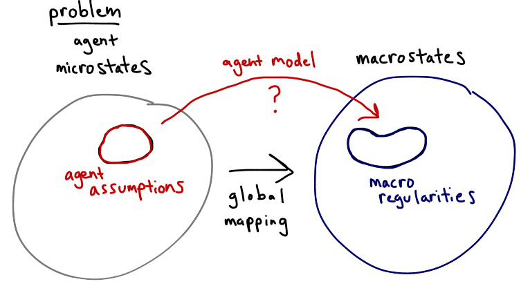

> _“It was hard for me to find anything in the essay that the world’s most orthodox reductionist would disagree with. Yes, of course you want to pass to higher abstraction layers in order to make predictions, and to tell causal stories that are predictively useful — and the essay explains some of the reasons why.”_

> Scott Aaronson

Economist Diane Coyle and Physicist Sean Carroll both tweeted about this [_Quanta_ magazine article](https://www.quantamagazine.org/a-theory-of-reality-as-more-than-the-sum-of-its-parts-20170601/) about Erik Hoel's "new mathematical explanation of how consciousness and agency arise", so I naturally was intrigued. With the mathematics being information theory (which I apply to economics on this blog), I was doubly intrigued. However (as I tweeted about this myself) I think this may be a case where the description for a mass audience might have gotten away from the source material. That's why I led with the quote from Aaronson (which Carroll also emphasized in his tweet): the magazine article seems to take this a bit too far as a counterargument to reductionism than the math Hoel employs does.

Let me see first if I can explain [Hoel's essay](http://fqxi.org/data/essay-contest-files/Hoel_FQXi_EPH_wandering_goa.pdf) \[pdf\] and [the original paper](http://www.pnas.org/content/110/49/19790.full.pdf) \[pdf\] (this will be a bit of a simplification). Let's say you want to send a message from point C to point E faithfully in the presence of noise. As Shannon defined the problem when [he invented information theory](http://math.harvard.edu/~ctm/home/text/others/shannon/entropy/entropy.pdf) \[pdf\], you want to make sure that for any possible message you select at C to encode and transmit, you can receive and decode it at E. I chose the letters to represent the information source and destination to represent Cause and Effect. When you decode E (your measured data) using your theory, you hope to get back the cause C.

If you are communicating in the presence of noise, some ways (i.e. theories) of decoding E (i.e. data) are better than others. One metric for this is called the [Kullback-Liebler divergence](https://en.wikipedia.org/wiki/Kullback%E2%80%93Leibler_divergence) (that I've talked about before on this blog). It measures information loss if you try to decode E with the "wrong" code. In communication theory, it's about losing bits because of mis-matched probability distributions. Hoel thinks of [effective theories](http://informationtransfereconomics.blogspot.com/2017/04/lecture-on-effective-field-theory.html) at different scales as the different codes, and instead of losing bits you are losing the fidelity of your causal description. Because the theories at different scales are in general different, one of them could easily be "the best" (i.e. you could minimize the KL divergence for one encoding, one particular theory at a particular scale). This description maximizes what Hoel called the "effective information" of the causal description.

Scales here means descriptions in terms of different degrees of freedom: atoms or agents. Describing an economy in terms of atoms is probably impossible. Describing it in terms of agents is probably better. Describing it in terms of general relativity is also probably impossible. Hoel's contention is that there could well be a macro scale effective theory that there are one or more optimal descriptions \[1\] in between atoms and galaxies in the presence of noise. We would say this "more faithful" description in the presence of noise is "emergent". Your description of an economy in terms of agents is lacking, but pretty good in terms of emergent macroeconomic forces.

Like the Arrow-Debreu general equilibrium/equilibria, Hoel's math isn't constructive (nor unique). There is no reason that the lossy agent theory couldn't be the best causal description in the presence of noise. There is also no reason there isn't a tower of causal descriptions at different scales. And just because macroeconomics or quantum chromodynamics is hard, it doesn't mean there must exist a better theory at a proper scale that's more faithful in the presence of noise.

You may have noticed that I keep adding the phrase "in the presence of noise". That's because it's incredibly important to this concept. Without it, each description at each scale is just as good as any other if they are describing the same theory. It's because our measurements are fallible and our computations are limited that different effective theories work better at different scales. It may take thousands of processor-hours to decode a signal using the proper code, but there may be a heuristic solution with some error that takes a fraction of a second. We might only be able to measure the state of the system to a limited accuracy given the complexity or noise involved. The noise is our human limitations. As fallible humans, all we can really ever hope for are effective theories that are easier to understand and effective variables that are easier to measure.

It might be easier to think about it this way: What does it mean for a causal description in terms of agents to be different than a causal description in terms of macroeconomic forces? If they give different results, how are they theories of the same system? If your agent model is bad at describing a macroeconomy and my information equilibrium model is really good, in what way is the information equilibrium model a "coarse-graining" of the agent model? I think most of us would say that these are actually just different theories, and not theories of the same system at different scales. Unless they give the same results without noise, there's no real impetus to say they're both descriptions of same system.

In a sense, physics as a field gave over to the mindset that all we have are effective theories starting in the 70s ([here's Weinberg on phenomenological Lagrangians](http://pion.org.br/~evjaspc/xviii/images/Burgess/Jan29/Aditional/Phenomenological-Lagrangians-Weinberg.pdf) \[pdf\], and [here's a modern lecture](http://informationtransfereconomics.blogspot.com/2017/04/lecture-on-effective-field-theory.html) passing this mindset on to the next generation). I went through graduate school with the understanding that the standard model (core theory) was really just an effective theory at an energy scale of a few GeV. Newtonian physics is just an effective theory for speeds much slower than the speed of light.

However something that exists because of our limitations is not necessarily a law of the universe; it says more about us than about the systems we are trying to describe. Along with the non-constructive argument (constructive in his paper for only a limited system that doesn't necessarily generalize to e.g. macroeconomic theories or hadronic physics), we can boil down Hoel's essay to:

> There sometimes can be simpler descriptions at different scales, and you can use information theory as a formal description of this.

This is quite different from the breathless accounts in the _Quanta_ magazine article and the press blurbs accompanying it.

> _"his new mathematical explanation of how consciousness and agency arise"_

No, it's just a argument that effective descriptions we could call consciousness and agency _could_ arise because measuring and computing the behavior of neurons is hard and therefore probably lossy. It doesn't explain how or even tell us if they exist. It would be nice if this happened, but it doesn't have to.

> _"New math shows how, contrary to conventional scientific wisdom, conscious beings and other macroscopic entities might have greater influence over the future than does the sum of their microscopic components."_

This blurb completely misrepresents Hoel's result to the point of journalistic malpractice. It's not contrary to "conventional scientific wisdom"; his result is basically what physicists already do with effective theories. Hoel put together a possible formal argument in terms of information theory potentially explaining why effective theories area useful approach to science. Macroscopic entities _might_ be easier to use to predict the future than their microscopic components because they're easier to measure and more computationally tractable. In fact, Hoel's result also says that conscious beings might themselves be useless in terms of describing economies and societies (that's something [I posited some years ago](http://informationtransfereconomics.blogspot.com/2014/08/against-human-centric-macroeconomics.html)).

> _"A new idea called causal emergence could explain the existence of conscious beings and other macroscopic entities."_

Again, this doesn't explain the existence, it just formalizes the idea that some causal descriptions may be better than others at different scales. And like the previous quote, it seems to have a predilection for conscious beings when in fact it applies to atoms emerging from quarks, chemistry from atoms, cells from chemistry, humans from cells, and economies from humans. The theory doesn't explain the existence conscious beings in the same way it doesn't explain the existence of atoms. It describes the existence of atoms as an effective description in a particular framework.

It is somewhat unfortunate that Hoel's work was "oversold" with this article because I think it is a genuinely interesting argument. I will probably reference it myself in the future whenever I argue against strict microfoundations or agent-based fundamentalism. It's essentially an argument against the Lucas critique: there is no reason to assume some macro regularity might have an efficient description in terms of microeconomics (in general it is probably worse!). Hopefully the exaggerated versions of the claims don't detract from Hoel's insight.

**_\*  \*  \*_**

I wanted to add a couple of additional comments that didn't fit in the post above.

**Dimensional reduction**

Hoel's idea that he formalized in terms of information theory is something that I've used as an informal general principle in my approach to pretty much any theoretical attempt to understand empirical data. I gave it the name "dimensional reduction", and I've talked about it on multiple occasions over the years ([here](http://informationtransfereconomics.blogspot.com/2016/03/the-irony-of-microfoundations.html), [here](http://informationtransfereconomics.blogspot.com/2014/06/what-if-money-was-made-of-vinegar.html), or [here](https://informationtransfereconomics.blogspot.com/2016/04/different-types-of-emergence.html), for example). As I put it in the first of those links:

> _In general, if you have a microstate model with millions of complex agents that have thousands of parameters, you have a billion dimensional microstate problem (m ~ 1,000 × 1,000,000 = 10⁹). There are three possible outcomes:_
>
> _
>
>
>
> _The macrostate is a billion dimensional problem (M ~ m)_
>
> _The macrostate is a bit simpler (M < m)_
>
> _The macrostate is a much smaller problem (M << m)_
>
> _

In the second and third cases, the dimension of the "phase space" of the problem is reduced; I called this "dimensional reduction" (there is [something related in machine learning](https://en.wikipedia.org/wiki/Dimensionality_reduction)). The less complex description is hopefully more tractable computationally and hopefully easier to measure e.g. statistically.

But again, it doesn't have to exist. It's just nice if it does because that means it might not be hopelessly complex. Essentially, if macroeconomics is comprehensible to humans, then some kind of dimensional reduction (i.e. a scale with an effective coarse-graining) makes the system tractable (is a less lossy code to decode the cause from the measured effects).

**Causal entropy**

I did take issue with the characterization of this:

> _“Romeo wants Juliet as the filings want the magnet; and if no obstacles intervene he moves towards her by as straight a line as they. But Romeo and Juliet, if a wall be built between them, do not remain idiotically pressing their faces against its opposite sides like the magnet and the filings... Romeo soon finds a circuitous way, by scaling the wall or otherwise, of touching Juliet’s lips directly. With the filings the path is fixed; whether it reaches the end depends on accidents. With the lover it is the end which is fixed, the path may be modified indefinitely.” — William James_ 

> _The purposeful actions of agents are one of their defining characteristics, but are these intentions and goals actually causally relevant or are they just carried along by the causal work of the microscale? As William James is hinting at, the relationships between intentions and goals seem to have a unique property: their path can be modified indefinitely. Following the logic above, they are causally relevant because as causal relationships they provide for error-correction above and beyond their underlying microscales._

There's another way to approach this that entirely exists at the microscale called [causal entropy](http://informationtransfereconomics.blogspot.com/2016/09/causal-entropic-forces-as-economic.html). In another exaggeration for a mass audience (this time [a TED talk](https://www.ted.com/talks/alex_wissner_gross_a_new_equation_for_intelligence)), it was called "a new equation for intelligence". However in that case, even "dumb" automatons can accomplish pretty astounding tasks ([navigate a maze](https://www.youtube.com/watch?v=SEZoDMsjwpo&list=PLEXwXLT-a6beFPzal3OznPQC0pieccAle) \[YouTube\], [use tools](http://www.alexwg.org/publications/PhysRevLett_110-168702.pdf) \[pdf\]) if they're given a simple directive to maximize causal entropy.

**Minima of effective information**

Hoel's scales show that the effective description can simplify. In my research, I noted a lot of descriptions simplify at different scales, but in between those scales you nearly always had a mess. This mostly derived from my thesis where I tried to work with an intermediate scale between the high energy scale of perturbative quarks and the low energy scale of hadrons. However it also seems to appear in the [AdS/CFT correspondence](https://en.wikipedia.org/wiki/AdS/CFT_correspondence) in string theory (the supergravity theory turns into a non-perturbative mess well before the perturbative string theory starts to be a good effective description). As I put it [in one of my first blog posts](http://informationtransfereconomics.blogspot.com/2013/04/the-philosophical-motivations.html):

> _You go from hadrons to a **mess** and only then to quarks as you zoom in._

Where Hoel talks about effective information being higher at different scales, I made a conjecture [that I wrote down on this blog a couple of years ago](http://informationtransfereconomics.blogspot.com/2015/10/the-representative-macro-theory-agent.html) about there being what are essentially **_minima_** of Hoel's effective information _between_ scales:

> _... the emergent macro-theory tends to have more to do with just the symmetries and bulk properties of the state space rather than the details of the micro-theory._ 

> _In the quark case it's actually pretty interesting -- **there is no scale at which both the quark and hadron theories are simple descriptions**. At high energy, the quark theory simplifies. At low energy, the hadron theory simplifies \[3\]. In physics we call this [duality](https://en.wikipedia.org/wiki/Duality#Physics) -- sometimes the wave description of a quantum system simplifies and sometimes the particle description simplifies. Some phenomena are more easily seen as electric fields and moving charges, some phenomena are more easily seen in terms of magnetic fields._ 

> _For economic phenomena, sometimes the representative agent simplifies and sometimes micro-theory agents simplify. ..._ 

> _... \[3\] I have a conjecture that this always happens._

Emphasis added.

If Hoel's result is true about useful effective theories being local maxima of effective information, then my conjecture is correct and there must exist local minima between them.

**_\*  \*  \*_**

**Footnotes:**

\[1\] As a side note, I make the argument on this blog that [information equilibrium is a pretty good macro scale effective description](http://informationtransfereconomics.blogspot.com/2015/10/the-smd-theorem-and-oh-no-not-another.html).
