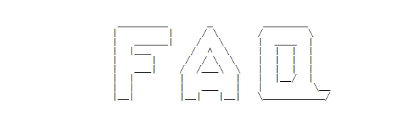

FAQ (Frequently Asked Question) pages used to be a more prevalent aspect of the internet, but seem to be fading ‒ probably due to being able to ask those questions directly in a Google search or on Quora or similar sites. Anyway, this will be a reference post that will be occasionally updated with some of the questions and misunderstandings I frequently run across from readers. [Here's a link to some basic definitions](http://informationtransfereconomics.blogspot.com/2016/09/basic-definitions-in-information.html) that I'll assume readers have read.

**Don't economists already study information in economics?**

The "information" in information transfer economics is from [information theory](https://en.wikipedia.org/wiki/Information_theory) and the study of communication channels. It has a technical definition more directly related to probability than to e.g. knowledge of how the monetary system works or whether a company is about to announce disappointing earnings. The key insight from Shannon in his seminal paper on the subject was that the meaning of messages sent through a communication channel is not as important as the number of possible messages (which determines the information content of each message). [It's that state space that matters here](https://informationtransfereconomics.blogspot.com/2016/09/the-economic-state-space-mini-seminar.html).

That being said, the work of [Christopher Sims](http://informationtransfereconomics.blogspot.com/2016/09/channel-capacity-and-rate-distortion-in.html) comes closest to treating information in a similar way. (And he finds the message doesn't seem matter!)

**Why do you treat economic agents as mindless atoms?**

This is a bit of a mischaracterization of how the information equilibrium/dynamic equilibrium framework treats economic agents. The best way to put it is that the framework treats humans as so complex their decisions appears to be [algorithmically random](https://en.wikipedia.org/wiki/Algorithmic_information_theory) (i.e. indistinguishable from a computer program with random outputs for a given set of inputs). The main assumption however is that an ensemble of economic agents will fully explore the possible options available to them in the presence of constraints. The net result is a model that looks like "mindless atoms", but it isn't the whole story. 

This approach is somewhat different from traditional economics where agents are usually assumed to choose the best option available to them. However, economist [Gary Becker had a paper from 1962](http://informationtransfereconomics.blogspot.com/2015/10/gary-beckers-emergent-rational-agents.html) that also looked at this "random" approach (thanks to economist [David Glasner](https://uneasymoney.com/) to pointing it out to me). He \[Becker\] referred to it as "irrational", but I am agnostic as to the motivations of the agents. Even a rational decision can look like an irrational one if you are missing some knowledge of the agent (e.g. selling a stock at a loss in recession looks irrational, but it is possible the person had medical bills to pay).

**But mindless atoms don't panic ...**

While information **_equilibrium_** treats agents effectively as random "mindless atoms" (but really treats them as so complex they look random), the information **_transfer_** framework is more general. If agents didn't spontaneously correlate in state space due to human behavior (e.g. panic, groupthink), then the information transfer framework reduces to something that looks like boring standard thermodynamics. However, they do in fact panic. In terms of thermodynamics, this means that the information transfer framework is like thermodynamic, but missing [a second law of thermodynamics](https://en.wikipedia.org/wiki/Second_law_of_thermodynamics). The "mindless atoms" will occasionally panic and huddle in a corner of the room and you have non-ideal information transfer as opposed to information equilibrium.

There is less the information transfer framework can say about scenarios where we have non-ideal information transfer, but it still could be used to put bounds on economic variables.

**Wait. Isn't this just saying sometimes your theory applies and sometimes it doesn't?**

Yes, but in a particular way. For example, the effect of correlations (panic, groupthink) is generally negative on prices.

Additionally, empirical data appears to show that information equilibrium is a decent description of macroeconomic variables except for a sparse subset (i.e. most of the time). That sparse subset seems to correspond to recessions. Since human behavior is one of the ways the system can fail to be in information equilibrium, this is good evidence that information equilibrium fails in exactly the way the more general information transfer framework says it should.

In a [very deep way](http://informationtransfereconomics.blogspot.com/2014/02/ii-entropy-and-microfoundations.html), one can think of information equilibrium being a good approximation in the same way the Efficient Market Hypothesis (EMH) is sometimes a good approximation. Failures of the EMH seem to be correlations due to human behavior.

**If your theory is so awesome, why aren't you well known in economics circles?**

The short answer is: _I don't know_. You'd think [forecasting better than macro institutions](https://informationtransfereconomics.blogspot.com/2019/04/unemployment-rate-holds-steady-at-38.html) would somehow get out there more. But I think the bulk of  econ twitter and the dwindling econoblogosphere is more interested in how they think the economy works than how it actually works.

That said, [I was invited to give a talk](https://informationtransfereconomics.blogspot.com/2018/10/outside-box-workshop.html) at my local university's (and alma mater's) economics department — so I'm guessing like most things in academic research it's more of [a long slog than](https://www.brainyquote.com/quotes/max_planck_101765) becoming a rock star overnight.

**Well, why haven't you at least been published then?**

[It's apparently really hard](https://voxeu.org/article/nine-facts-about-top-journals-economics) to be published in an econ journal even if you're a famous professor, with revisions often taking years. If you don't have an econ degree, you're almost certainly going to get [desk rejections](https://savageminds.org/2012/11/08/desk-reject/) (as I have).

I have two papers (so far) available as pre-prints ([here](https://papers.ssrn.com/sol3/papers.cfm?abstract_id=3094757) and [here](https://papers.ssrn.com/sol3/papers.cfm?abstract_id=2894072)) and at least in physics and machine learning these are basically the only things people read these days because publishing is so slow. Even economics does basically the same thing, except [their pre-print server](https://www.nber.org/papers.html) is closed off to everyone except insiders.

**Why don't you get rich using your theory?**

In a way, I am because my 401(k) is invested in index funds. The theory says that unless you can predict human behavior, you cannot predict episodes of non-ideal information transfer. Therefore the optimal portfolio choice is to diversify and hold for a long period of time. This is what most financial advisers say anyway (and the reason is effectively the same: because the EMH is a good starting approximation).

Some individual people might well be good at predicting human behavior and therefore could potentially outperform the diversified index fund investor, but I am not one of those people. Individual human behaviors frequently baffle me.

I have put together [some speculative research](http://informationtransfereconomics.blogspot.com/2016/12/stocks-and-k-states.html) about stock markets, but again the results are broadly similar to already known investment strategies.

**So you have economics all figured out?**

No, not in the slightest. This is all research. I am currently testing the models using empirical data and forecasts. Readers should not confuse my excitement and interest for certainty.

**Are you a heterodox economist?**

Not really because [heterodox econ is its own thing](https://developingeconomics.org/2019/05/08/why-so-hostile-busting-myths-about-heterodox-economics/). Though I have no issues with any approach that is honest in its representation — especially because economics is at best [a nascent science](https://informationtransfereconomics.blogspot.com/2016/07/ceteris-paribus-and-method-of-nascent.html).

**But you're definitely saying mainstream economics is wrong?**

Not really. I do believe there are some assumptions made in many (mainstream and heterodox) approaches in economics about the impact of human decision-making, human behavior, and complexity of the macroeconomic system that are unfounded from an empirical perspective. A simpler approach like information equilibrium avoids making strong assumptions about human behavior (we only assume agents explore opportunities most of the time) and uses information theory as a shortcut to understanding complex systems (per the abstract of Fielitz and Borchardt's [original paper](https://arxiv.org/abs/0905.0610) on information equilibrium for natural systems).

That being said, [information equilibrium can be used to formulate](http://informationtransfereconomics.blogspot.com/2016/07/list-of-standard-economics-derived-from.html) many mainstream economic models. Several of these information equilibrium versions of mainstream models tend to be less empirically accurate than information equilibrium models constructed from observed empirical regularities directly (a good example is the [New Keynesian DSGE model versus the monetary information equilibrium model](http://informationtransfereconomics.blogspot.com/2016/08/dsge-part-5-summary.html)).

In the sense that modern economics grew out of the principles of supply and demand and marginalism, one can think of information equilibrium/information transfer as a generalization of those principles. It therefore has some overlap with mainstream economics.

**Have you heard of Duncan Foley?**

[Yes](https://informationtransfereconomics.blogspot.com/2018/04/yes-ive-read-duncan-foley-have-you.html).

**Have you heard of Steve Keen?**

[Unfortunately, yes](https://informationtransfereconomics.blogspot.com/2018/10/keen.html).

**What about MMT?**

[_\*sigh\*_](https://informationtransfereconomics.blogspot.com/2019/03/mmt-keynes-monetary-kookiness.html)

**But how could you possibly find anything wrong with MMT?**

[_\*eyes roll back in head\*_](https://informationtransfereconomics.blogspot.com/2019/03/mmt-cannot-produce-forecasts-nor.html)

**But what about _X_?**

Over the past six years (as of 2019), I have written over a million words on information equilibrium, dynamic equilibrium, information transfer, and the applications to economics. I probably have written about _X_, so have a look via the search bar (or better yet a [Google site search like this for "scope"](https://www.google.com/search?q=site%3Ainformationtransfereconomics.blogspot.com+scope) which will search comments as well). I try to use mainstream economics terminology where I can, so you can use phrases like nominal rigidity or tâtonnement. Comments are open on all of the older posts if you have questions.

If you're looking for a good place to start, I put together [a "tour of information equilibrium" chart package](http://informationtransfereconomics.blogspot.com/2017/04/a-tour-of-information-equilibrium.html).
