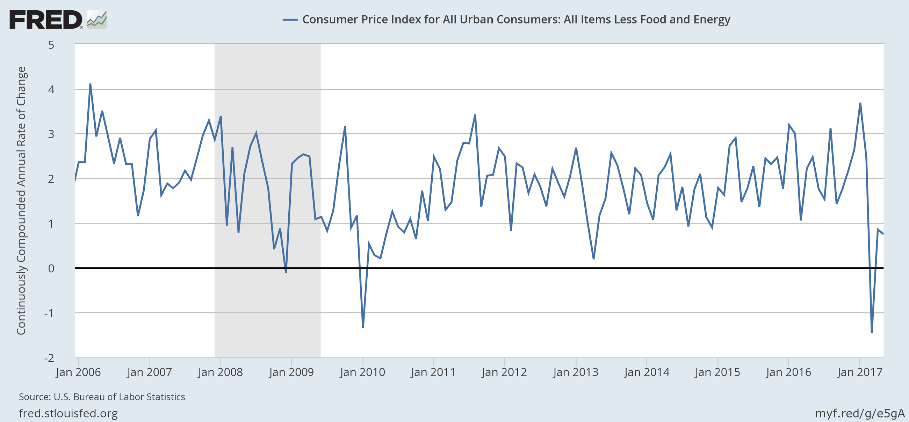

The Fed makes its interest rate announcement today at 2pm Eastern (11am Pacific). If they raise rates, then a couple of recession indicators will move towards the higher probability of recession end of the spectrum. For example, there's the inverted yield curve (discussed more extensively [here](http://informationtransfereconomics.blogspot.com/2014/09/the-emerging-story-of-great-recession.html)):

There is also [the "avalanche" indicator](http://informationtransfereconomics.blogspot.com/2015/11/are-we-no-longer-safe-from-recession.html) (the yellow area indicates above-trend interest rates and recessions never seem to happen without them):

Additionally, several of the [JOLTS measures](http://informationtransfereconomics.blogspot.com/2017/06/jolts-and-narratives.html) are showing a slowdown relative to the dynamic equilibrium (in this graph, the hires data is starting to fall below the green line):

Up until the last couple data points, the unemployment rate was seeming to flatten out signalling a potential recession [in the dynamic equilibrium model](http://informationtransfereconomics.blogspot.com/2017/06/unemployment-forecasts-may-data-update.html):

All of this is of course speculative, with only the inverted yield curve being a mainstream indicator. However, if the information equilibrium/dynamic equilibrium picture is correct, we are starting to accumulate several indicators of a future recession. Each on its own is definitely not enough, and the Fed could hold off raising rates today due to a low CPI inflation number (making yield curve less likely):

However, I wanted to get this out there before the Fed announcement today to both make sure I'm keeping myself honest as well as providing a test of the usefulness of the information equilibrium model.

...

**Update 11:32am**

[They raised them](http://www.wsj.com/livecoverage/federal-reserve-june-meeting).
