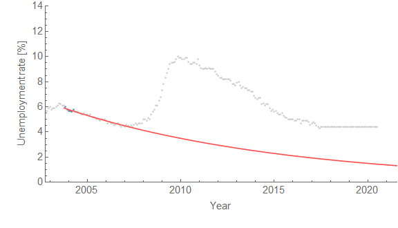

Given the latest report of 4.3%, it's looking more like the dynamic equilibrium path without the recession shock is the correct forecast from January of this year. I plotted out the dynamic equilibrium path without the recession (red) to the end of 2018 in order to better compare with the [FRB SF forecast](http://economistsview.typepad.com/economistsview/2017/01/frbsf-the-current-economy-and-the-outlook.html) (also from January, which I finally added to the same graph):

There are no error bars on the FRB SF forecast, however we should probably estimate them as roughly the same size as the error on the dynamic equilibrium model in red.

I will also start to keep track of the effect new data has on the [algorithmic recession indicator forecast](http://informationtransfereconomics.blogspot.com/2017/04/predicting-future-recessions.html) (which really only tells us that the unemployment rate has to start rising or falling before some date). The most recent data has pushed that date out from 2018.5 to 2019.1 (end of January 2019):

