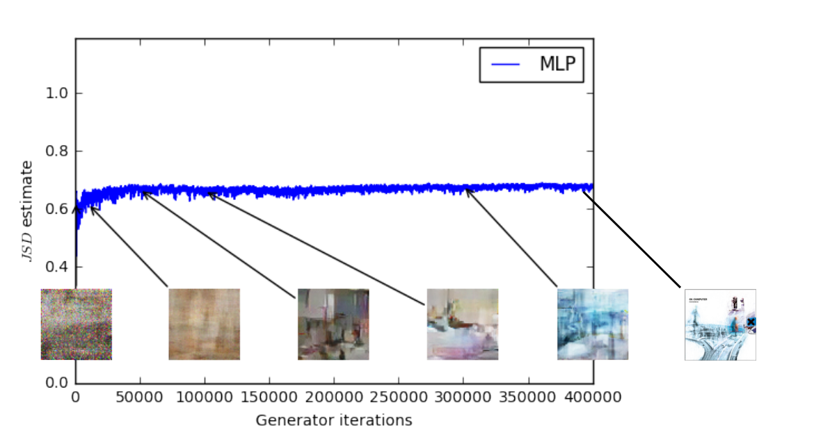
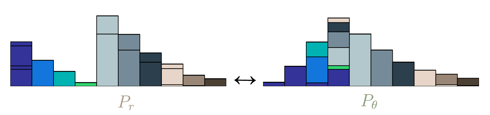
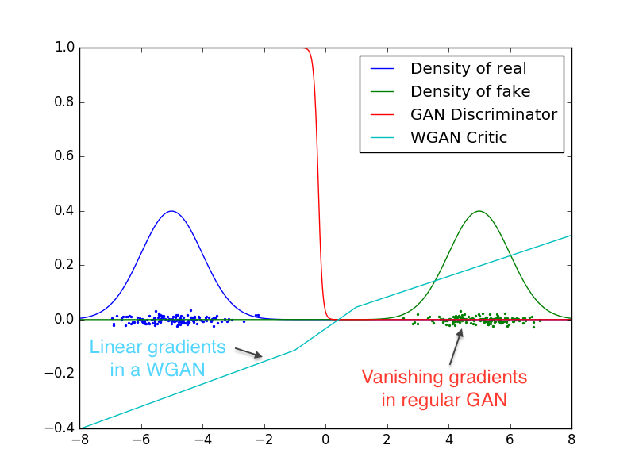

[This paper](https://arxiv.org/abs/1701.07875) (Arjovsky, Chintala, and Bottou \[ACB\]) on Wasserstein Generative Adversarial Networks (WGANs) has been generating (no pun intended) a lot of buzz in the machine learning community. Earlier this year, [I mentioned](http://informationtransfereconomics.blogspot.com/2017/02/generative-adversarial-networks-and.html) some intuition I had about a possible connection between GANs and information equilibrium as well as the potential for GANs to function as a model of markets.

ACB uses the [Wasserstein distance (metric)](https://en.wikipedia.org/wiki/Wasserstein_metric) (also called the [Earth Mover's Distance](https://en.wikipedia.org/wiki/Earth_mover%27s_distance)) instead of the original [Jensen-Shannon distance (divergence)](https://en.wikipedia.org/wiki/Jensen%E2%80%93Shannon_divergence) (a symmetric version of the [Kullback-Liebler divergence](https://en.wikipedia.org/wiki/Kullback%E2%80%93Leibler_divergence)). One of the benefits of the W-metric for machine learning is that it tends to have non-zero gradients (so e.g. gradient descent solvers won't have as many issues as could happen with other metrics illustrated in the figure at the top of this post). In an odd coincidence, the W-metric has come up two other times recently in unrelated contexts in my real job.

I noticed that this approach also has some interesting connections to information equilibrium. For starters, the W-metric is very much the intuitive guide I usually give for the distribution of supply coming into equilibrium with demand. We have two distributions where a lump of the supply distribution is moved to some place where there is an excess in the demand distribution as part of our approach to equilibrium. Here's a figure illustrating the concept [from a nice discussion of WGAN](https://vincentherrmann.github.io/blog/wasserstein/):

There is even a happy accident in terminology in that there is a "cost function" involved. There is an additional happy accident that the exact solution for histogram distributions is obtained via linear programming, discussed in the context of economics [in this blog post](http://crookedtimber.org/2012/05/30/in-soviet-union-optimization-problem-solves-you/). By the way, there is an another nice overview of ACB [here](http://www.alexirpan.com/2017/02/22/wasserstein-gan.html).

One of the other interesting aspects of WGANs is that the GAN "discriminator" is replaced by a WGAN "critic" (per ACB via the previous link):

The critic makes much more sense in the context of economics: at constant demand, a low price is a "critic" of excess supply and a high price is a "critic" of scarce supply.

The GAN analogy is still a one-sided model of supply and demand (it is a model for constant demand and varying supply or vice versa), rather than a full "general equilibrium" analogy (where supply and demand react to changes in each other).

I'm going to close (for now) with another observation about some of the math involved, namely [Lipschitz functions](https://en.wikipedia.org/wiki/Lipschitz_continuity). One of the problems with the abstract WGANs is that the W-metric is generally intractable ([like the linear programming economic allocation problem](http://crookedtimber.org/2012/05/30/in-soviet-union-optimization-problem-solves-you/)). However one can rewrite the problem using [Kantorovich-Rubinstein duality](https://en.wikipedia.org/wiki/Wasserstein_metric#Dual_representation_of_W1) which couches it in terms of Lipschitz functions which are (put simply) functions with bounded slope. The _K_\-Lipshitz condition (bounded by slope _K_) is:

__d​ₙ​​​(f(m​₁​​), f(m​₂​​)) ≤ K dₘ​​(m₁​​, m​₂​​)__

for all

_m₁_ and _m​₂_ 

where _f(m) : m → n_ and the _d_'s are metrics on the manifolds _m_ and _n_. Longtime readers of this blog may know where this is going already: this can be represented as an [information equilibrium (transfer) condition](http://informationtransfereconomics.blogspot.com/2016/09/basic-definitions-in-information.html). If we have information transfer from "demand" _A_ to "supply" _B_, then:

_dA/A ≤ k dB/B_

_d(_log _A) ≤ k d(_log _B)_

which is the infinitesimal version of the _K_\-Lipschitz condition (for log _A_ and log _B_) with the IT index _k_ playing the role of the slope _K_. That is to say that information transfer relationships are "locally" _k_\-Lipschitz. The definition of _K_\-Lipschitz is actually a global (i.e. for all of _m_ (i.e. log _B_)), so the KR duality trick would only work functions that are in information equilibrium (i.e. the equal sign, because then log _A_ = _k_ log _B_ + _c_ and the slope is actually equal to _k_ for all log _B_ measured from any two points log _b₁_ and log _b₂_).

\[**Update 19 June 2017:** n.b. this also applies to the price _p = dA/dB_ being locally _K_\-Lipschitz, but with _K_ = _k_ − 1.\]

The Lipschitz function representation of the WGAN also yields a solution up to an overall scale. I discuss the potential importance of scale invariance in economics in several posts (e.g. [here](http://informationtransfereconomics.blogspot.com/2017/05/in-conversation-with-steve-roth-i.html) or [here](http://informationtransfereconomics.blogspot.com/2016/10/invariance-under-inversion.html)).

I am not sure there is anything useful in the observation; it may be wildly off-base. I am still looking into the possible use of of GANs as a model of the "market algorithm", possibly showing us how markets work as well as under what conditions they don't work (and ways to improve them).
