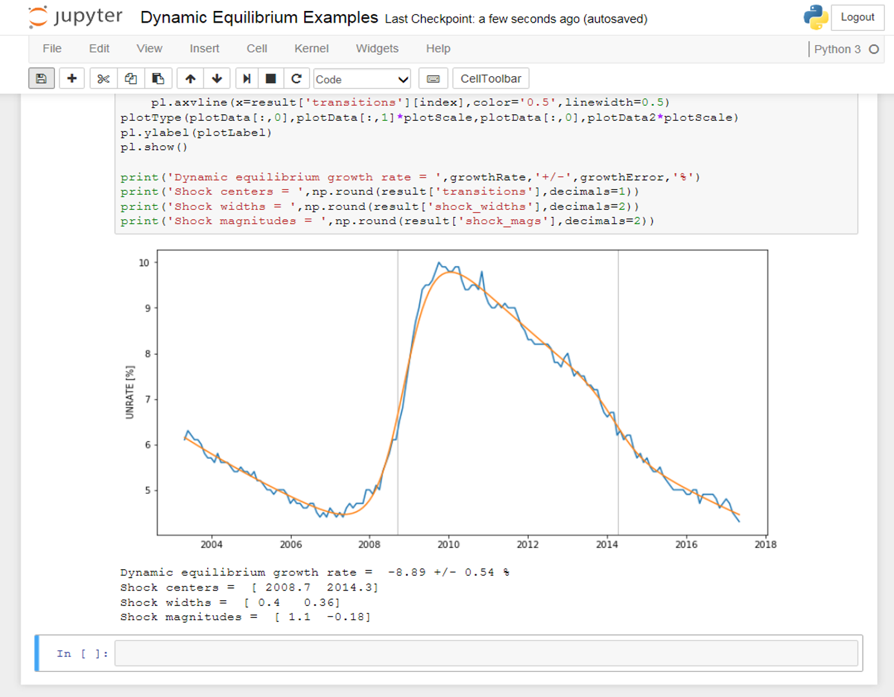

I have put together the 0.1-beta version of IEtools (_Information Equilibrium tools_) for python (along with a demo jupyter notebook looking at the [unemployment rate](http://informationtransfereconomics.blogspot.com/2017/01/dynamic-equilibrium-unemployment-rate.html) and _[NGDP/L](http://informationtransfereconomics.blogspot.com/2017/03/the-quantity-theory-of-labor-and.html)_). Everything is available in my [GitHub repositories](http://informationtransfereconomics.blogspot.com/2017/02/information-equilibrium-code.html). The direct link to the python repository is:

[https://github.com/infotranecon/IEtools](https://github.com/infotranecon/IEtools)

While I still love _Mathematica_, (and will likely continue to use it for most of my work here), python is free for everybody.
