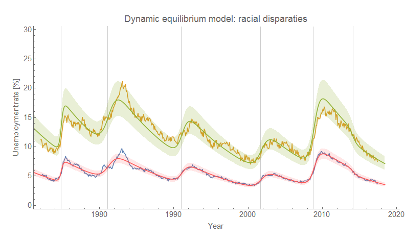

I can't remember where I saw it on Twitter while I was on vacation, but someone graphed the most recent unemployment data by race. One of the things I noticed was the similarities in the shape of the time series. Could the disparities be explained by a single [dynamic equilibrium](http://informationtransfereconomics.blogspot.com/2017/01/dynamic-equilibrium-presentation.html), but with different initial conditions? Is the reason black unemployment is high today simply because it was high in the past?

It turns out the answer is basically yes.

Unlike the [case of different education levels](http://informationtransfereconomics.blogspot.com/2017/02/heterogeneous-labor-supply-shocks.html) where the shape is basically the same but the dynamic equilibrium rates – the roughly constant rate of falling unemployment after a shock – are sufficiently different as to be distinguishable, the dynamic equilibrium rate for black and white unemployment is the same within model error (they are both approximately 0.09 and differ by only 0.003, see the addendum). In the graph at the top of this post, the same dynamic equilibrium fit (shown in red and green) does a reasonable job explaining both black and white unemployment (yellow and blue, respectively).

Since the model deals in logarithms, the two time series are essentially scaled versions of each other (instead of a linear model, in which they'd be shifted versions of each other). The underlying [matching model](http://informationtransfereconomics.blogspot.com/2017/01/matching-theory-and-employment-in.html) is therefore the same, just with different initial conditions (higher black unemployment in 1972 than white). If white unemployment and black unemployment had been the same in 1972, then they'd be roughly the same today.

Since both white and black employment (according to this model) are hit by the _same_ shocks, this means that black unemployment will _never_ fall to the same level as white unemployment without some kind of intervention. Additionally, this intervention cannot be racially blind because it has to decrease black unemployment but not decrease white unemployment as much (because that would not improve the ratio). It would therefore take the form [of some kind of reparations](https://www.theatlantic.com/magazine/archive/2014/06/the-case-for-reparations/361631/) (e.g. a black-only [WPA](https://en.wikipedia.org/wiki/Works_Progress_Administration)).

**Addendum: Methodology**

I used four different methods to apply the dynamic equilibrium model (described in detail [here](http://informationtransfereconomics.blogspot.com/2017/01/dynamic-equilibrium-presentation.html)). I fit the entire dynamic equilibrium either to white unemployment, or black unemployment and then used that fit ‒ call it _f(t)_, such that _exp(f(t)) = u(t)_ with _u(t)_ being the applicable unemployment rate  ‒ to fit to the other unemployment rate _u\*(t)_. In that second fit, I used a log-linear model:

_f\*(t) = f(t) + a t + b_

so that _u\*(t) = exp(f\*(t)) = exp(f(t) + a t + b)_. However I took _a_ \= 0 in one case (same EQ), and fit _a_ to the data in the other. Therefore _a_ measures the discrepancy from the dynamic equilibrium _α_ (measuring the roughly constant logarithmic slope of the falling unemployment). The measured rates were:

_α_
_α+a_
_a_

_α_
_α + a_
_a_

In both cases, black unemployment fell faster than white unemployment (i.e. [the matching function performed better](http://informationtransfereconomics.blogspot.com/2017/01/matching-theory-and-employment-in.html)).

_a_ _u\*(t)_
_a_
_a_ _u\*(t)_
_a_

The results were largely similar (within the error of the model), so I've relegated these graphs to this addendum. Here are the results (the fit data _u(t)_ is blue, the model _f(t)_ is red, the other unemployment data _u\*(t)_ is yellow and the other model _f\*(t)_ is green):

