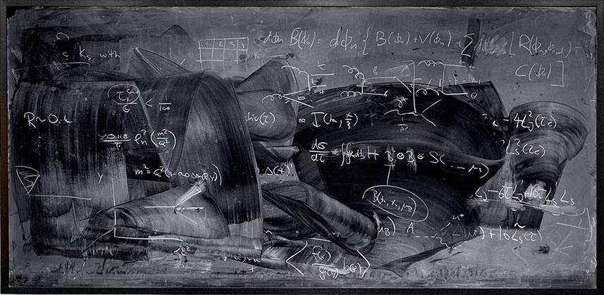

In the aftermath of the Great Recession, there has been much discussion about the use of math in economics. Complaints range from "too much math" to "not rigorous enough math" ([Paul Romer](https://www.aeaweb.org/articles?id=10.1257/aer.p20151066)) to "using math to obscure" ([Paul Pfleiderer](https://www.gsb.stanford.edu/faculty-research/working-papers/chameleons-misuse-theoretical-models-finance-economics)). There are even complaints that economics has "[physics envy](http://noahpinionblog.blogspot.com/2015/05/economists-dont-have-physics-envy.html)". [Ricardo Reis](http://personal.lse.ac.uk/reisr/papers/17-wrong.pdf) \[pdf\] and [John Cochrane](http://johnhcochrane.blogspot.com/2017/06/reis-on-state-of-macro.html) have defended the use of math saying it enforces logic and that complaints come from people who don't understand the math in economics.

As a physicist, I've had no trouble understanding the math in economics. I'm also not averse to using math, but I am averse to using it improperly. In my opinion, there seems to be a misunderstanding among both detractors and proponents of what mathematical theory is for. This is most evident in macroeconomics and growth theory, but some of the issues apply to microeconomics as well.

The primary purpose of mathematical theory is to provide equations that illustrate relationships between sets of numerical data. That what Galileo was doing when he was rolling balls down inclined planes (comparing distance rolled and time measured with water flowing), discovering distance was proportional to the square of the water volume (i.e. time).

Not all fields deal with numerical data, so math isn't always required. Not a single equation appears in Darwin's _Origin of Species_, for example. And while there exist many cases where economics studies unquantifiable behavior of humans, a large portion of the field is dedicated to understanding numerical quantities like prices, interest rates, and GDP growth.

Once you validate the math with empirical data and observations, you've established "trust" in your equations. Like a scientist's academic credibility letting her make claims about the structure of nature or simplify science to teach it, this trust lets the math itself become a source for new research and pedagogy.

Only after trust is established can you derive new mathematical relationships (using logic, writing proofs of theorems) using those trusted equations as a starting point. This is the forgotten basis in Reis' claims about math enforcing logic. Math does help enforce logic, but it's only meaningful if you start from empirically valid relationships.

This should not be construed to require models to start with "realistic assumptions". As Milton Friedman [wrote](https://en.wikipedia.org/wiki/Essays_in_Positive_Economics) \[1\], unrealistic assumptions are fine as long as the math leads to models that get the data right. In fact, models with unrealistic assumptions that explain data would make a good scientist question her thinking about what is "realistic". Are we adding assumptions we feel in our gut are "realistic" that don't improve our description of data simply because we are biased towards them?

Additionally, toy models, "[quantitative parables](http://informationtransfereconomics.blogspot.com/2017/06/barriers-to-entry-in-quantitative.html)", and models that simplify in order to demonstrate principles or teach theory should either come after empirically successful models and establish "trust", or they themselves should be subjected to tests against empirical data. Keynes was wrong when he said that one shouldn't fill in values in the equations [in a letter to Roy Harrod](http://economia.unipv.it/harrod/edition/editionstuff/rfh.346.htm). Pfleiderer's chameleon models are a symptom of ignoring this principle of mathematical theory. Falling back to claims a model is a simplified version of reality when it fails when compared to data should immediately prompt questions of why we're considering this model at all. Yet Pfleiderer tells us some people consider this argument a valid defense of their models (and therefore their policy recommendations).

I am not saying that all models have to perform perfectly right out of the gate when you fill in the values. Some will only qualitatively describe the data with large errors. Some might only get the direction of effects right. The reason to compare to data is not just to answer the question "How small are the residuals?", but more generally "What does this math have to do with the real world?" Science at its heart is a process for connecting ideas to reality, and math is a tool that helps us do that when that reality is quantified. If math isn't doing that job, we should question what purpose it is serving.  Is it trying to make something look more valid than it is? Is it obscuring political assumptions? Is it just signaling abilities or membership in the "mainstream"? In many cases, it's just tradition. You derive a DSGE model in the theory section of a paper because everyone does.

Beyond just comparing to the data, mathematical models should also be appropriate for the data.

A model's level of complexity and rigor (and [use of symbols](http://informationtransfereconomics.blogspot.com/2016/11/translating-among-econ.html)) should be comparable to the empirical accuracy of the theory and the quantity of data available. The rigor of a DSGE model is comical compared to how poorly the models forecast. Their complexity is equally comical when they are [outperformed by simple autoregressive processes](http://informationtransfereconomics.blogspot.com/2016/10/forecasting-it-versus-all-comers.html). DSGE models frequently have 40 or more parameters. Given only 70 or so years of higher quality quarterly post-war data (and many macroeconomists [only deal with data after 1984 due to a change in methodology](http://economistsview.typepad.com/economistsview/2013/04/empirical-methods-and-progress-in-macroeconomics.html)), 40 parameter models should either perform very well empirically or be considered excessively complex. The poor performance ‒ and excessive complexity given that performance ‒ of DSGE models should make us question the assumptions that went into their derivation. The poor performance should also tell us that we shouldn't use them for policy.

A big step in using math to understand the world is when you've collected several different empirically successful models into a single paradigm or framework. That's what [Newton](https://en.wikipedia.org/wiki/Philosophi%C3%A6_Naturalis_Principia_Mathematica) did in the seventeenth century. He collected Kepler's, Galileo's, and others' empirical successes into a framework we call Newtonian mechanics.

When you have a mathematical framework built upon empirical successes, deriving theorems starts to become a sensible thing to do (e.g. [Noether's theorem](https://en.wikipedia.org/wiki/Noether%27s_theorem) in physics). Sure, it's fine as a matter of pure mathematics to derive theorems, but only after you have an empirically successful framework do those theorems have implications for the real world. You can also begin to understand the scope of the theory by noting where your successful framework breaks down (e.g. [near the speed of light](https://en.wikipedia.org/wiki/Relativistic_mechanics) for Newtonian mechanics).

A good case study for where this has gone wrong in economics is the famous [Arrow-Debreu general equilibrium theorem](https://en.wikipedia.org/wiki/Arrow%E2%80%93Debreu_model). The "framework" it was derived from is rational utility maximization. This isn't a real framework because it is not based on empirical success but rather philosophy. The consequence of inappropriately deriving theorems in frameworks without empirical (what economists call external) validity is that we have no clue what the [scope](http://informationtransfereconomics.blogspot.com/2015/10/we-built-this-theory-on-scope-conditions.html) of general equilibrium is. Rational utility maximization [may only be valid near a macroeconomic equilibrium](http://informationtransfereconomics.blogspot.com/2016/02/one-more-physics-analogy.html) (i.e. away from financial crises or recessions) rendering Arrow-Debreu general equilibrium moot. What good is a theorem telling you about the existence of an equilibrium price vector when it's only valid if you're in equilibrium? That is to say the microeconomic rational utility maximization framework may require "macrofoundations" — empirically successful macroeconomic models that tell us what a macroeconomic equilibrium is.

From my experience making these points on my blog, I know many readers will say that I am trying to tell economists to be more like physics, or that social sciences don't have to play by the same rules as the hard sciences. This is not what I'm saying at all. I'm saying economics has unnecessarily wrapped itself in a straitjacket of its own making. Without an empirically validated framework like the one physics has, economics is actually _far more free_ to explore a variety of mathematical paradigms and empirical regularities. Physics is severely restricted by the successes of Newton, Einstein, and Heisenberg. Coming up with new mathematical models consistent with those successes is hard (or would be if physicists hadn't developed tools that make the job easier like Lagrange multipliers and quantum field theory). Would-be economists are literally free to come up with anything that appears useful \[2\]. Their only constraint on the math they use is showing that their equations are indeed useful — by filling in the values and comparing to data.

**Footnotes:**

\[1\] Friedman also wrote: "Truly important and significant hypotheses will be found to have 'assumptions' that are wildly inaccurate descriptive representations of reality, and, in general, the more significant the theory, the more unrealistic the assumptions (in this sense) (p. 14)." This part is garbage. Who knows if the correct description of a system will involve realistic or unrealistic assumptions? Do you? Really? Sure, it can be your personal heuristic, much like many physicists look at the "beauty" of theories as a heuristic, but it ends up being just another constraint you've imposed on yourself like a [straitjacket](http://informationtransfereconomics.blogspot.com/2017/01/a-good-series-on-macro-and.html).

\[2\] To answer [Chris House's question](https://orderstatistic.wordpress.com/2014/03/21/why-are-physicists-drawn-to-economics/), I think this freedom is a key factor for many physicists wanting to try their hand at economics. Physicists also generally play by the rules laid out here, so many don't see the point of learning frameworks or models that haven't shown empirical success.
