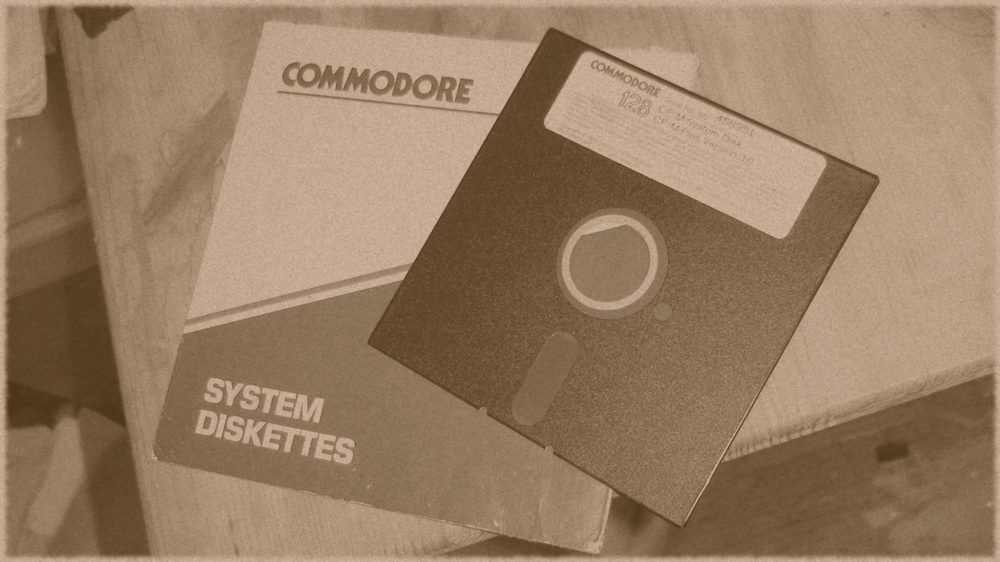

First, this isn't about [bootstrapping in stats](https://en.wikipedia.org/wiki/Bootstrapping_\(statistics\)). It's about something more fundamental to the scientific method.

I've been seeing an idea crop up again ‒ in a recent comment that I can't seem to find right now, on Twitter, and in a blog post from [Roger Farmer](http://www.rogerfarmer.com/rogerfarmerblog/2017/7/30/who-is-a-post-keynesian):

> _My talk was predicated on the fact that there can be no measurement without theory ..._

This is one of those ideas that seems to have morphed from something insightful into something that [very serious people](http://rationalwiki.org/wiki/Very_Serious_People) say \[1\].

Yes, in some sense any "measurement" is going to be made inside some paradigm that is going to influence the measurement process (what to measure, how to measure, or whether a measurement is showing a "change"). It's the subject of James Burke's great documentary series [_The Day the Universe Changed_](https://en.wikipedia.org/wiki/The_Day_the_Universe_Changed) where he explores how conceptual frameworks (theory) influence how the universe is perceived (measurement).

What is forgotten is that there are different degrees of influence. Sure, using an HP filter with GDP data leaves the idea of a recession defined by GDP shocks [entirely up to the theorist](http://noahpinionblog.blogspot.com/2012/07/steve-williamson-explains-modern-macro.html). Your "theory" of how smooth GDP "should be" determines whether or not you see recessions in the GDP data. Even more theory goes into [whether or not you think GDP is above or below potential](http://informationtransfereconomics.blogspot.com/2016/09/how-rgdp-got-its-slopes.html).

In contrast, unemployment rates are pretty straightforward measurements that don't involve a lot of macroeconomic theory to interpret. Sure, there are theories involved in turning responses to the surveys (you might use an [optical transfer function](https://en.wikipedia.org/wiki/Optical_transfer_function) of a telescope as an analogy for the corrections to survey data) into unemployment rate data and different definitions of "unemployed" (for which [data are also available](https://fred.stlouisfed.org/series/U6RATE)). However, none of those caveats depend strongly on your macroeconomic theory. Whether unemployment is "high" or "low" depends on your theory (i.e. the counterfactual), but the time series is just an (imperfect) empirical measurement of the number of people without jobs who want one.

In macroeconomics (or economics in general) there exists a hierarchy of empirical measurements that depend more or less strongly on your theoretical framework. Here's a heuristic hierarchy starting from least theory dependent to most theory dependent with some examples:

_S&P 500 (**least**)_

_._

_._

_._

_Unemployment rate_

_._

_._

_._

_NGDP_

_._

_RGDP_

_._

_._

_._

_Non-accelerating rate of unemployment_

_Natural rate of interest (**most**)_

It is important to note that the S&P 500 measurement itself is not theory dependent. It is the weighted sum of some stock values. The S&P 500 is not "really" some other value in the sense that GDP could "really" be much higher because of stuff that isn't included. Whether or not this measurement is important to the economy is theory dependent, however.

The same kind of thing exists in physics. The [QCD scale](https://en.wikipedia.org/wiki/Coupling_constant#QCD_scale) is theory dependent (and even regulator [scheme dependent](https://en.wikipedia.org/wiki/Minimal_subtraction_scheme)). The temperature outside is less theory dependent. The mass of an object is even less theory dependent.

And it's a good thing this hierarchy exists! Because otherwise science would never work. If all observations were strongly theory dependent, you'd never have a set of observations you could use to get started theorizing. Any observation would've come via some other implicit theory, so you couldn't use it to motivate your own theory. (I guess there's the outside chance you just happened to stumble upon the theory that explains everything at once right out of the gate.) You need a set of measurements that enables you to bootstrap into the push and pull of theory and evidence that we call science.

Physics started with falling objects. Evolutionary biology started with counting different creatures. Prices and counting seem like a good start for economics \[2\]. In any case, the idea that there can be no measurement without theory should be a qualified statement.

...

**Footnotes:**

\[1\] I think [another case](http://informationtransfereconomics.blogspot.com/2016/04/its-complicated-alternative-approaches.html) of very serious people discussing economic methodology comes in the form of "complexity".

\[2\] I mentioned this before [here](http://informationtransfereconomics.blogspot.com/2015/05/im-not-sure-noah-smith-understands.html), but counting and motion represent the two big paradigms of mathematics: algebra and calculus. And instead of [the diagram from XKCD](https://xkcd.com/435/), I actually see two pyramids with physics at the top of one and economics at the top of the other with mathematics in the intersection. Money and physical reality (geometry, motion) are the two major drivers of mathematics and the mathematics that is actually developed tends to be constrained by this. In the 1200s Fibonnacci introduces algebra and "Arabic" (Indian) numerals in Italy for merchants' accounting an interest computations. Adelard is involved int he reintroduction of geometry and astronomy to Western Europe a bit before. You can also see the difference in that algebra was for business, but geometry and motion were more heavily involved with astronomy and time (and hence religion). Consider this a more social view of mathematics as a human institution instead of a philosophical view from Plato's cave.
