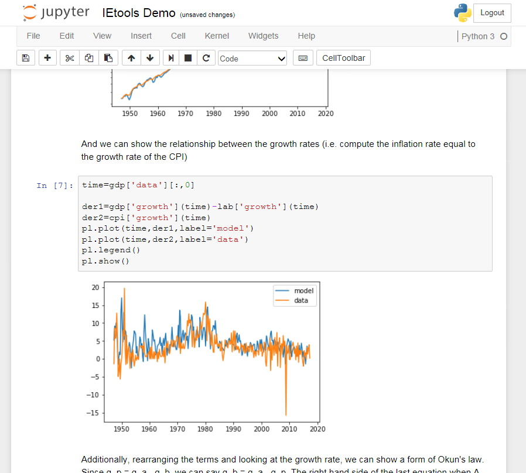

I added some more functionality to the **_IEtools.py_** package ([on GitHub](https://github.com/infotranecon/IEtools)) for working with information equilibrium. There's now a fitting function for the parameters in an information equilibrium relationship as well as better file readers (FRED xls and csv), and the imported data structures now include growth rates and interpolating functions.

There's also a little demo of [Okun's law](http://informationtransfereconomics.blogspot.com/2017/03/the-quantity-theory-of-labor-and.html).
