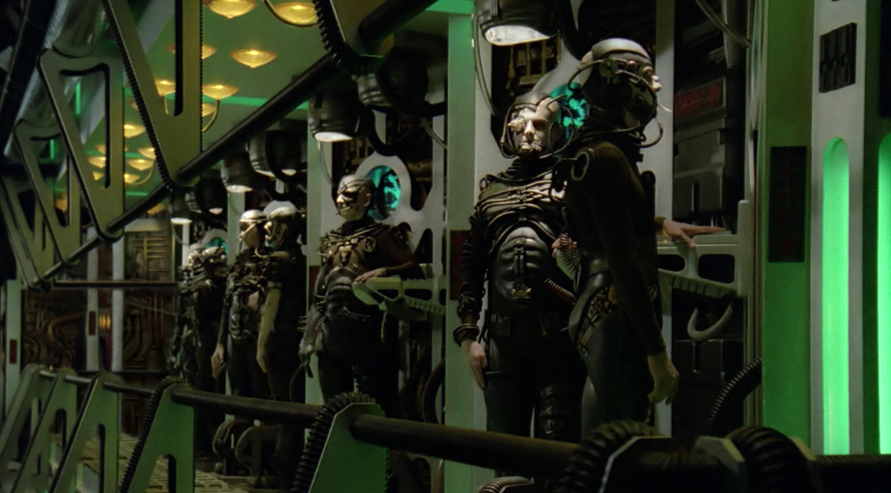

Now that the book is out and I'm back from vacation, I can start up the regular blogging again. While I was on vacation, I read [Miles Kimball's post](https://blog.supplysideliberal.com/post/2017/5/29/there-is-no-such-thing-as-decreasing-returns-to-scale) on decreasing returns to scale (via [unlearningecon](https://twitter.com/UnlearningEcon/status/899950549826768896)). It opens:

> _There is no such thing as decreasing returns to scale. Everything people are tempted to call decreasing returns to scale has a more accurate name. The reason there is no such thing as decreasing returns to scale was explained well by Tjalling Koopmans in his 1957 book Three Essays on the State of Economic Science. The argument is the replication argument: if **all** factors are duplicated, then an identical copy of the production process can be set up and output will be doubled. It might be possible to do better than simply duplicating the original production process, but there is no reason to do worse. In any case, doing worse is better described as stupidity, using an inappropriate organizational structure, or X-inefficiency rather than as decreasing returns to scale._

I think this is an excellent example of a case where economics takes a cold logical argument, and attempts to apply it to real world data. Essentially, Kimball is saying there is no such thing as decreasing returns to scale because of logic (the replication argument \[1\]) therefore everything that appears as decreasing returns to scale must be something else. That something else, however, relies on a particular model of the underlying microeconomics that we don't necessarily understand with a good empirical model (organizational structure, "stupidity").

In physics, sometimes we don't understand the particular micro theory well enough but are able to make an effective macro theory by using micro theory to narrow down a form and fit parameters. The classic example is [chiral perturbation theory](https://en.wikipedia.org/wiki/Chiral_perturbation_theory) (which is so classic that when you say Effective Field Theory without specifying any more detail, the assumption is that you're talking about chiral perturbation theory). In that case we don't understand quark physics enough to describe nuclei and hadron interactions in terms of the quark theory (QCD).

In another (possible) example, Einstein's gravity may actually not be a real force but rather an entropic force ([here](https://arxiv.org/abs/gr-qc/9504004), [here](https://arxiv.org/abs/1001.0785)) and therefore Einstein's description is an effective theory where we don't understand the real micro theory (e.g. is there quantum gravity?).

In the economics example, we don't necessarily understand the underlying microeconomics that yield decreasing returns to scale, but we can begin to understand them as an effective theory of decreasing returns to scale. Kimball's claim translated into physics would have him saying there is no such thing as a gravitational field, it's all gravitons. Not only would physicists continue to use Einstein's equations without knowing the quantum theory of gravity, but Kimball the physicist could be completely wrong because it may turn out there is no such thing as a graviton because gravity is an emergent effective theory.

I think the point I am trying to make here is that the underlying micro theory of production by humans organized in firms is not some well-established empirically accurate theory. But Kimball is making assumptions about it that may turn out to be incorrect. I can illustrate the converse with what turns out to be a formally equivalent argument in physics: [the Gibbs paradox](https://en.wikipedia.org/wiki/Gibbs_paradox).

The Gibbs paradox is about the entropy of an ideal gas: the first formula derived was a decent effective description but had issues with a theoretical replication argument. If you doubled the amount of an ideal gas, you more than doubled the entropy using Gibbs formula. It was a problem, but in this case it was a problem that involved an otherwise empirically successful micro theory (statistical mechanics of atoms). Because physicists had been successful with the micro theory, you could take the replication argument seriously. If physicists had been ignorant of the underlying micro theory, there would have been no reason to think this was a problem (maybe entropy wasn't extensive, i.e. "constant returns to scale"). Maybe whatever matter was made of had this property in terms of Boltzmann's definition of entropy? With 20/20 hindsight, we know it wasn't correct \[2\] but was statistical mechanics a foregone conclusion? If it started disagreeing with empirical data, like many other ideas in physics, it would've been thrown out. How does Kimball know X-efficiency isn't going to be thrown out by empirical studies?

The thing is that organizations and economic forces are at their heart social systems. There is no particular reason that doubling all the means of production should yield at least double the output, especially if we're including things like money. Two people working on a project doesn't necessarily double the output or divide the time it takes in half. Why? I don't know. It's probably complicated.

However, let me close with an explicit example of a plausible social model that could manifest decreasing returns to scale: trust. Trust has decreasing returns to scale. The bigger a group of humans, the less trust there is among them. As trust decreases, contracts inside a firm need to be more explicitly specified resulting in additional costs (Coase and the theory of the firm). It's true I may never be able to build a microfounded model of agent trust, but I could build an effective theory based on sociology studies.

In the end, it doesn't make sense to say: "There is no such thing as decreasing returns to scale, you should call it lack of trust, which always happens in human systems and always leads to decreasing returns to scale." Decreasing returns to scale (if that model is true) is as fundamental to production as the production inputs if it always happens. It is true that maybe we could discover an alien species where trust doesn't decrease as you increase the size of the social group (e.g. the Borg). At that point we might have to rewrite the theories. But much like we can't logically deduce the existence of aliens, using logic to say there's no such thing as decreasing returns to scale without an empirically accurate theory that tells us the underlying micro theory assumptions are sensible.

...

**Footnotes:**

\[1\] The replication argument is used to argue that there can't be increasing returns to scale either.

\[2\] The solution was found in recognizing atoms of the same type are actually indistinguishable, so the many identical states where you exchange one atom for another are over-counted in Gibbs' entropy formula.
