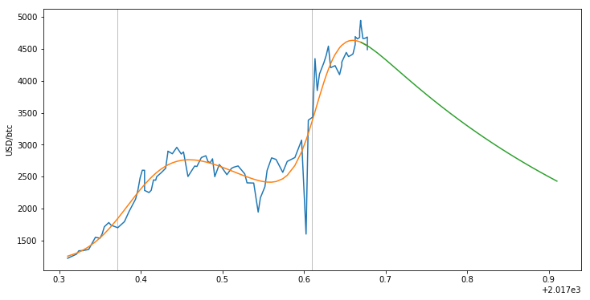

So I made some bold forecasts of [the S&P 500](http://informationtransfereconomics.blogspot.com/2017/01/what-about-s-500.html) (in January) and the [bitcoin exchange rate](https://informationtransfereconomics.blogspot.com/2017/05/dynamic-equilibrium-and-bitcoin.html) (in May) using the [dynamic equilibrium model](https://informationtransfereconomics.blogspot.com/2017/01/dynamic-equilibrium-presentation.html). The S&P 500 forecast is doing really well (second graph is a zoom in on the first):

In the bitcoin forecast, I made a bold claim about a turnaround in the price — and the turnaround came and was well-described by the model:

However it was followed by a shock (centered in early to mid August). This shock is of the typical size in the historical data (best seen in the logarithmic scale graph):

The most recent data looks exactly like a shock centered at 2017.6, or 10 days into August. It's width is about 6 days, so it's perfectly consistent with [the August 1st bitcoin "fork"](http://fortune.com/2017/07/30/bitcoin-cash-fork/). Here is the dynamic equilibrium model fit to the recent data:

There was no telling how big the fork shock would be using the dynamic equilibrium model, but you could understand the shape.

**Update 5 September 2017**

The _Mathematica_ code for the bitcoin model is up on [my Github](https://github.com/infotranecon/dynamicequilibrium).

**Update 6 September 2017**

Jupyter notebook/python IEtools code [is now available on Github](https://github.com/infotranecon/IEtools) as well. Forecast does not include error in this version, however.

