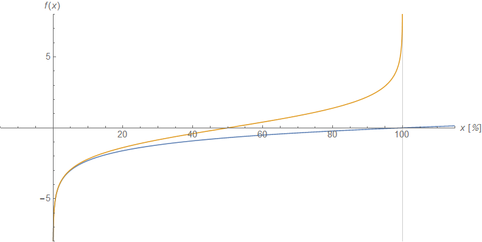

The latest data for July for the dynamic equilibrium model of the [(prime age) civilian labor force participation rate](http://informationtransfereconomics.blogspot.com/2017/05/civilian-labor-force-participation-and.html) is now available. No big news — just continuing to be a decent model:

There is a scope condition on this model: it won't work for CLF participation rates close to 100%. The model operates on a log-linear transform of the data which is fine for ratios that can go above 1. However, CLF is limited to being being between 0% and 100% (a labor force participation rate, like an unemployment rate above 100%, doesn't make sense). For these kinds of measures, instead of a log-linear transformation $x \rightarrow \log x$ we need to use

As you can see, it is a decent approximation until you get close to 100%:

