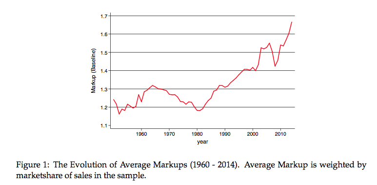

There was a brief period several days ago where markups were all the rage in the econ blogs due to a new paper on market power by Jan De Loecker and Jan Eeckhout. Dietrich Vollrath documents it in his opening paragraph [here](https://growthecon.com/blog/DE-Markups/). He also discusses the paper at length and I recommend his post.

This post is mostly just a few notes about interpreting this in terms of information equilibrium. Vollrath illustrates the basic formula (in terms of a single input/output, just add indices as necessary):

We can rewrite this in terms of an information equilibrium relationship where the marginal costs $MC$ are the abstract price in the "market for revenue" $R \rightleftarrows I$ with input $I$ with IT index $1/\mu$ (see [here for definitions](https://informationtransfereconomics.blogspot.com/2016/09/basic-definitions-in-information.html)):

So we can make the identification of $\mu$ with the markup. Now in the paper, they discover $\mu$ is changing. This is exactly what happens if we think of this equation [as representing an ensemble average](https://informationtransfereconomics.blogspot.com/2017/07/dynamic-equilibrium-and-ensembles-and.html):

The key thing to recognize is that the markup in the first graph is the inverse of the IT index graphed in the second graph: a rise in the markup is a fall in the IT index. The second graph is from this post on falling [labor productivity growth](https://informationtransfereconomics.blogspot.com/2016/07/an-ensemble-of-labor-markets.html) (see also [here](http://informationtransfereconomics.blogspot.com/2016/07/economic-temperature-functions.html)). Interestingly, Vollrath and the paper also discuss a connection with falling productivity growth. (**Update #1:** the graphs have different domains as well, but as the inputs are generally growing $\sim \exp r t$, then there is a log-linear relationship between the magnitude of inputs and time. **Update #2:** see update #3 below.).

The "market power" story [people are telling](https://noahpinionblog.blogspot.com/2017/08/the-market-power-story.html) in relation to this paper (and [before](https://www.bloomberg.com/view/articles/2017-02-15/monopolies-are-worse-than-we-thought)) is in the information equilibrium re-telling the exact same story I've told before: there are a lot more ways to construct an economy with a particular growth rate out of many firms in low growth states and a few in high growth states than out of many firms in high growth states. The "maximum entropy" state should result in lower (ensemble average) productivity and (here) higher (ensemble average) markups. See [here for a more detailed explanation in terms of partition functions](https://informationtransfereconomics.blogspot.com/2016/09/balanced-growth-maximum-entropy-and.html).

...

**Update #3:** 

Actually reran the computation to show an apples-to-apples comparison. First, there is the IT index versus inputs (as above):

Then there are the exponentially growing inputs:

Putting these together (and using IT index = 1/markup) with the markup data from the paper (red) as an overlay:

Also, this is what an example Monte Carlo throw for available state space for the ensemble of firms' markups looked like (q.v. [here](https://informationtransfereconomics.blogspot.com/2016/09/the-economic-state-space-mini-seminar.html)):

