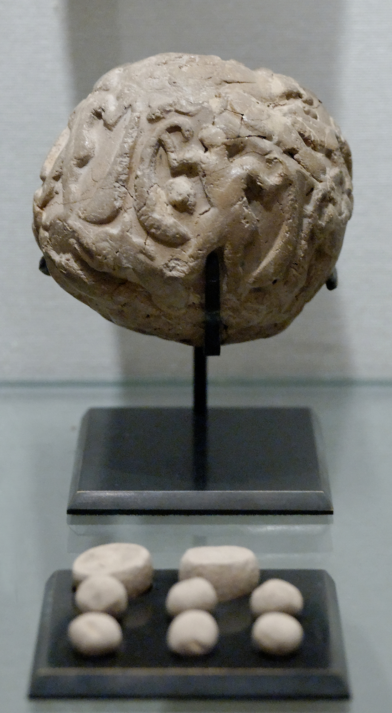
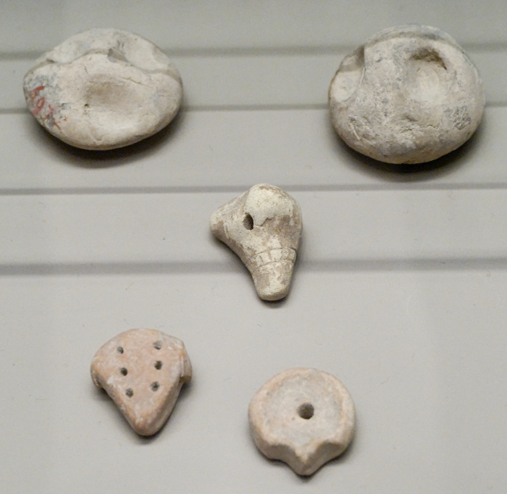
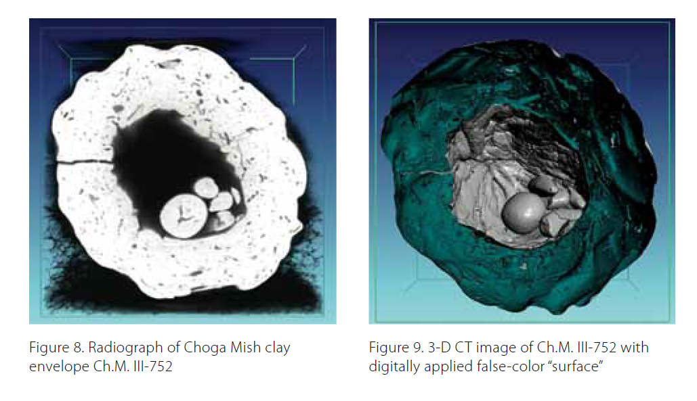
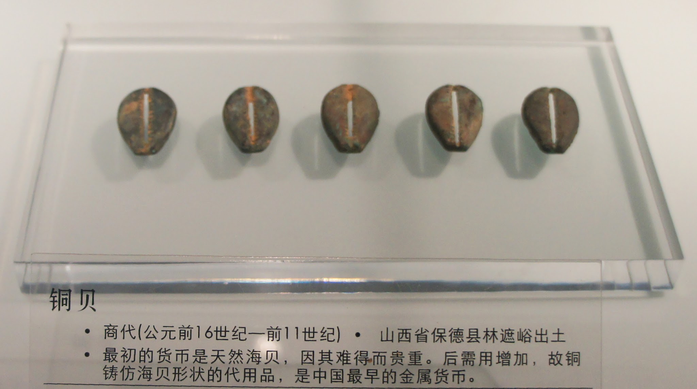

I was reading the new CORE economics textbook. [It starts off with](http://www.core-econ.org/the-economy/book/text/01.html) some bold type stating "capitalism revolutionized the way we live", effectively defining economics as the study of capitalism as well as "other economic systems". The first date in the first bullet point is the 1700s (the first sentence mentions an Islamic scholar of the 1300s discussing India). This started me thinking: how would I start an economics textbook based on the information-theoretic approach I've been working on?

_An envelope-tablet (bulla) and tokens ca. 4000-3000 BCE from the Louvre._ 
_© Marie-Lan Nguyen / Wikimedia Commons_

**Commerce and information**

While she was studying the uses of clay before the development of pottery in Mesopotamian culture in the early 1970s, Denise Schmandt-Besserat kept encountering small dried clay objects in various shapes and sizes. They were labelled with names like "enigmatic objects" at the time because there was no consensus theory of what they were. Schmandt-Besserat first cataloged them as "geometric objects" because they resembled cones and disks, until ones resembling animals and tools began to emerge. Realizing they might have symbolic purpose, she started calling them tokens. That is what they are called today.

The tokens appear in the archaeological record as far back as 8000 BCE, and there is evidence they were fired which would make them some of the earliest fired ceramics known. They appear all over Iran, Iraq, Syria, Turkey, and Israel. Most of this was already evident, but unexplained, when Schmandt-Besserat began her work. Awareness of the existence of tokens, in fact, went back almost all the way to the beginning of archaeology in the nineteenth century.

Tokens were found inside one particular "envelope-tablet" (hollow cylinders or balls of clay — called _bullae_) found in the 1920s at a site near ancient Babylon. It had a cuneiform inscription on the outside that read: "Counters representing small cattle: 21 ewes that lamb, 6 female lambs... " and so on until 49 animals were described. The _bulla_ turned out to contain 49 tokens.

In a 1966 paper Pierre Amiet suggested the tokens represented specific commodities, citing this discovery of 49 tokens and the speculation that the objects were part of an accounting system or other record-keeping. Similar systems are used to this day. For example, in parts of Iraq pebbles are used as counters to keep track of sheep.

But because this was the only such envelope-tablet known, it seemed a stretch to reconstruct a entire system of token-counting based on one single piece of evidence. But, as Schmandt-Besserat later noted, the existence of many tokens having the same shape but in different sizes is suggestive that they belonged to an accounting system of some sort. With no further evidence however, this theory remained just one possible explanation for the function of the older tokens that pre-dated writing.

In 2013, fresh evidence emerged from _bullae_ dated to ca. 3300 BCE.  Through use of CT scanning and 3D modelling to see inside unbroken clay balls, researchers discovered that the _bullae_ contained a variety of geometric shapes consistent with Schmandt-Besserat's tokens.

_CT scan of Choga Mish bulla and Denise Schmandt-Besserat_

While these artifacts were of great interest in Schmandt-Besserat's hypothesis about the origin of writing, they fundamentally represent economic archaeological artifacts.

Could a system function with just a single type of token? Cowrie shells seemed to provide a similar accounting function around the Pacific and Indian oceans (because of this, the Latin name of the specific species is _Monetaria moneta_, "the money cowrie"). The distinctive cowrie shape was even cast in copper and bronze in China as early as 700 BCE, making it an early form of metal coinage. The earliest known metal coins along the Mediterranean come from Lydia from before 500 BCE.

_[Bronze cowrie shells](https://zh.wikipedia.org/wiki/%E9%93%9C%E8%B4%9D#/media/File:Bronze_cowries.jpg) from the Shang dynasty (1600-1100 BCE)_

The 2013 study of the Mesopotamian _bullae_ was touted in the press as the "very first data storage system", and (given the probability distributions of finding various tokens) a bulla containing a particular set of tokens represents a specific amount of information by Claude Shannon's definition in his 1948 paper establishing information theory.

In this light, commerce can be seen as an information processing system whose emergence is deeply entwined with the emergence of civilization. It is also deeply entwined with modern mathematics.

Fibonacci today is most associated with the Fibonacci sequence of integers. His _Liber Abaci_ ("Book of Calculation", 1202) introduced Europe to Hindu-Arabic numerals in its first section, and in the second section illustrated the usefulness of these numerals (instead of the Roman numerals used at the time) to businessmen in Pisa with examples of calculations involving currency, profit, and interest. In fact, Fibonacci's work spread back into Arabic business as the Arabic numerals had mostly been used by Arabic astronomers and scientists.

The accouting system and other economic data is often described using these numerals today — at least where they need to be accessed by humans. In reality, the vast majority of commerce is conducted using abstract _bullae_ that either contain a token or not: bits. These on/off states (_bullae_ that contain a token or not) that are the fundamental units of information theory also represent the billions of transactions and other information flowing from person to person or firm to firm.

At its heart, economics is the study of this information processing system.

...

**Update:** See also Eric Lonergan's [fun blog experiment](https://www.philosophyofmoney.net/money-and-language/) (click on the last link) on money and language. Additionally, Kocherlakota's _[Money is Memory](https://www.minneapolisfed.org/research/sr/sr218.pdf)_ \[pdf\] is relevant.

**Credits:**

I took liberally (maybe too liberally) from the first link here, and added to it.

[https://www.usu.edu/markdamen/1320Hist&Civ/chapters/16TOKENS.htm](https://www.usu.edu/markdamen/1320Hist&Civ/chapters/16TOKENS.htm)

[http://sites.utexas.edu/dsb/tokens/](http://sites.utexas.edu/dsb/tokens/)

[https://oi.uchicago.edu/sites/oi.uchicago.edu/files/uploads/shared/docs/nn215.pdf](https://oi.uchicago.edu/sites/oi.uchicago.edu/files/uploads/shared/docs/nn215.pdf)
