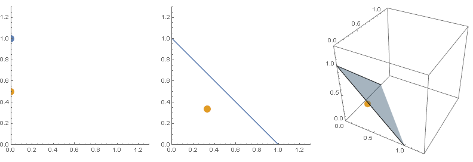
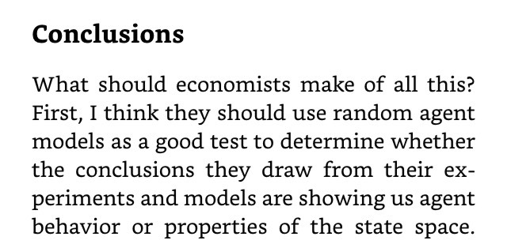

[Noah Smith points us](https://twitter.com/Noahpinion/status/903848602258116608) to a _[Psychology Today](https://www.psychologytoday.com/blog/after-service/201706/would-people-agree-about-everything-if-we-paid-them)_ article that makes a case that people don't actually believe "partisan facts", but rather have little incentive to express truth. In an experiment, subjects are given such an incentive to give "correct" answers and quickly resort to truth (or at least what the subjects believe the experimenters say is the truth).

[I mentioned on Twitter](https://twitter.com/infotranecon/status/903992226841190402) the irony of asking Tyler Cowen and Bryan Caplan about these results: both are economists at George Mason University which is heavily funded by the Koch brothers. I wonder if they realize that explaining how people give the "right answers" when incentivized impacts their own research and blogging given understanding they are incentivized to give pro-free market, pro-business (specifically oil business) answers to economic questions.

Another thing I noted is that this is yet another sad case of a science (psychology) deferring to economics for rational explanations of human behavior when economic models of rational humans tend to get a lot of data wrong. I bring this point up [a couple times in my book](https://www.amazon.com/dp/B0754X3PYF/ref=as_li_ss_il?ie=UTF8&linkCode=li3&tag=arandomphysic-20&linkId=2e568ae2894f04659913c24caeb03bfd) (with examples from biology).

However the point of this blog post is that this study gives us an excellent example to attempt to explain the results using ["random" agents](http://informationtransfereconomics.blogspot.com/2017/06/information-transfer-economics-faq.html). We can see this as a system where agents are given additional choices (additional dimensions of the state space), changing the equilibrium.

First, agents are basically given a single choice: answer political questions politically. They aren't directed to do so, but given they've been screened for political affiliation and the questions are political this seems like an appropriate baseline.

Then they are given a choice: answer the questions politically, or answer the questions "correctly" in order to win 200 dollars. We now have a state space with two dimensions: political and pecuniary.

Finally, they are given the option to say "I don't know". This opens up a third option, and so our state space increased to three dimensions.

In terms of "random" agents, we have this picture going from 1 to 2 to 3 dimensions:

The yellow point indicates the "maximum entropy" point: the location of the average given all of the states in the state space are equally likely.

According to this model, we should expect our results to go from 1/2 (the baseline political response) to 1/3 along the political dimension, down to 1/4. In terms of percentages, that indicates a 33% drop from 1/2 and a 50% drop from 1/2 respectively.

The [study](http://johnbullock.org/papers/partisanBiasInFactualBeliefs.pdf) \[pdf\] finds a 55% and 80% drop, which is a bit bigger (roughly twice as large of an effect). But looking at this with the glass half-full says that random agents can account for about half the partisan effect. Pretty strong for a social science result. What could be happening ...

The study only had about 200 participants for each party meaning we should expect an error of about 1/√200 ~ 7%. That doesn't account for the entire effect.

The study does only find a p-value of 0.05 for the payment effect, so maybe [there was some p-hacking involved](http://www.npr.org/sections/13.7/2014/06/02/318212713/science-trust-and-psychology-in-crisis).

However, the likely explanation is that the study screened for political partisans (selection bias), so our initial guess of a uniform distribution from 0 to 1 in the 1-dimensional case (left graph in the figure above) is probably wrong, and a value greater than 1/2 would lead to a more precipitous drop. If we said instead of 1/2 the initial point was at 1, the drop would actually be 66% and 75%. Including the error, that would be a much more in line with the results. An experiment with subjects drawn from the general population would shed some light on this.

The study also finds "that even small incentives reduce partisan divergence substantially" making us believe that it really is more a result of adding a dimension (choice between political and pecuniary motivation) than the amount of incentive. It's more about the available state space than agent decisions.

We could also look at this as a place where we separate "economics" from social science (as I also talk about in my book, but also [here](http://informationtransfereconomics.blogspot.com/2015/10/economics-as-and-versus-social-science.html)): economics (i.e. the theory of the state space) accounts for at least half of the effect while psychology and human behavior may account for the other half \[1\].

**Update 3 September 2017**

This post is an example of what I mean in my book when I say:

Economics should at least use the random agent/state space hypothesis (i.e. [Gary Becker's "irrational agents"](https://informationtransfereconomics.blogspot.com/2015/10/gary-beckers-emergent-rational-agents.html)) as a null hypothesis.

...

**Footnotes:**

\[1\] Of course, given the selection bias and error, the economics could explain almost the entire effect.
