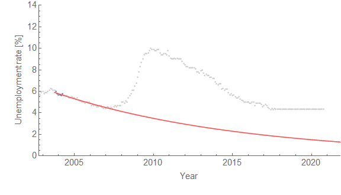

New unemployment data is out and I thought I'd update the "[recession detection algorithm](http://informationtransfereconomics.blogspot.com/2017/04/determining-recessions-with-algorithm.html)"; it's still saying that we should expect a recession by early 2019 (now February 2019 rather than January 2019 [per the previous update](http://informationtransfereconomics.blogspot.com/2017/06/unemployment-forecasts-may-data-update.html)) unless the unemployment rate continues to fall towards 3.8%.

The way this algorithm works is to essentially project a counterfactual unemployment rate that stays constant, and using [the dynamic equilibrium model](http://informationtransfereconomics.blogspot.com/2017/01/dynamic-equilibrium-presentation.html) determine when this counterfactual hits a threshold deviation from the dynamic equilibrium model (a threshold that was used to accurately detect recessions on the previous data). At that point a new shock (a recession) will be required in order to continue to fit the data — that's the latest date the unemployment rate can continue to be constant.

There's another (speculative) indicator that comes out of this. As more observations are added, the date will be pushed further into the future if that data is consistent with the no-shock counterfactual. However, that push should be roughly 1-to-1 with length of added data. When it isn't, that should mean a recession is more likely (think of it as coiling a spring). The previous update moved the date from 2018.5 to 2019.1 with 2 extra months of data (0.2 year). That was an "uncoiling" of the spring. A recession became less likely because adding 0.2 year of data moved the date much more than 0.2 year (it moved it 0.6 year). The current update moved the date 0.1 year after adding 3 months (0.25 year), so represents a mild "coiling" of the spring.

I hope to do some testing of this speculative indicator in the future. Anyway, here's the updated animation for the projection along with the latest update to the dynamic equilibrium model:

