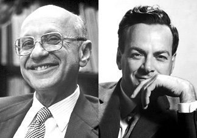

I read [Noah Smith's recent blog post](http://noahpinionblog.blogspot.com/2017/09/realism-in-macroeconomic-modeling.html) on search and matching theory and simultaneously had two ideas for posts of my own. So this will be a mini-series of two posts: a post on methodology and [a post an example of that methodology](https://informationtransfereconomics.blogspot.com/2017/09/search-and-matching-ii-theory.html). This is the first one.

I have on many occasions questioned the attacks on Milton Friedman's pool player analogy, [including one of Noah Smith's](https://informationtransfereconomics.blogspot.com/2016/06/macroeconomists-are-weird-about-theory.html). With his recent post, I think I understand his issue better; I think his concern is misplaced.

Milton Friedman's pool player analogy is essentially an early motivation for what physicists call "[effective theory](https://en.wikipedia.org/wiki/Effective_theory)". Friedman was writing in the 50s and effective theory doesn't make a big appearance until the late 70s in physics (e.g. [Weinberg's paper](http://www.sbfisica.org.br/~evjaspc/xviii/images/Burgess/Jan29/Aditional/Phenomenological-Lagrangians-Weinberg.pdf) \[pdf\] on phenomenological Lagrangians in which he says quantum field theory has almost zero content \[1\]). Effective theory is probably one of the most useful methodologies in physics. The standard model is viewed as an effective field theory. It gets the data right, but we don't really believe electrons are fundamental and a fundamental scalar like the Higgs actually violates some core principles of physics (a fundamental scalar with a mass below the [Planck mass](https://en.wikipedia.org/wiki/Planck_mass) is basically nonsense). The theory is wrong about the vacuum energy by over 100 orders of magnitude, but gets g-2 correct to more than 10 decimal places. We say it's an effective theory for measurements at scales well below the Planck scale (or even the [GUT scale](https://en.wikipedia.org/wiki/Grand_unification_energy)).

Now it's true that when Friedman said _better_ models will have _more_ unrealistic assumptions that is just plain wrong. In effective theory, you should be agnostic towards the realism of the assumptions (as long as they don't violate symmetry principles (which economics doesn't have)). I also don't think Friedman actually followed his own rules or leaned over backwards to cast doubt or present his biases as a scientist should. But just because someone may have been wrong about a couple of things does not mean everything they've ever said is wrong and therefore we should take the opposite view.

Now I discussed this in terms of scales and scope before in the other post on Noah and the pool player analogy. But in his recent post, he gave me new insight when he says:

> _I personally think this is silly, because it ends up throwing away most of the available data that could be used to choose between models. Also, it seems unlikely that non-realistic models could generate realistic results. ... Figuring out how things actually work is a much more promising route than making up an imaginary way for them to work and hoping the macro data is too fuzzy to reject your overall results._

The pool player analogy is problematic for economics because economists approach their field [more like Solow than Feynman](https://informationtransfereconomics.blogspot.com/2017/09/solow-has-science-backward.html). Before the heterodox Econ people get all self righteous, let me say they don't get it either.

Feynman says you should be leaning over backwards to give evidence that your theory is wrong. If the best you can do is say "it isn't rejected", then you're leaning over backwards to give evidence your model is right. Basically "it isn't rejected" means there's probably a vast literature about why your paper could be wrong and every Econ paper that makes this claim should include this vast literature ― something like "_of course this result is questionable, c.f. all of economic research_." **_in every paper_**.

Basically, you shouldn't publish and you shouldn't be published. It's fine as a thesis project (I'd almost say inconclusive results demonstrate research aptitude ―  the point of a Phd thesis ―  even more than conclusive ones).

We also see Noah following Solow in assuming his own concept of realism (and the human bias that goes with it) is what the "true" theory of economics has chosen. He should be leaning over backwards to reject his own gut feelings about the realism of assumptions. What if macro is emergent and the assumptions about micro don't matter? Then you've placed yourself in a straitjacket of your own making because you had too much confidence in your own insights. Science is about doubting your intuition. Human intuition did not evolve to understand electrons or e-commerce. Why would you think your intuition about what is realistic should apply? Quantum mechanics is "unrealistic": it severely strains most people's intuition about realism. We accept it because it's freakishly accurate. Who are we with our ape brains that evolved to survive in Africa to question the "realism" of the fundamental laws of nature at scales smaller than the wavelength of visible light?

The main point here is that Milton Friedman's pool player analogy isn't about models with unrealistic assumptions that "aren't rejected"; it's about (or supposed to be about) models with unrealistic assumptions that **_get the data right_** ―  they forecast well and produce expected errors depending on the models' scope. However, I will cede to Noah that economic **_practice_** does seem to be incompatible with the pool player analogy. The analogy becomes dangerous when you switch out "gets the data right" with "isn't rejected" and forget to lean over backwards.

When Noah says:

> _It's good to see macroeconomists moving away from this counterproductive philosophy of science._

We should take this to mean the lack of leaning over backwards to cast doubt and forgetting to present your own biases. However, physics has successfully been using this philosophy, calling it [effective theory](https://en.wikipedia.org/wiki/Effective_theory), since the 1960s and 70s. If it's counterproductive in economics, it means there's something wrong with economics.

In [part II](https://informationtransfereconomics.blogspot.com/2017/09/search-and-matching-ii-theory.html), I will attempt to give an example of these issues in the approach to unemployment and search and matching theory. **Update:** [now available](https://informationtransfereconomics.blogspot.com/2017/09/search-and-matching-ii-theory.html).

...

**Footnotes:**

\[1\] From Weinberg (1979):

> _This remark is based on a "theorem", which as far as I know has never been proven, but which I cannot imagine could be wrong. The "theorem" says that although individual quantum field theories have of course a good deal of content, quantum field theory itself has no content beyond analyticity, unitarity, cluster decomposition, and symmetry. This can be put more precisely in the context of perturbation theory: if one writes down the most general possible Lagrangian, including all terms consistent with assumed symmetry principles, and then calculates matrix elements with this Lagrangian to any given order of perturbation theory, the result will simply be the most general possible S-matrix consistent with analyticity, perturbative unitarity, cluster decomposition and the assumed symmetry principles. As I said, this has not been proved, but any counterexamples would be of great interest, and I do not know of any._
