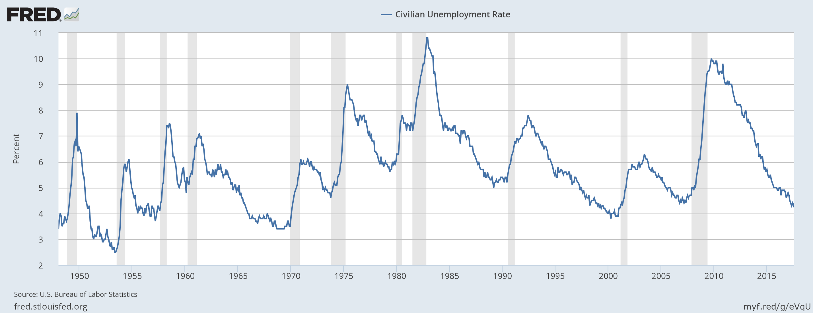
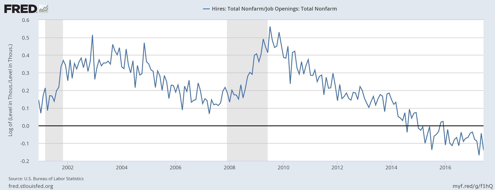

I think Claudia Sahm illustrates the issue with economics [I describe in Part I](https://informationtransfereconomics.blogspot.com/2017/09/search-and-matching-i-methodology.html) with her comments on the approach to models of unemployment. Here are a few of [Sahm's](https://twitter.com/Claudia_Sahm/status/906466059238207488) tweets:

> _I was "treated" to over a dozen paper pitches that tweaked a Mortensen-Pissarides \[MP\] labor search model in different ways, this isn't new ... but it is what science looks like, I appreciate broad summary papers and popular writing that boosts the work but this is a sloooow process ... \[to be honest\], I've never been blown away by the realism in search models, but our benchmark of voluntary/taste-based unemployment is just weird_

Is the benchmark approach successful? If it is, then the lack of realism should make you question what is realistic and therefore the lack of realism of MP shouldn't matter. If it isn't, then why is it the benchmark approach? An unrealistic _**and**_ unsuccessful approach should have been dropped long ago. Shouldn't you be fine with any other attempt at understanding regardless of realism?

This discussion was started by [Noah Smith's blog post](http://noahpinionblog.blogspot.com/2017/09/realism-in-macroeconomic-modeling.html) on search and matching models of unemployment, which are generally known as Mortensen-Pissarides models (MP). He thinks that they are part of a move towards realism:

> _Basically, Ljungqvist and Sargent are trying to solve the Shimer Puzzle - the fact that in classic labor search models of the business cycle, productivity shocks aren't big enough to generate the kind of employment fluctuations we see in actual business cycles. ... Labor search-and-matching models still have plenty of unrealistic elements, but they're fundamentally a step in the direction of realism. For one thing, they were made by economists imagining the **actual process** of workers looking for jobs and companies looking for employees. That's a kind of realism._

One of the unrealistic assumptions MP makes is the assumption of a steady state. Here's [Morentsen-Pissarides (1994)](http://www.iab.de/UserFiles/File/downloads/gradab/Dokumente%20Garloff/Mortensen_Pissarides_1994_Job%20creation%20and%20job%20destruction%20in%20the%20theory%20of%20unemployment_RES_pp_397_415.pdf) \[pdf\]:

> _The analysis that follows derives the initial impact of parameter changes on each conditional on current unemployment, u. Obviously, unemployment eventually adjusts to equate the two in steady state. ... the decrease in unemployment induces a fall in job creation (to maintain v/u constant v has to fall when u falls) and an increase in job destruction, until there is convergence to a new steady state, or until there is a new cyclical shock. ... Job creation also rises in this case and eventually there is convergence to a new steady state, where although there is again ambiguity about the final direction of change in unemployment, it is almost certainly the case that unemployment falls towards its new steady-state value after its initial rise._

It's entirely possible that an empirically successful model has a steady state (the information equilibrium model described below asymptotically approaches one at _u_ = 0%), but a quick look at the data (even data available in 1994) shows us this is an unrealistic assumption:

Is there a different steady state after every recession? Yet this particular assumption is never mentioned (in **_any_** of the commentary) and we have _e.g._ lack of heterogeneity as the go-to example from [Stephen Williamson](http://noahpinionblog.blogspot.com/2017/09/realism-in-macroeconomic-modeling.html?showComment=1504982967002#c376633552010734915):

> _Typical Mortensen-Pissarides is hardly realistic. Where do I see the matching function in reality? Isn't there heterogeneity across workers, and across firms in reality? Where are the banks? Where are the cows? It's good that you like search models, but that can't be because they're "realistic."_

Even Roger Farmer only goes so far as to say there are multiple steady states (multiple equilibria, using a similar [competitive search](http://rogerfarmer.com/NewWeb/PdfFiles/fa-con-cra.pdf) \[pdf\] and matching framework). Again, it may well be that an empirically successful model will have one or more steady states, but if we're decrying the lack of realism of the assumptions shouldn't we decry this one?

I am going to construct the information equilibrium approach to unemployment trying to be explicit and realistic about my assumptions. But a key point I want to make here is that "realistic" doesn't necessarily mean "explicitly represent the actions of agents" (Noah Smith's "pool players arm"), but rather "realistic about our ignorance".

What follows is essentially a repeat of [this post](https://informationtransfereconomics.blogspot.com/2017/01/matching-theory-and-employment-in.html), but with more discussion of methodology along the way.

Let's start with an assumption that the information required to specify the economic state in terms of the number of hires ($H$) is equivalent to the information required to specify the economic state in terms of the number of job vacancies ($V$) when that economy is in equilibrium. Effectively we are saying there are, for example, two vacancies for every hire (more technically we are saying that the information associated with the probability of two vacancies is equal to the information associated with the probability of a single hire). [Some math](http://informationtransfereconomics.blogspot.com/2017/04/a-tour-of-information-equilibrium.html) lets us then say:

$$ 
\text{(1) } \; \frac{dH}{dV} = k_{v} \; \frac{H}{V} 
$$

This is completely general in the sense that we don't really need to understand the details of the underlying process, only that the agents fully explore every state in the available state space. We're assuming ignorance here and putting forward the most general definition of equilibrium consistent with conservation of information and scale invariance (i.e. doubling $H$ and $V$ gives us the same result).

If we have a population that grows a few percent a year, we can say our variables are proportional to an exponential function. If $V \sim \exp v t$ with growth rate $v$, then according to equation (1) above $H \sim \exp k_{v} v t$ and (in equilibrium):

$$ 
\frac{d}{dt} \log \frac{H}{V} \simeq (k_{v} - 1) v 
$$

When the economy is in equilibrium (a scope condition), we should have lines of constant slope if we plot the time series $\log H/V$. And we do:

This is what I've called a "[dynamic equilibrium](http://informationtransfereconomics.blogspot.com/2017/01/dynamic-equilibrium-presentation.html)". The steady state of an economy is not e.g. some constant rate of hires, but rather more general — a constant decrease (or increase) in $H/V$. However the available data does not appear to be equilibrium data alone. If the agents fail to fully explore the state space (for example, firms have correlated behavior where they all reduce the number of hires simultaneously), we will get violations of the constant slope we have in equilibrium.

In general it would be completely _ad hoc_ to declare "2001 and 2008 are different" were it not for other knowledge about the years 2001 and 2008: they are the years of the two recessions in the data. Since we don't know much about the shocks to the dynamic equilibrium, let's just say they are roughly Gaussian in time (start of small, reach a peak, and then fall off). Another way to put this is that if we subtract the log-linear slope of the dynamic equilibrium, the resulting data should appear to be logistic step functions:

The blue line shows the fit of the data to this model with 90% confidence intervals for the single prediction errors. Transforming this back to the original data representation gives us a decent model of $H/V$:

Now employment isn't just vacancies that are turned into hires: there have to be unemployed people to match with vacancies. Therefore there should also be a dynamic equilibrium using hires and unemployed people ($U$). And there is:

Actually, we can rewrite our information equilibrium condition [for two "factors of production"](http://informationtransfereconomics.blogspot.com/2017/04/a-tour-of-information-equilibrium.html) and obtain the Cobb-Douglas form (solving a pair of partial differential equations like Eq. (1) above):

$$ 
H(U, V) = a U^{k_{u}} V^{k_{v}} 
$$

This is effectively a matching function (not the same as in the MP paper, but discussed in e.g. [Petrongolo and Pissarides](http://citeseerx.ist.psu.edu/viewdoc/download?doi=10.1.1.589.7046&rep=rep1&type=pdf) (2001) \[pdf\]). We should be able to fit this function to the data, but it doesn't quite:

Now this should work fine if the shocks to $H/U$ and shocks to $H/V$ are all the shocks. However it looks like we acquire a constant error coming through the 2008 recession:

Again, it makes sense to call the recession a disequilibrium process. This means there are additional shocks _to the matching function itself_ in addition to the shocks to $H/U$ and $H/V$. We'd interpret this as a recession representing a combination of fewer job postings, fewer hires per available worker, as well as fewer matches given openings and available workers. We could probably work out some plausible psychological story (unemployed workers during a recession are seen as not as desirable by firms, firms are reticent to post jobs, and firms are more reticent to hire for a given posting). You could probably write up a model where firms suddenly become more risk averse during  a recession. However you'd need many, many recessions in order to begin to understand if recessions have any commonalities.

Another way to put this is that given the limited data, it is impossible to specify the underlying details of the dynamics of the matching function during a recession. During "normal times", the matching function is boring — it's fully specified by a couple of constants. All of your heterogeneous agent dynamics "integrate out" (i.e. aggregate) into a couple of numbers. The only data that is available to work out agent details is **_during recessions_**. The JOLTS data used above has only been recorded since 2000, leaving only about 30 monthly measurements taken during two recessions to figure out a detailed agent model. At best, you could expect about 3 parameters (which is in fact how many parameters are used in the Gaussian shocks) before over-fitting sets in.

But what about heterogenous agents (as Stephen Williamson mentions in his comment on Noah Smith's blog post)? Well, the information equilibrium approach [generalizes to ensembles of information equilibrium relationships](https://informationtransfereconomics.blogspot.com/2017/07/dynamic-equilibrium-and-ensembles-and.html) such that we basically obtain

$$ 
H_{i}(U_{i}, V_{i}) = a U_{i}^{\langle k_{u} \rangle} V_{i}^{\langle k_{v} \rangle} 
$$

where $\langle k \rangle$ represents an ensemble average over different firms. In fact, the $\langle k \rangle$ might change slowly over time (roughly the growth scale of the population, but it's logarithmic so it's a very slow process). The final matching function is just a product over different types of labor indexed by $i$:

$$ 
H(U, V) = \prod_{i} H_{i}(U_{i}, V_{i}) 
$$

Given that the information equilibrium model with a single type of labor for a single firm appears to explain the data about as well as it can be explained, adding heterogenous agents to this problem serves only to reduce information criterion metrics for explanation of empirical data. That is to say Williamson's suggestion is worse than useless because it makes us dumber about the economy.

And this is a general issue I have with economists not "leaning over backward" to reject their intuitions. Because we are humans, we have a strong intuition that tells us our decision-making should have a strong effect on economic outcomes. We feel like we make economic decisions. I've participated in both sides of the interview process, and I strongly feel like the decisions I made contributed to whether the candidate was hired. They probably did! But millions of complex hiring decisions at the scale of the aggregate economy seem to just average out to roughly a constant rate of hiring per vacancy. Noah Smith, Claudia Sahm, and Stephen Williamson (as well as the vast majority of mainstream and heterodox economists) all seem to see "more realistic" being equivalent to "adding parameters". But if realism isn't being measured by accuracy and information content compared to empirical data, "more realistic" starts to mean "adding parameters for no reason". Sometimes "more realistic" should mean a more realistic understanding of our own limitations as theorists.

It is possible those additional parameters might help to explain microeconomic data (as Noah mentions in his post, this is "most of the available data"). However, since the macro model appears to be well described by only a few parameters, this implies a constraint on your micro model: if you aggregate it, all of the extra parameters should "integrate out" to single parameter in equilibrium. If they do not, they represent observable degrees of freedom that are for some reason not observed. This need to agree with not just the empirical data but its [information content](https://en.wikipedia.org/wiki/Akaike_information_criterion) (i.e. not have too many parameters than are observable at the macro scale) represents "[macrofoundations](https://uneasymoney.com/2012/12/25/the-state-were-in/)" for your micro model. But given the available macro data, leaning over backwards requires us to give up on models of unemployment and matching that have more than a couple parameters — even if they aren't rejected.
