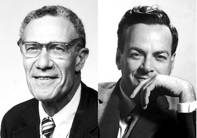

[Brad DeLong quotes](http://www.bradford-delong.com/2017/09/must-read-because-economic-theory-can-be-nothing-but-crystalized-or-distilled-economic-theory-robert-m-solow-19.html) from Solow (1985):

> _As soon as time-series get long enough to offer hope of discriminating among complex hypotheses, the likelihood that they remain stationary dwindles away, and the noise level gets correspondingly high. Under these circumstances, a little cleverness and persistence can get you almost any result you want. I think that is why so few econometricians have ever been forced by the facts to abandon a firmly held belief._

A scientist would ask: Why did you hold that belief so firmly in the first place?

I'm not trying to say here that scientists are somehow better people who are smarter and know this kind of thing innately. This is the learned experience of science as a discipline. It is diluted by the sheer volume of empirical success in the 20th century, but "science" used to hold a lot of beliefs firmly that weren't based on empirical successes. Firmly held beliefs like the Earth being stationary or the aether, both of which come from our human intuition by the way (we don't feel like the Earth is rotating, and it's hard to conceive of waves in nothing).

I was part of a recent [Twitter discussion](https://twitter.com/JoMicheII/status/904051170691469313) that illustrates how difficult it is even for scientists to hold their intuition (and inevitably their bias) at bay. The linked tweet links to an article by astronomy professor Adam Frank. He holds his belief that quantum mechanics (nature at the micro scale) should be intuitive so firmly that he effectively endows it with magical powers to explain consciousness, abandoning "materialism".

Intuition may be a useful way to start to solve problems, but our intuition is part of our human nature and was created via the process of evolution. There is no reason to expect it to be useful in understanding nature at scales smaller than atoms or the economics of nations (or money at all). The check on our intuition is comparison with the data, and if the data doesn't allow you to discriminate "among complex hypotheses" (i.e. intuitions) then you shouldn't be holding that intuition that firmly.

This is what Paul Romer called [Feynman integrity](https://paulromer.net/feynman-integrity/), Romer quoting Feynman:

> _It’s a kind of scientific integrity, a principle of scientific thought that corresponds to a kind of utter honesty–a kind of leaning over backwards. For example, if you’re doing an experiment, you should report everything that you think might make it invalid–not only what you think is right about it: other causes that could possibly explain your results; and things you thought of that you’ve eliminated by some other experiment, and how they worked–to make sure the other fellow can tell they have been eliminated._ 

> _Details that could throw doubt on your interpretation must be given, if you know them. You must do the best you can–if you know anything at all wrong, or possibly wrong–to explain it. If you make a theory, for example, and advertise it, or put it out, then you must also put down all the facts that disagree with it, as well as those that agree with it. There is also a more subtle problem. When you have put a lot of ideas together to make an elaborate theory, you want to make sure, when explaining what it fits, that those things it fits are not just the things that gave you the idea for the theory; but that the finished theory makes something else come out right, in addition._

When Solow says so few economists are "forced by the facts to abandon a firmly held belief", he has science backwards. They shouldn't be looking to be "forced". **_They should be leaning over backwards to abandon those firmly held beliefs._**

...

**Update +4 hours**

To be fair, Solow appears to be saying this is a problem as he continues:

> _If I am anywhere near right about this, the interests of scientific economics would be better served by a more modest approach. There is enough for us to do without pretending to a degree of completeness and precision which we cannot deliver ..._

But I don't think he correctly recognizes the problem (why are those beliefs held so firmly to begin with?) because his solution ignores it:

> _The true functions of analytical economics are... to organize our necessarily incomplete perceptions about the economy, to see connections that the untutored eye would miss, to tell plausible-sometimes even convincing-causal stories with the help of a few central principles, and to make rough quantitative judgments about the consequences of economic policy and other exogenous events._

Nope. In cases where knowledge is incomplete, you should be saying: I don't know. And in order to be helpful to society, you should be saying that politicians don't know either. If your stories aren't backed up by data, then they're just stories. You should be leaning over backwards to not create stories where the data is inconclusive.

He goes on (quoted from Brad DeLong's shortening) to make even bolder claims about the economy without having empirical evidence to back it up and well as telling us that experiments won't work:

> _There are, however... reasons for pessimism.... Hard sciences dealing with complex systems... less complex than the U.S. economy... succeed because they can isolate, they can experiment, and they can make repeated observations under controlled conditions\[;\]... or because they can make long series of observations under natural but essentially stationary conditions.... Neither of these... is open to economists...._

Did we figure out that economic systems are more complex than systems the "hard sciences" deal with? How can you know unless you've actually figured out some sort of model where this is true? You should be leaning over backward to try and not make this claim without supporting evidence. I've talked about this before (e.g. [here](https://informationtransfereconomics.blogspot.com/2017/01/complex-systems-versus-complicated.html) and [here](https://informationtransfereconomics.blogspot.com/2017/08/economics-criticism-as-art-criticism.html)). But the basic argument Solow seems to be making is this:

1.  Solow thinks he and his colleagues are all smart people just like physicists
2.  Physicists have figured out a lot about physical systems with lots of empirical accuracy
3.  Therefore economic systems must be much be more complex than physical systems and empirical accuracy is hard to achieve
4.  Therefore economists should tell stories

The thing is that physics set up its successful empirically accurate mathematical framework in the late 1600s (Newton), so have been at this a lot longer than economists have even been working with their rational utility maximization economic framework (starting, say, around the time of Samuleson). It's actually somewhat paradoxical to say economics is much more complex than physics because you've been working on it for a much shorter time.

Usually impasses like this in science are the sign of an upcoming paradigm shift: that one or more of those "few central principles" Solow mentions above are actually wrong. Ptolemaic epicycles became exceedingly complex because pure circles and the Earth-centered coordinate system was wrong. You only have to look up "[partial aether dragging](https://en.wikipedia.org/wiki/Aether_drag_hypothesis#Partial_aether_dragging)" to see how complex things started to get before physicists abandoned it for special relativity.

It's relevant that those "central principles" were all based on human intuition and biases: we don't feel the Earth moving, perfect circles are "special", or waves have to propagate in _something_. Maybe instead of telling causal stories using those principles, you should be questioning those principles. And questioning yourself is part of Feynman's leaning over backwards.

On my blog, I am trying to make a case that the principle that should be questioned is that human decisions are central to understanding microeconomic and macroeconomic systems. [Cameron Murray](http://www.fresheconomicthinking.com/2017/08/a-random-physicist-takes-on-economics.html) does a great job of explaining this thesis in terms an economist might better understand in his review of my book. I could of course be wrong about this, and really we should be questioning something else (like the lack of a role for behavioral economics or the effects of social institutions, for example). But I do not see mainstream economic thought even beginning to question its central principles — in fact, I see many examples of pushing back against it. DeLong's blog post citing Solow represents some of that, along with his "[thinking like an economist](http://www.bradford-delong.com/2017/07/how-to-think-like-an-economist-if-that-is-you-wish-to.html)" posts. This writing says: yes, there are problems, economics is different from science, but they are inevitable and you can't do any better. Why are they inevitable? Because of our core principles — that economics is a social science and human decisions matter.

You also see the push back in more frequent pieces arguing in favor of the status quo (Ricardo Reis, see e.g. [here](https://informationtransfereconomics.blogspot.com/2017/07/what-mathematical-theory-is-for.html)) and defending economics against its critics (Noah Smith's "Lazy econ critiques", and Chris Auld's piece I talk about [here](https://informationtransfereconomics.blogspot.com/2017/08/lazy-econ-critique-critiques.html)). Economists are looking for ways to maintain the status quo, to not question central principles. "We heard your tired critiques and have changed" paraphrasing Noah Smith ... "Economics has become more empirical." Yes, there is more data in papers lately, but no one is leaning over backwards to reject theories. Why are there still papers and economists talking about the Euler equation? The Phillips curve? NAIRU? Economists should be leaning over backwards to drop them, but instead Simon Wren-Lewis [says](https://mainlymacro.blogspot.com/2017/02/nairu-bashing.html) it's the only way to connect the real economy to inflation. So? I thought economics was such a complex system we can't know if employment and inflation are linked ... wait, is this a case of Solow's "causal stories with the help of a few central principles"?

I think convincing economics to question its central principles will be a difficult slog that'll likely end in failure. As Cameron Murray says in his review of my book:

> _However, I highly doubt that this idea will be picked up in a hurry by the economics profession for a couple of main reasons. ... No longer will economists be the only ones to proclaim that they know the secrets to a better (or higher utility/welfare) society. In fact, they will have to admit that they don’t. ... Second, it removes the ability to blame bad choices by individuals as the cause of their economic destiny. If our theory of microeconomics is that people behave randomly within constraints, then to improve outcomes for certain groups of people, we need to change the nature of their constraints, not their decisions._
