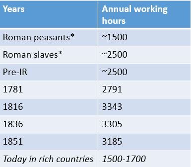

[Branko Milanovic posted a chart](https://twitter.com/BrankoMilan/status/908375969035104261) on Twitter showing the average annual hours worked showing, among other things, that people worked twice as many hours during the industrial revolution:

From 1816 to 1851, the number of hours fell by about 0.14% per year:

100 (Log\[3185\] − Log\[3343\])/(1851-1816) = − 0.138

This graph made me [check out the data on FRED](https://fred.stlouisfed.org/series/PRS85006023#0) for average working hours (per week, indexed to 2009 = 100). In fact, I checked it out with the [dynamic equilibrium model](http://informationtransfereconomics.blogspot.com/2017/01/dynamic-equilibrium-presentation.html):

Any guess what the dynamic equilibrium rate of decrease is? It's − 0.132% — almost the same rate as in the 1800s! There was a brief period of increased decline (a shock to weekly labor hours centered at 1973.4) that roughly coincides with [women entering the workforce](https://informationtransfereconomics.blogspot.com/2017/07/adding-race-and-gender-to-macroeconomics.html) and the inflationary period of the 70s (that might be all part of the same effect).
