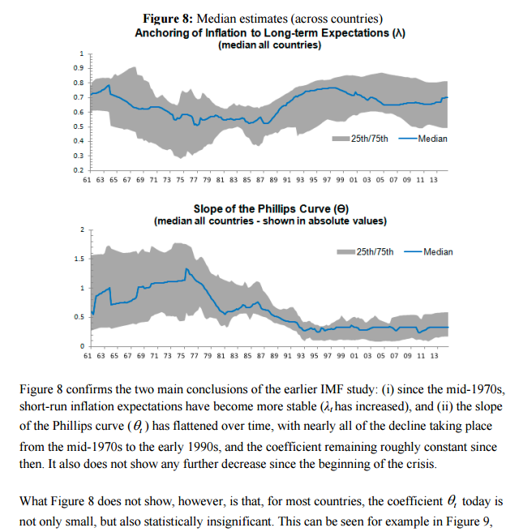
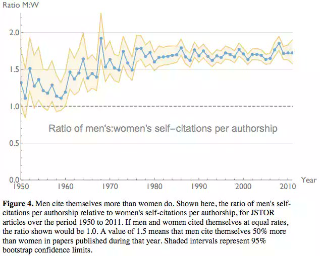

Janet Yellen in her Fed briefing from last week said "Our understanding of the forces driving inflation is imperfect." At least one aspect that's proven particularly puzzling is the relationship between inflation and unemployment: the Phillips curve. In an IMF working paper from November of 2015, Blanchard, Cerutti, and Summers show the gradual fall in the slope of the Phillips curve from the 1960s to the present. I discussed it in January of 2016 [in a post here](https://informationtransfereconomics.blogspot.com/2016/01/the-slope-of-phillips-curve-is-roughly.html). A figure is reproduced below:

Since that time, I've been investigating the [dynamic equilibrium model](https://informationtransfereconomics.blogspot.com/2017/01/dynamic-equilibrium-presentation.html) and one thing that [I noticed is that there appears](https://informationtransfereconomics.blogspot.com/2017/04/can-we-see-phillips-curve.html) to be a Phillips curve-like anti-correlation signal if you look at PCE inflation data and unemployment data:

See [here for more about that graph](http://informationtransfereconomics.blogspot.com/2017/04/can-we-see-phillips-curve.html). It was also consistent with a "fading" Phillips curve. While I was thinking about the unemployment model today, I realized that the Phillips curve might be directly connected with [women entering the workforce and the impact it had on inflation via the employment population ratio](https://informationtransfereconomics.blogspot.com/2017/07/adding-race-and-gender-to-macroeconomics.html). I put the fading Phillips curve on the dynamic equilibrium view of the employment population ratio for women:

We see the stronger Phillips curve signal in the second graph above (now marked with asterisks in this graph) follows the "non-equilibrium" shock of women entering the workforce. After that non-equilibrium shock fades, the employment population ratio for women starts to become highly correlated with the ratio for men — showing almost identical recession shocks.

This suggests that the Phillips curve is not just due to inflation resulting from increasing employment, but rather inflation resulting from new people entering the labor force. The Phillips curve disappears when we reach an employment-population ratio equilibrium. This would explain falling inflation since the 1990s as the employment-population ratio has been stable or falling.

Now I don't necessarily want to say the mechanism is the old "wage-price spiral" — or at least the old version of it. What if the reason is sexism? Let me explain.

A recent study showed that men self-cite more often that women in academic journals, but the interesting aspect for me was that this appears to increase right around the time of women entering the workforce:

What if the wage-price spirals of the strong Phillips curve era were due to men trying (and succeeding) to negotiate even higher salaries than women (who were now more frequently in similar jobs)? As the labor market tightens during the recovery from a recession, managers who gave a woman in the office a raise might then turn around and give a man an even larger raise. The effect of women in the workforce would be to amplify what might be an otherwise undetectable Phillips curve effect into a strong signal in the 1960s, 70s and 80s. While sexism hasn't gone away, this effect may be attenuated today from its height in that period. This "business cycle" component of inflation happens on top of an overall surge in inflation due to an increasing employment population ratio (see also [Steve Randy Waldman](http://www.interfluidity.com/v2/4706.html) on the demographic explanation of 1970s inflation).

Whether sexism is really the explanation, the connection betweem women entering the workforce and the Phillips curve is intriguing. It would also mean that the fading of the Phillips curve might be a more permanent feature of the economy until some other demographic phenomenon occurs.
