Well, this would probably count as a new shock to the bitcoin exchange rate:

Since we're in the leading edge of it, it's pretty uncertain. However, I'd like to talk about something I've mentioned before: [usefulness](https://informationtransfereconomics.blogspot.com/2016/07/ceteris-paribus-and-method-of-nascent.html). While there is no particular reason to **_reject_** the bitcoin dynamic equilibrium model forecast, it does not appear to be **_useful_**. If shocks are this frequent, then the forecasting horizon is cut short by those shocks — and as such we might not ever get enough data without having to posit another shock thereby constantly increasing the number of parameters (and making e.g. the [AIC worse](https://en.wikipedia.org/wiki/Akaike_information_criterion)).

Another way to put this is that unless the dynamic equilibrium model of exchange rates is confirmed by some other data, we won't be able to use the model to say anything about bitcoin exchange rates. Basically, the _P(model|bitcoin data)_ will remain low, but it is possible that _P(model|other data)_ could eventually lead us to a concurrence model.

As such, I'm going to slow down my update rate following this model \[I still want to track it to see how the data evolves\]. Consider this a failure of model usefulness.

...

**Update 17 October 2017**
Starting to get a handle on the magnitude of the shock — it's on the order of the same size as the bitcoin fork shock (note: log scale):

**Update 18 October 2017**

More data just reduced uncertainty without affecting the path — which is actually a really good indication of a really good model! Too bad these shocks come too frequently.

**Update 23 October 2017**

**Update 25 October 2017**

**Update 30 October 2017**

**Update 1 November 2017**

**Update 2 November 2017**

**Update 6 November 2017**

**Update 9 November 2017**

**Update 10 November 2017**

**Update 13 November 2017**

**Update 14 November 2017**

**Update 16 November 2017**

**Update 28 November 2017**

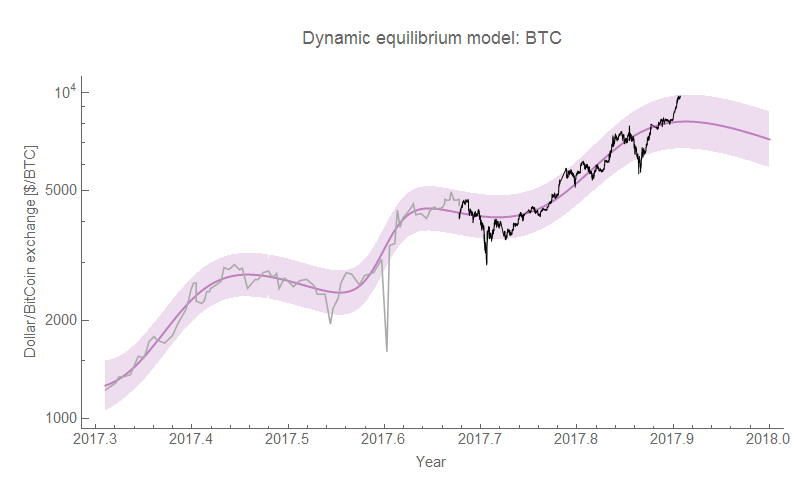
**Update 30 November 2017**

**Update 7 December 2017**

Despite this having been wrong, it's been fun following it. One thing I have come to recognize is that even in the [unemployment forecasts](https://informationtransfereconomics.blogspot.com/2017/04/determining-recessions-with-algorithm.html) there is a tendency to undershoot and then overshoot the magnitude of shocks.  A few more graphs:

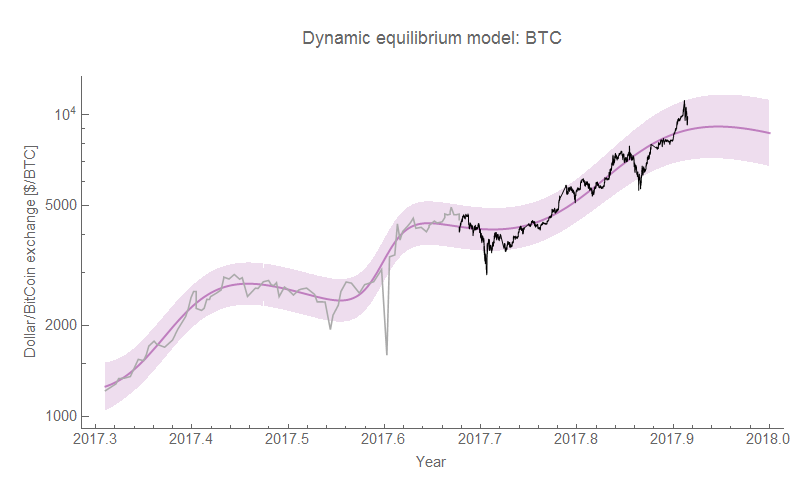
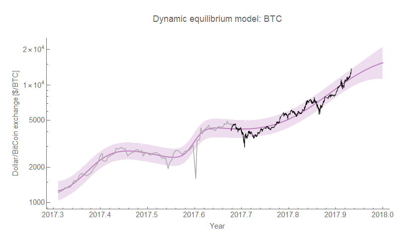
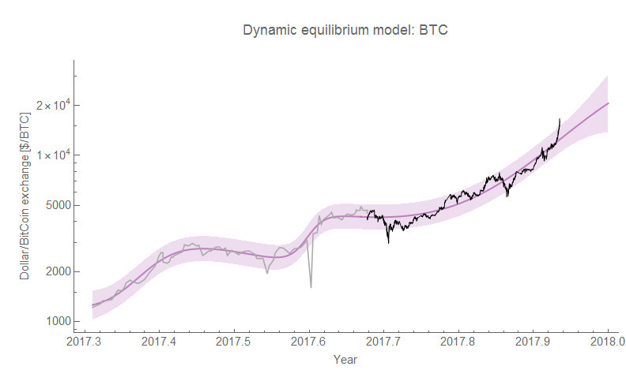
**Update 15 December 2017**

I re-graphed the solutions with the expanded scope since December 11th on the same y-axis and added the latest data:

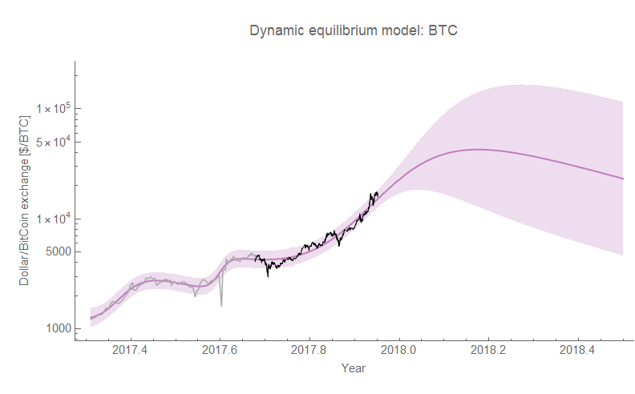
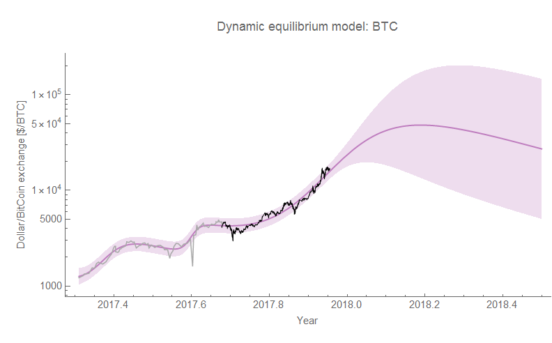

**Update 19 December 2017**

**Update 20 December 2017**

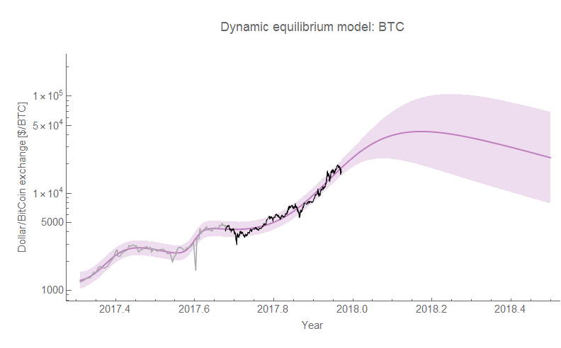
**Update 25 December 2017**

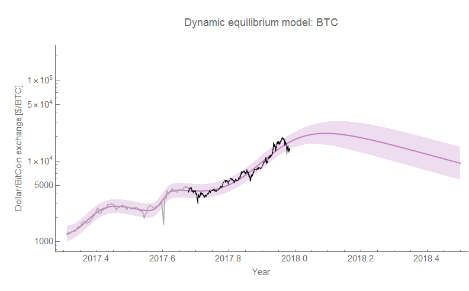
**Update 02 January 2018**

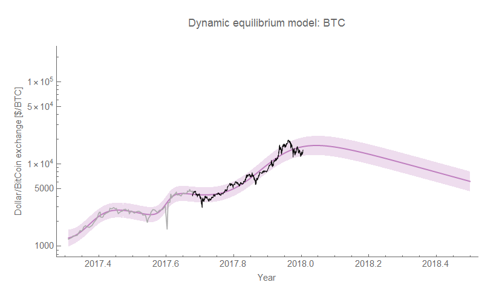
**Update 08 January 2018**

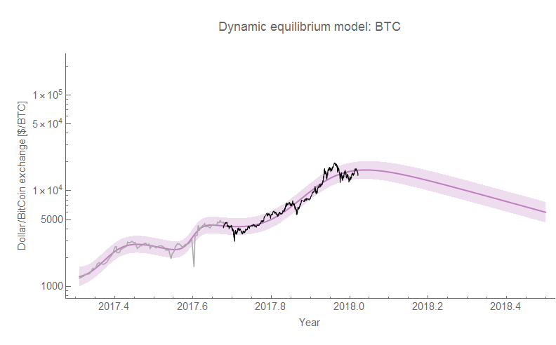**Update 15 January 2018**

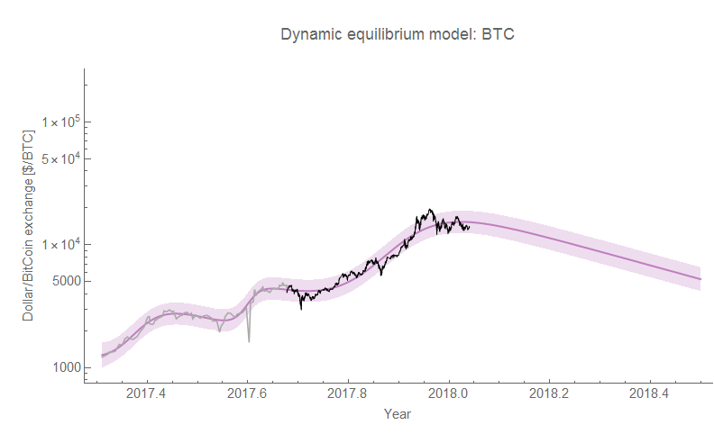**Update 5 February 2018 (with Jan 22 and Jan 31)**

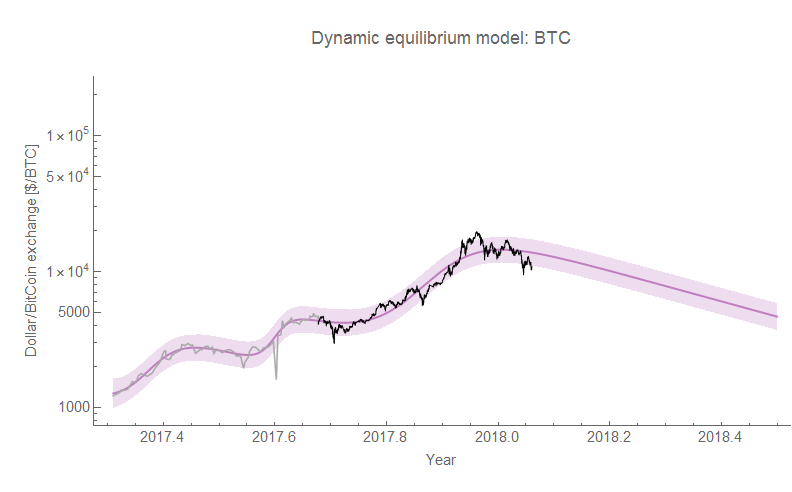
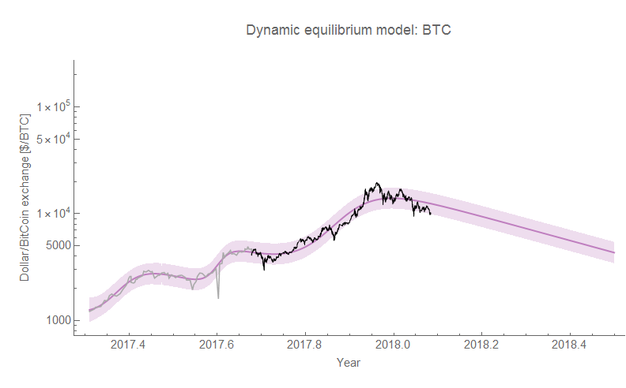
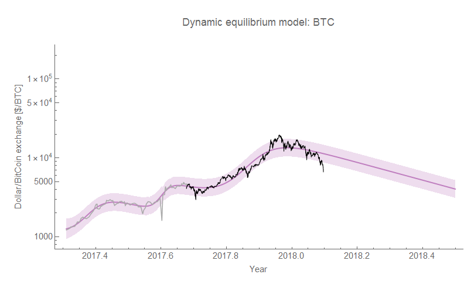**26 February 2018**

**17 April 2018**

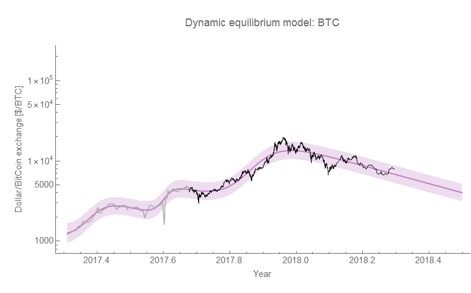
