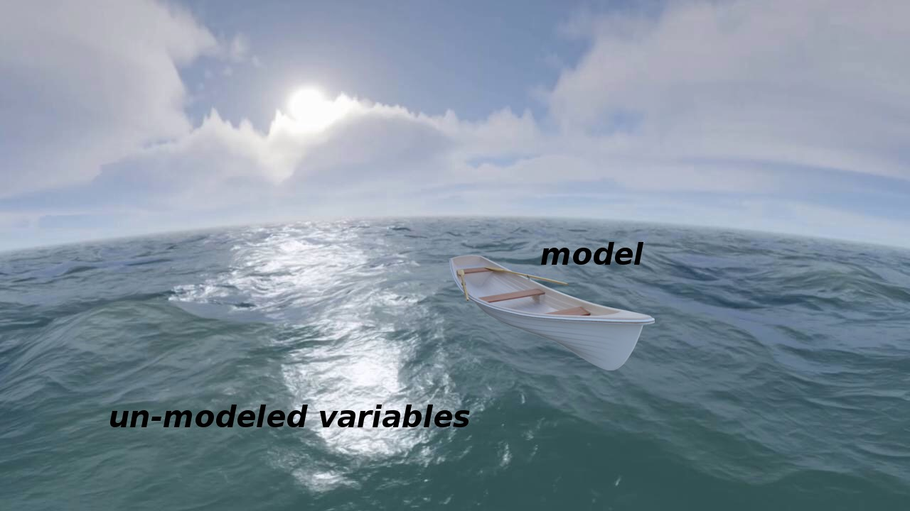
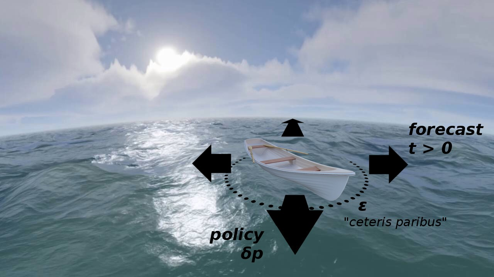

During the course of an [ongoing debate with Britonomist](https://twitter.com/infotranecon/status/925415418268749824) sparked by [my earlier post](https://informationtransfereconomics.blogspot.com/2017/10/corporate-taxes-and-unscientific.html), he argued that a model that isn't designed for forecasting shouldn't be used to forecast. But if it's not good for forecasting, it can't be good for e.g. policy changes either. In fact, without some really robust reasoning or empirical validation a model that can't be used to forecast can't be used for _anything_.

Now Britonomist is in good company as Olivier Blanchard has said almost the exact same thing he said in his [blog post on five classes of macro models](https://piie.com/blogs/realtime-economic-issues-watch/need-least-five-classes-macro-models) where Blanchard separated policy models from forecasting models. But I think that's evidence of some big fundamental issues in economic methodology. As I'm going to direct this post at a general audience, please don't take me being pedantic as talking down to Econ — on my own, I'd probably write this post entirely in terms of differential geometry on high dimensional manifolds (which is what the following argument really is).

The key assumption underlying the ability to forecast or determine the effects of policy changes is the _ceteris paribus_ assumption. The basic idea is that the stuff you don't include is either negligible or cancels out on average. It's basically a more specific form of Hume's uniformity of nature. Let's think of the _ceteris paribus_ condition as a constraint on the ocean underneath a boat. The boat is our macro model. You can think of the un-modeled variables as the curvature of the Earth (the variables that vary slowly) and the waves on the ocean (the variables that average out). \[After comment from Britonomist on Twitter, I'd like to add that these are just examples. There can also be "currents" — i.e. things that aren't negligible — in the _ceteris paribus_ condition. In physics, we'd consider these variables as ones that vary slowly (i.e. the current is roughly the same a little bit to the west or south), but people may take "vary slowly" to mean aren't very strong which is not what I mean here.\]

Here's a picture:

The _ceteris paribus_ condition lets us move the boat to the west and say that the sea is similar there so our boat still floats (our model still works). We only really know that our boat floats in an epsilon (ε) sized disk near where we started, so checking that it floats when we move west (i.e. comparison to data) is still important.

Now let's say east-west is time. Moving west with the boat is forecasting with the model. Moving north and south is changing policy. We move south, we change some collection of policy parameters in, say, the Taylor rule for a concrete example. The key takeaway here is that the _ceteris paribus_ condition under the boat is the same for both directions we take the model: policy or forecasting.

It's true that the seas could get rougher to the south or a storm might be off in the distance to the northwest which may limit the distance we can travel in a particular direction under a given _ceteris paribus_ scenario. But if we can't take our model to the west even a short distance, then we can't take our model to the south even a short distance. A model that can't forecast can't be used for policy \[1\]. This is because our _ceteris paribus_ condition must coincide for both directions at the model origin. If it's good enough for policy variations, then it's good enough for temporal variations. Saying it's not good enough means knowing a lot about the omitted variables and their behavior \[2\].

And the truth is that looking at forecasts and policy changes are usually not orthogonal. You look at the effect of policy changes over a period of time. You're usually heading at least a little northwest or southwest instead of due south or due north.

But additionally there is the converse: if your model can't forecast, then it's probably useless for policy as well unless that manifold has the weird properties I describe in footnote \[1\]. Another way to put this is that saying a model can be used for policy changes but not forecasting implies an unnaturally large (or small) scale defined by the ratio of policy parameter changes to temporal changes \[3\]. Movement in time is somehow a much bigger step than movement in parameter space.

Now it is entirely possible this is actually the way things are! But there had better be really good reasons (such as really good agreement with the empirical data). Nice examples where this is true in physics are phase transitions. Sometimes a small change in parameters (or temperature) leads to a large qualitative change in model output (water freezes instead of getting colder). Effectively saying a macroeconomic model that can be used for policy but not forecasting is saying there's something like a phase transition for small perturbations of temperature.

This all falls under the heading of [scope conditions](https://informationtransfereconomics.blogspot.com/2015/10/we-built-this-theory-on-scope-conditions.html). Until we collect empirical data from different parts of the ocean and see if our boat floats or sinks, we only really know about an "epsilon-sized ball" near the origin (per Noah Smith at the link). Empirical success gives us information about how big epsilon is. Or — if our theory is derived from a empirically successful framework — we can explicitly derive scope conditions (e.g. we can show using relativity that Newtonian physics is in scope for _v << c_). However, claims that a macro model is good for policy but not forecasting is essentially a nontrivial claim about model scope that needs to be much more rigorous than "it's POSSIBLE" (in reference to [my earlier post](https://informationtransfereconomics.blogspot.com/2017/10/corporate-taxes-and-unscientific.html) on John Cochrane being unscientific), "it's not actually falsified", "it's just a toy model", or "it makes sense to this one economist".

And this is where both Blanchard and Britonomist are being unscientific. You can't really have a model that's good for policy but not forecasting without a lot of empirical validation. And since empirical validation is hard to come by in macro, there's no robust reason to say a model is good for one thing and not another. As Britonomist says, sometimes some logical argument is better than nothing in the face of uncertainty. People frequently find as much comfort in the pretense of knowledge as in actual knowledge. But while grasping at theories without empirical validation is sometimes helpful (lots of _Star Trek_ episodes require Captain Picard to make decisions based on unconfirmed theories, for example), it is just an example of being **_decisive_**, not being **_scientific_** \[4\].

**Footnotes**

\[1\] This is where the differential geometry comes in handy. Saying a model can be used for policy changes (_d**p**_ where **_p_** is the vector of parameters) but not for forecasting (_dt_ where _t_ is time) implies some pretty strange properties for the manifold the model defines (with its different parameters and at different times). In particular, it's "smooth" in one direction and not another.

Another way to think of this is that time is just another parameter as far as a mathematical model is concerned and we're really looking at variations _d**p**'_ with _**p**' = (**p**, t)_.

\[2\] Which can happen when you're working in a well-defined and empirically validated theoretical framework (and your model is some kind of expansion where you take only leading order terms in time changes but, say, up to second order terms in parameter changes). This implies you know the scale relating temporal and parameter changes I mention later in the post.

\[3\] |_d**p**_| = _k dt_ with _k >>_ 1\. The scale is _k_ and _1/k_ is some unnatural time scale that is extremely short for some reason. In this "unnatural" model, I can apparently e.g. double the marginal propensity to consume but not take a time step a quarter ahead.

\[4\] As a side note, the political pressure to be decisive runs counter to being scientific. Science deals with uncertainties by creating and testing multiple hypotheses (or simply accepting the uncertainty). Politics deals with uncertainty by choosing a particular action. That is a source of bad scientific methodology in economics where models are used to draw conclusions where the scientific response would be to claim "we don't know".
