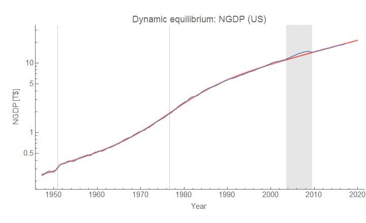
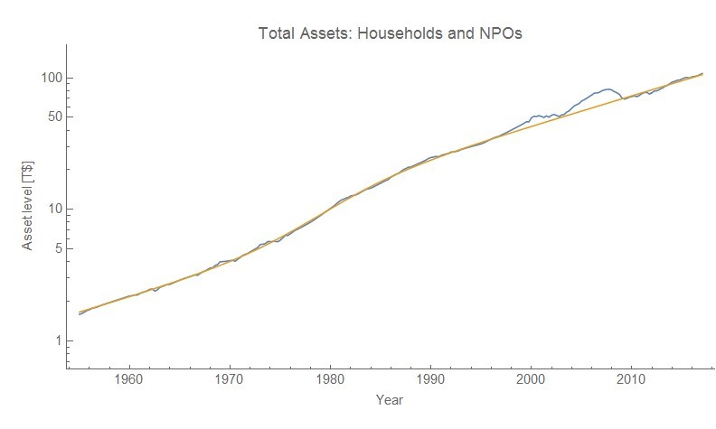
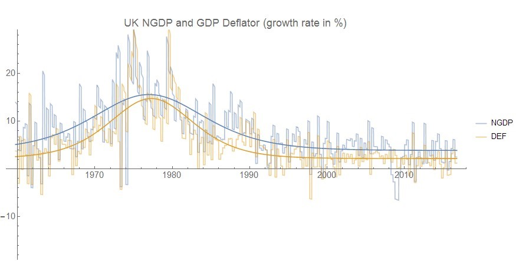
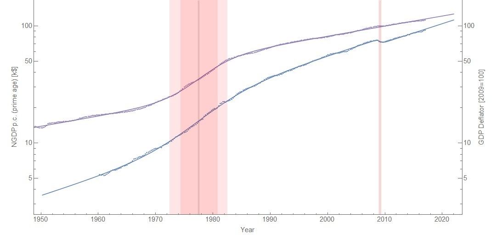

I was reading [Simon Wren-Lewis on productivity](https://mainlymacro.blogspot.com/2017/10/the-obr-productivity-and-policy-failures.html), [this out of NECSI](http://necsi.edu/research/economics/econuniversal), as well as [this from David Andolfatto](https://andolfatto.blogspot.com/2017/08/a-monetary-fiscal-theory-of-inflation.html) on monetary policy. It sent me down memory lane with some of my posts (linked below) where I've talked about various ways to frame macro data.

The thing is that certain ways of looking at the data can cause you to make either more complicated or less complicated models. And more complicated models don't always seem to be better at forecasting.

Because we tend to think of the Earth at rest, we have to add [Coriolis and centrifugal "pseudo forces"](https://en.wikipedia.org/wiki/Fictitious_force#Circular_motion) to Newton's law because it is a non-inertial frame. In an inertial frame, Newton's laws simplify.

Because ancient astronomers thought not only that they were seeing circles in the sky, but that the Earth was at rest (in the center) they had to add epicycle upon epicycle to the motions of planets. In Copernicus's frame (with a bit of help from Kepler and Newton), the solar system is much simpler (on the time scale of human civilization).

Now let me stress that this is just a possibility, but maybe macroeconomic models are complex because people are looking at the data using the wrong frame and seeing a complex data series?

As I mentioned above, I have written several posts on how different ways of framing the data — different models — can affect how you view incoming data. Here is a selection:

> [https://informationtransfereconomics.blogspot.com/2017/03/the-recovery-and-using-models-to-frame.html](https://informationtransfereconomics.blogspot.com/2017/03/the-recovery-and-using-models-to-frame.html)

> [https://informationtransfereconomics.blogspot.com/2017/04/macroeconomics-has-no-equilibrium-data.html](https://informationtransfereconomics.blogspot.com/2017/04/macroeconomics-has-no-equilibrium-data.html)

> [https://informationtransfereconomics.blogspot.com/2017/04/productivity-growth-and-verdoorns-law.html](https://informationtransfereconomics.blogspot.com/2017/04/productivity-growth-and-verdoorns-law.html)

> [https://informationtransfereconomics.blogspot.com/2017/04/growth-regimes-lowflation-and-dynamic.html](https://informationtransfereconomics.blogspot.com/2017/04/growth-regimes-lowflation-and-dynamic.html)

One thing that ties these posts together is that not only do I use the dynamic equilibrium model as an alternative viewpoint to the viewpoints of economists, but that the dynamic equilibrium model radically simplifies these descriptions of economies.

What some see as the output of complex models with puzzles become almost laughably simple exponential growth plus shocks. In fact, not much seems to have happened in the US economy at all since WWII except [women entering the workforce](https://informationtransfereconomics.blogspot.com/2017/09/was-phillips-curve-due-to-women.html) — the business cycle fluctuations are trivially small compared to this effect.

We might expect our description of economies to radically simplify when you have the right description. In fact, [Erik Hoel has formalized this](http://www.erikphoel.com/blog/a-primer-on-causal-emergence) in terms of effective information: delivering the most information about the state of the system using the right agents.

Whether or not you believe Hoel about causal emergence — that these simplifications must arise — we know we are encoding the most data with the least amount of information because the dynamic equilibrium models described above for multiple different time series can be represented as functions of each other.

If one time series is _exp(g(t))_, then another time series _exp(f(t))_ is given by

_f(t) = c g(a t + b) + d t + e_

And if _Y = f(X)_, then _H(Y) ≤ H(X)_.

\[_ed._ _H(X)_ is the information entropy of the random variable _X_\]

Now this only works for a single shock in the dynamic equilibrium model (the coefficients _a_ and _b_ adjust the relative widths and centroids of the single shocks in the series defined by _f_ and _g_). But as I mentioned above, most of the variation in the US time series is captured by a single large shock associated with women entering the workforce.

The dynamic equilibrium frame not only radically simplifies the description of the data, but radically reduces the information content of the data. But the kicker is that this would be true regardless of whether you believe the derivation of the dynamic equilibrium model or not.

You don't have to believe there's a force called gravity that happens between any two things with mass to see how elliptical orbits with the sun at one focus radically simplifies the description of the solar system. Maybe there's another way to get those elliptical orbits. But you'd definitely avoid making a new model that requires you to look at the data as being more complex (i.e. a higher information content).

This is all to say the dynamic equilibrium model bounds the relevant complexity of macroeconomic models. [I've discussed this before here](https://informationtransfereconomics.blogspot.com/2017/01/curve-fitting-and-relevant-complexity.html), but that was in the context of a particular effect. The dynamic equilibrium frame bounds the relevant complexity of all possible macroeconomic models. If a model is more complex than the dynamic equilibrium model, then it has to perform better empirically (with a smaller error, or encompass more variables with roughly the same error). More complex models should also reduce to the dynamic equilibrium model in some limit if only because the dynamic equilibrium model describes the data \[1\].

...

**Footnotes:**

\[1\] It is possible for effects to conspire to yield a model that looks superficially like the dynamic equilibrium model, but is in fact different. A prime example is a model that yields a dynamic equilibrium shock as the "normal" growth rate and the dynamic equilibrium "normal" as shocks. Think of a W-curve: are the two up strokes the normal, or the down? Further data should show that eventually you either have longer up stokes or down strokes, and it was possible you were just unlucky with the data you started with.
